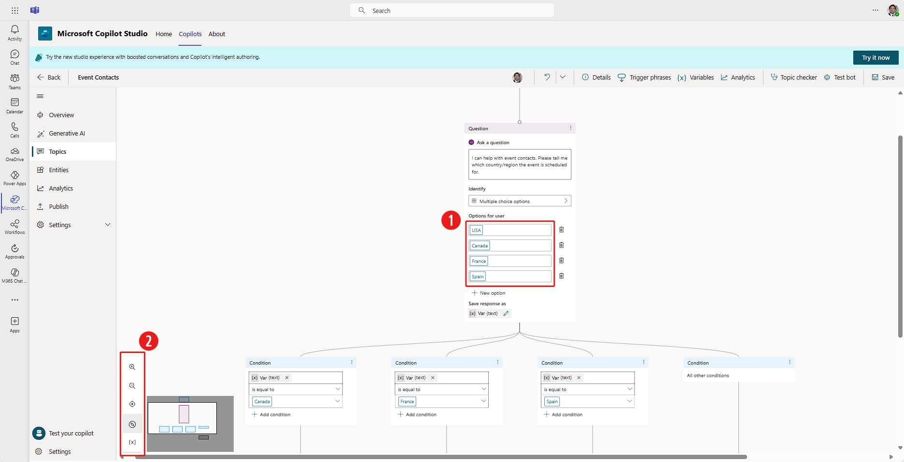
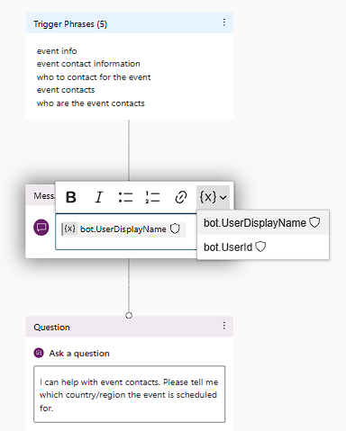
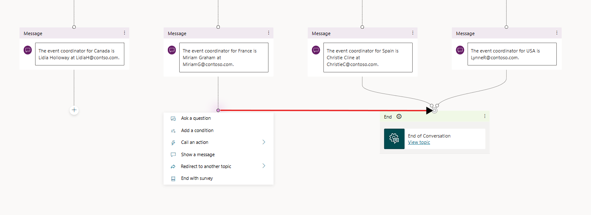

For your **Event Contacts** copilot, you need to expand the number of countries/regions that have contacts. Instead of listing all countries/regions in the message node, you want to ask the user which country/region they need contact information for. To accomplish this task, you'll use inputs, variables, and conditions.

- **Inputs** - The user's response in the **Ask a question** node.

- **Variables** - Store the **Inputs** to use in later conversation nodes.

- **Conditions** - Define the branching logic based on variables.

For your copilot, you need to delete the current message node because it will be replaced. Select the options ellipsis (**...**) for the message node and then select **Delete**.

## Add inputs and variables with the question node

To add inputs and variables with the question node, follow these steps:

1. Use the mouse to hover over the upper half of the line that connects the **Trigger Phrases** to the **End** node. Select the **Add node** plus **+** sign that appears and then select **Ask a question**.

1. Fill out the question node with the following information:

	  **Ask a question** - Enter the phrase:

	  `I can help with event contacts. Please tell me which country/region the event is scheduled for.`
	
	  **Identify** - Select **Multiple choice options**. The **Identify** field is where you indicate what type of response the copilot is listening for. Other responses that you can select include a number or a string. You can even have the copilot detect entities such as state names, phone numbers, or street addresses. To learn more about the different available options, see the links in the Summary unit at the end of this module.
	
	  **Options for user** - Enter **USA**, **Canada**, **France**, and **Spain** by selecting **+ New option** between each word. (See number 1 in the image below.)

	  Notice how the question box appears to move to the right of the authoring canvas as your options increase, and the child conditions populate the canvas below the question pane.  To recenter your canvas, you can left click and empty place and drag it, you can scroll, or you can use the screen view controls on the lower left of the canvas.  These controls include buttons to increase/decrease magnification, recenter the view, or even bring up a clickable mini map to help you navigate on your copilot canvas. (See number 2 in the image below.)

	> [!div class="mx-imgBorder"]
	> 

1. Return to the question node, and we'll set the **Save response as** value, currently shown as variable **Var (text)**. Select the edit icon next to **Var (text)** and a **Variable properties** panel appears on the right side of your screen. Replace the **Name** value of "Var" with "VarCountry" and close the panel. Notice how your new variable name "VarCountry" populates the **Condition** nodes below the **Question** node.

	Copilot Studio provides two variables by default: **copilot.UserDisplayName**, which provides the user's name, and **copilot.UserID**, which provides the user's sign in name. By using **copilot.UserDisplayName**, the copilot can call the user by name to personalize the experience. You can also use **copilot.UserID** to create a condition node to take actions based on which user whom the copilot is interacting with.

1. To have the **Event Contacts** copilot greet the user by name, add a new message node at the copilot's beginning. Move your canvas so that you can view the **Trigger Phrases** node and add a node just below that. For the new node, select **Show a message**. Then in the message input field select the **{X} insert variable** drop-down menu and select **copilot.UserDisplayName**.

	> [!div class="mx-imgBorder"]
	> 

1. You can further personalize it by adding "Hi " (with a space before the name) in front of it. Save your topic by selecting the **Save** button from the Copilot Studio ribbon.

## Condition node

For each multiple-choice option in the question node, Microsoft Copilot Studio creates a new condition node. You need to configure each condition node to provide the next appropriate response in the conversation.

For your **Event Contacts** copilot, you need to respond with the event contact for the country/region. For example, if the user selects **USA**, then the copilot should respond with Lynne Robbins' contact information. For the first entry, in this case **USA**, Copilot Studio doesn't automatically create a new **Condition** node, but each subsequent condition will create a new **Condition** node.

|     Country/Region    |     Name                 |     Email                    |
|----------------|--------------------------|------------------------------|
|     USA        |     Lynne Robbins        |     `LynneR@contoso.com`     |
|     Canada     |     Lidia   Holloway     |    `LidiaH@contso.com`       |
|     France     |     Miriam Graham        |     `MiriamG@contoso.com`    |
|     Spain      |     Christie   Cline     |     `ChristieC@contoso.com`  |

1. For each condition node, add a new message node after the condition that provides the correct contact and email address. For example, "The event coordinator for France is Miriam Graham at `MiriamG@contoso.com`."

	It's possible to add another condition node for USA, but for now, use the *All other conditions* for the message regarding the USA contact.
	
	For all four message nodes, you want to use the same **End of Conversation** system topic. Your copilot already has this topic defined under the **All other conditions** node. To link other nodes to this one, perform the following steps:

1. After one of the message nodes, select the **Add node** plus **+** symbol. Notice how a little circle appears on the top of the box. If you hover over it, the circle shows a pink-colored fill.

1. Left click and hold, then drag the pink circle to the top of the **End** node under your default condition message. When you have it in the right place, a pink halo appears above the node. Drop the connector from the message node there. Notice how both message nodes now connect to the **End** node.

1. Do the same with the other two **Message** nodes to connect them to the **End** node.
    
    > [!div class="mx-imgBorder"]
	> 

1. To test the copilot, select **Save**. Select the **Test copilot** option if the copilot testing pane isn't visible.

You've now learned how to incorporate default variables and how to define a variable by using an input condition. With these tools, you can continue to grow your copilot.
