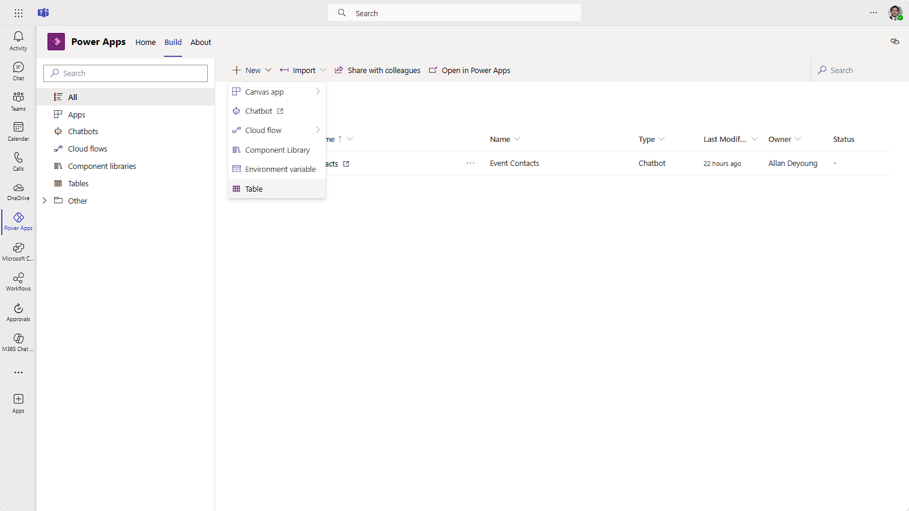
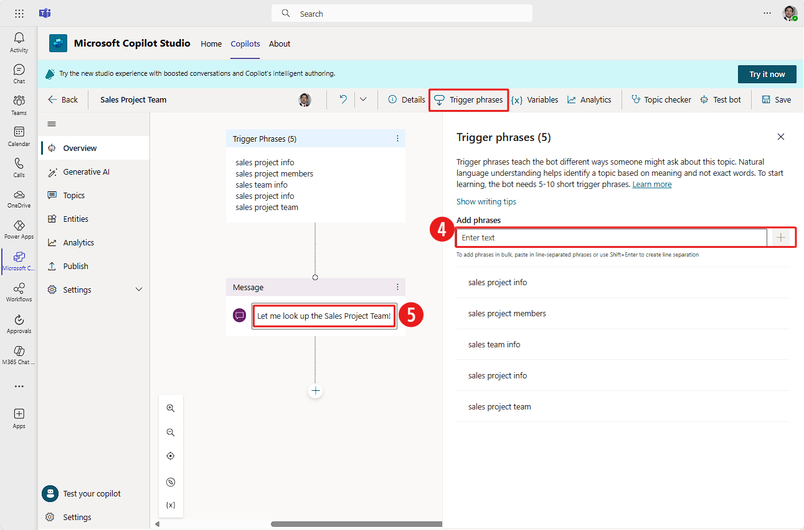
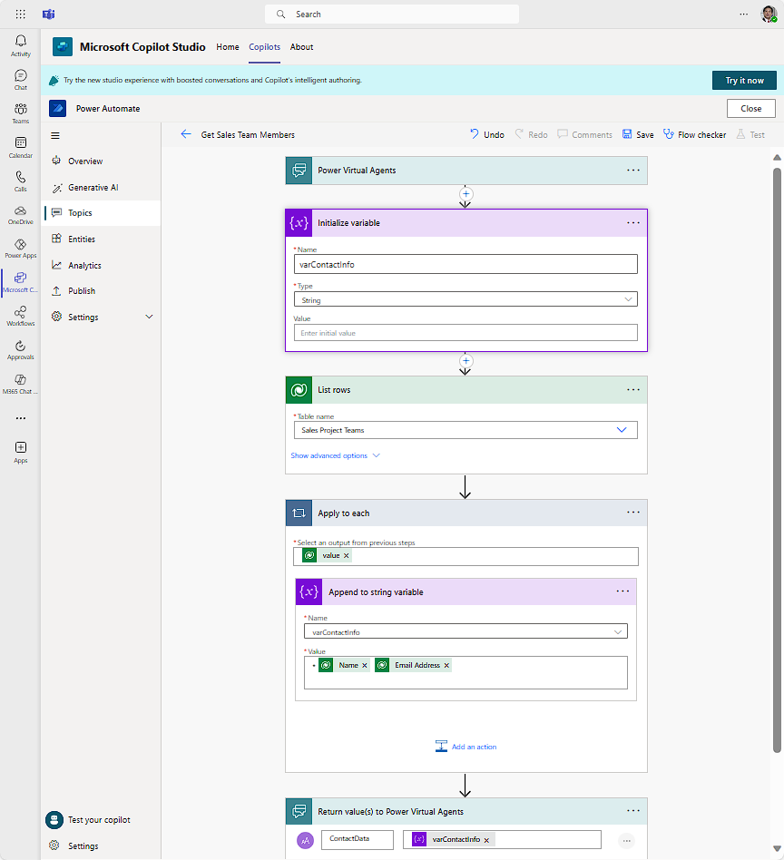

With the **Call an action** node, copilots can interact with Power Automate flows. You can use these flows to trigger automated processes or connect with Dataverse for Teams data, Microsoft Lists, or other data sources.

For example, the **Event Contacts** copilot could provide the Sales Project team members from a Dataverse for Teams table. Instead of editing the copilot when changes are made to this team, you can update the table.

## Step 1 - Create a Dataverse for Teams table

To create a Dataverse for Teams table, follow these steps:

1. Create a new Dataverse for Teams table in the same team as the copilot. Remember that you'll need to create it by using **Power Apps for Teams**.  In Power Apps for Teams, select the **Build** tab, and then select your Team.

1. Select **See all** below the **Items created for [your team name]**, to bring up the Team Solution list. The Team Solution list includes all of the Apps, copilots, Cloud flows, Tables, etc. that have been built in Dataverse for Teams for the selected Team. If you've selected the same Team that you created your *Event Contacts* copilot in, you'll see it in the Solution list.

1. From the Team Solution ribbon at the top, select **New** > **Table**.

	> [!div class="mx-imgBorder"]
	> 

   Name your new table **Sales Project Team** and select **Save**.  The columns and data types to use are as follows:

	|     Column           |     Data type    |
	|----------------------|------------------|
	|     Name             |     Text         |
	|     Email Address    |     Email        |

	You'll need to add the *Email Address* column to your table before continuing to the next step.

1. Add new rows for each of the four contacts.

	| Name | Email Address |
	|------|---------------|
	|Joseph Price | JosephP@contoso.com |
	|Nathan Rigby | NathanR@contoso.com |
	|Amber Rodriguez | AmberR@contoso.com |
	|Monica Thomson | MonicaT@contoso.com |

1. When complete, return to Microsoft Copilot Studio for Teams.

## Step 2 - Create a copilot topic with an Action step

To add an action, follow these steps:

1. In Microsoft Copilot Studio for Teams, select the **Copilots** tab from the ribbon, then find/select your **Event Contact** copilot to open it.

1. Go to your list of **Topics**.

1. Create a new topic by selecting **New topic** > **From blank** from the Topics ribbon. To name the topic select **Details** from the ribbon. Enter "Sales Project Team" into the **Name** field.

1. Select **Trigger phrases** and enter each of the following, press **+** after each entry:  

	`sales project team`

	`sales project info`

	`sales team info`

	`sales project members`

	`sales project info`

1. On the authoring canvas inside the **Message** node, enter:

	`Let me look up the Sales Project Team!`

	> [!div class="mx-imgBorder"]
	> 

1. Now, select the **Save** button from the ribbon to save your topic. Any changes that you haven't saved at this point could be lost when you switch to Power Automate to create the flow.

1. Add a new node after the **Message** node and then select **Call an action > Create a flow**. Copilot Studio might present you an option box to remind you to save your topic before leaving. If you've already saved it, select **Leave**. This action opens the Power Automate studio inside of Copilot Studio.
    
    There are some common templates available to immediately choose from. Each template allows you to pass information to the flow when it's triggered. As the flow finishes, it can pass information back to the copilot.  If you want to look at some more template options, you can select **See more templates**.  Some notables include:
    
    **Power Virtual Agents Flow Template** - This template only has the steps to receive and send information to the copilot.

    **Send a message to a Teams channel** - Trigger a Teams message from the copilot.

    **Send an adaptive card to a Teams channel** - Trigger an adaptive card to provide information into a Teams channel.

1. Select the one called **Power Virtual Agents Flow Template** (it might be called Microsoft Copilot Studio Flow Template).

1. Rename the flow to **Get Sales Team Members**.

1. Create a variable to hold the information that you want to provide back to the copilot. Select the **Insert new step** icon and select **Add an action**.

1. In the search box, enter "variable" and then, under **Actions**, select **Initialize variable**.

1. Enter "varContactInfo" for the **Name** and then select **String** for the type. Leave the **Value** blank.

1. Now we need a step to access the data from Dataverse from Teams. Under the **Initialize variable** step, select the **Insert new step** icon and select **Add an action**. Search for the **Microsoft Dataverse** connector then select **List Rows** as the trigger.

1. For **Table name**, select the **Sales Project Team** from the dropdown. (You can input "sales" in the input field to filter the list.)
    
    The **List rows** action pulls all table rows into an array. An array is a type of variable that can hold more than one value at a time. To work with data in the array, you need to go through each row and add the data to your **varContactInfo** variable.

1. Select the **Insert new step** icon after **List rows**. Select **Add an action**.

1. In the search box, enter **Control** and then, under **Actions**, select **Apply to each**.

1. In the **Select an output from previous steps** field, select the text box to add Dynamic content. Then select **value** from under the **List rows** action.

1. Select **Add an action** within the **Apply to each** step to continue.

1. In the **Choose and operation** search box, enter **variable** and then, under **Actions**, select **Append to string variable**.

1. In the **Append to string variable** step select **varContactInfo** for the **Name**.

1. For the **Value** of the **Append to string variable** action, we're going to create a bulleted list with the name and email of each person. Power Automate uses Markdown syntax when formatting text. To indicate a bulleted list in Markdown, you'll use the asterisk character \* at the line's start. (To learn more about Markdown, see the Summary section at the end of this module.)
    
    In the **Value** text box:
    
    1. Enter an asterisk \* and then add a space.
    1. Under dynamic content **List rows**, select **Name** and then add a space.
    1. Under dynamic content **List rows**, select **Email Address**.
    1. Press **Enter** to start a new line.

	We're done with this step.

1. Select the **Return value(s) to Microsoft Copilot Studio** step at the bottom of the flow, and then select **+ Add an output**.

1. Select **Text** as the type of output.

1. In the **Enter Title** text box, enter **ContactData**.

1. For the **Enter value to respond** field, select the input field and then select **varContactInfo** under the **Variables** section.

	Your flow should now resemble the following image:
	> [!div class="mx-imgBorder"]
	> 

1. Select **Save** from the Power Automate ribbon to finish editing the flow. Power Automate automatically runs the **Flow Checker** to look for problems. You might see a warning about "...OData filter queries..." but you can ignore that. Select **Close** to exit Power Automate and return to the copilot editor.

1. Select the **Add node** icon after the **Message** node and then select **Call an action**.

1. The flow that you created will appear in the list. Select **Get Sales Team Members**.

1. Add a **Show a message** step after the **Action** node.

1. Click inside the text box to bring up the menu. Select **ContactData** under **Insert variable {X}**.

1. Select **Save** from the Topic editing ribbon and wait for the topic to save. If the **Test bot** pane isn't visible, select the **Test bot** menu option.

Enter one of the trigger phrases to test the copilot. If you've done it correctly, your test copilot will provide the four names and email addresses of your Sales Project Team.

Copilot Studio can work through Power Automate flows to help you look up a single record in Dataverse for Teams based on the user's needs. For example, a user might want the contact information for a particular person based on their job title. While outside the scope of this module, Dataverse List Rows can use filters based on choices that the user has made in the copilot. For more information regarding OData queries like this, see the **Summary** unit at the end of this module.
