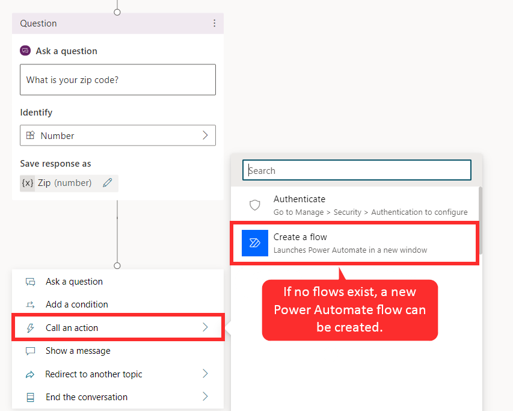
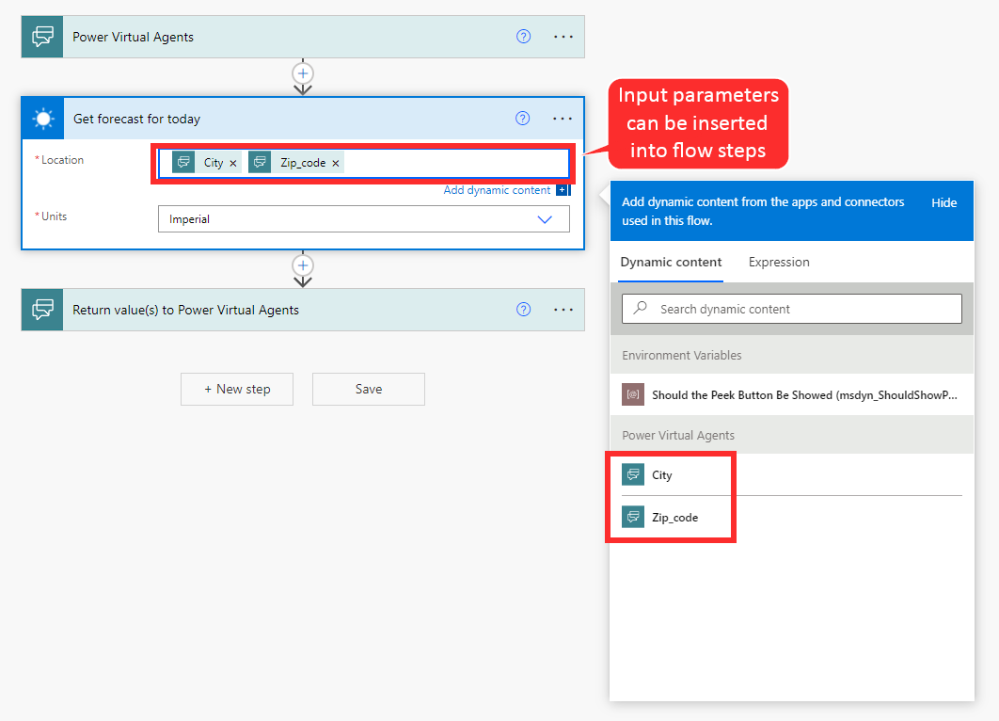
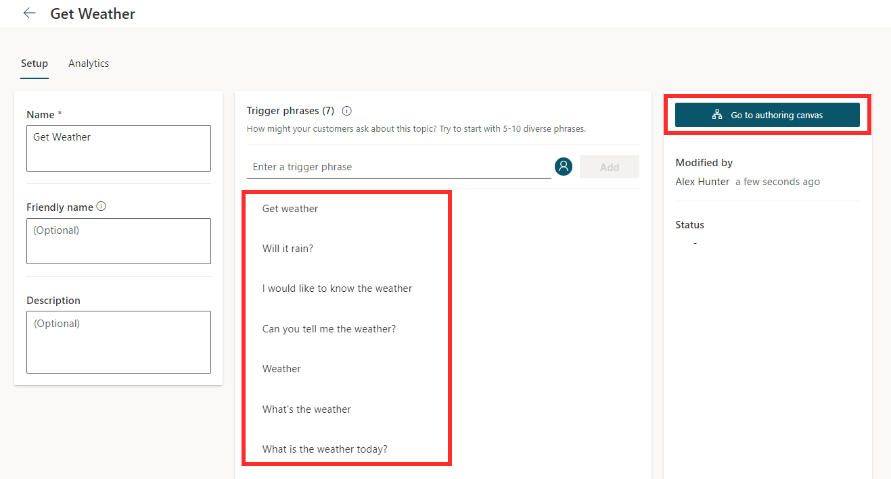
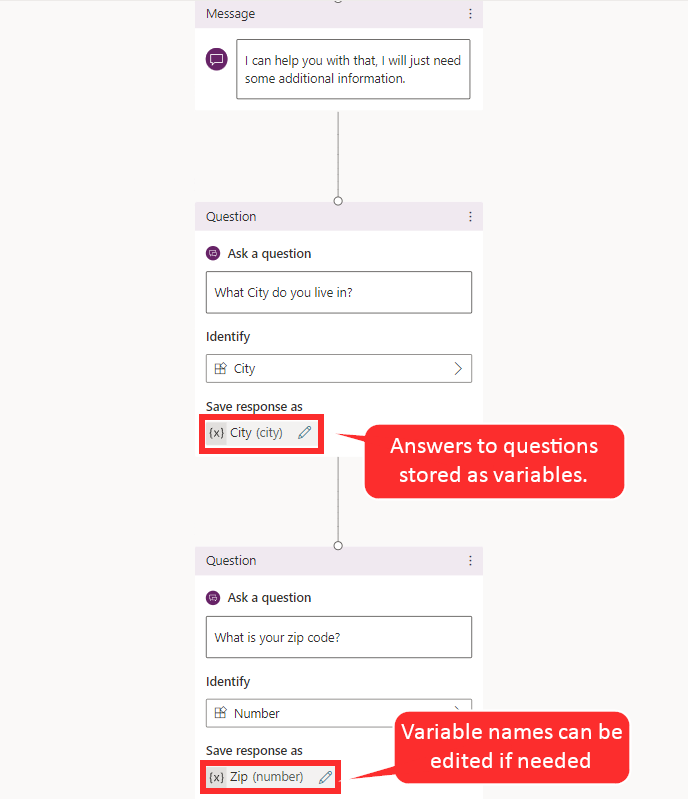
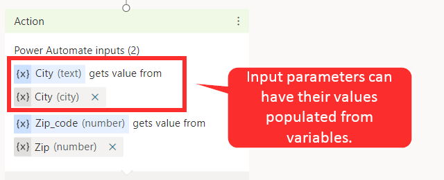

Frequently, when a bot interacts with customers, it might require information from other applications to provide the customer with a personalized experience. For example, if a customer asks about the weather for their location, the bot could pass the location details, such as the customer's city and postal address, to a weather service that will retrieve the forecast for their location. The forecast details can be sent back to the bot, which can then include those values in a message back to the customer.

Microsoft Copilot Studio bots perform these types of actions by calling Microsoft Power Automate flows. Flows can help automate activities, call operating systems, or engage with external applications. For example, Power Automate would pass the location information that is captured in the bot to an external service and then send the forecast details back to the Microsoft Copilot Studio bot.

Power Automate flows are called from within topics by using the **Call an action** node. You can use a flow that already exists in your [Power Apps environment](/power-virtual-agents/environments-first-run-experience/?azure-portal=true), or you can create one from within the Microsoft Copilot Studio [authoring canvas](/power-virtual-agents/authoring-create-edit-topics/?azure-portal=true). To allow a Power Automate flow to interact with a Microsoft Copilot Studio bot, it requires a special Microsoft Copilot Studio trigger. This trigger will capture data from the bot and send response information back to the bot.

Power Automate provides the following trigger and action:

- **Microsoft Copilot Studio** - Trigger that specifies input parameters that will be captured from the Microsoft Copilot Studio bot.

- **Return value(s) to Microsoft Copilot Studio** - Action that defines output parameters that are sent back to the Microsoft Copilot Studio bot.

When a new flow is created from a Microsoft Copilot Studio bot, a starter template is loaded that includes the Microsoft Copilot Studio trigger and the Return value(s) to Microsoft Copilot Studio action. You will only need to define the necessary input and output parameters and complete the structure of the flow.

> [!div class="mx-imgBorder"]
> 

## Work with input and output parameters

Variables that are defined in your bot can be to supply values to input parameters and consume values from output parameters. For example, a customer's response to the "What city do you live in?" question could be used as the value for a **City** input parameter.

### Input parameters

Input parameters represent values that will be captured in the Microsoft Copilot Studio bot and used by the Power Automate flow steps. No limit is placed on the number of input parameters that you can add. However, you can only use number, string, and Boolean types as input parameters with Power Automate flows.

> [!div class="mx-imgBorder"]
> 

Consider what type of data will be required when the input parameter is passed through the flow. For example, if you intend on sending a customer's city and zip code to the MSN weather service, you might configure the input parameters as shown in the following figure.

|     Name        |     Data   type    |
|-----------------|--------------------|
|     City        |     Text           |
|     Zip_Code    |     Number         |

The **City** parameter was defined as Text because MSN Weather consumes city names as text. The **Zip_Code** parameter was set to Number because it is consumed as a number. Each service that Power Automate can interact with will be different, so make sure that you take time to understand how it works.

> [!div class="mx-imgBorder"]
> 

When a step to get today's weather forecast from MSN Weather is added, the city and zip code will be passed to the location so that MSN Weather knows what forecast to get.

> [!div class="mx-imgBorder"]
> 

### Output parameters

Output parameters are values from a Power Automate flow that are returned to the Microsoft Copilot Studio bot. Like input parameters, output parameters can be a string, number, or Boolean value.

> [!div class="mx-imgBorder"]
> 

Returning to the previous weather example, after the flow has received the forecast details from the MSN weather service, you will create output parameters to store the details that are returned by the MSN weather service, where the values can be consumed by the Microsoft Copilot Studio bot. For example, if you want to present the customer with a summary and chance of rain percentage for their location, you might create the following output parameters.

|     Name              |     Data   Type    |
|-----------------------|--------------------|
|     Day_summary       |     Text           |
|     Location          |     Text           |
|     Chance_of_rain    |     Number         |

The actual details to include will come from the information that is received in the MSN forecast.

> [!div class="mx-imgBorder"]
> 

All flows that are created from the Microsoft Copilot Studio authoring canvas are saved in a default solution in Power Automate and they can be used by your bots immediately.

### Call a Power Automate flow as an action from a bot

After your flow has been created, it can be initiated from your bot topic by using the **Call an action** node. When you call the action, variables can be passed to the flow as input parameters. Make sure that you have created a topic with appropriate trigger phrases. For example, you can create a **Get Weather** topic that includes trigger phrases such as: 

- Will it rain?

- What's the weather?

- Get weather

> [!div class="mx-imgBorder"]
> 

To pass location information as variables to the Power Automate flow, you will need to capture them. The simplest way to accomplish this task is with the **Ask a question** node. You will use the **Identify** field on the question node to define what type of data that you want to capture. For example, you could set one item on the **Identify** field to **City** and the other to **Zip code**. The responses to these questions will be stored in variables.

> [!div class="mx-imgBorder"]
> 

After you have defined the questions that you will use to capture the details, add a new **Call an action** conversation node to the bot by selecting the weather flow that you created previously.

> [!div class="mx-imgBorder"]
> 

In the flow configuration, you will need to map the flow input blocks to the output variables from the question nodes. For example, **City (text)** gets its value from **City (city)** and **Zipcode (number)** gets its value from **Zip (number)**.

> [!div class="mx-imgBorder"]
> 

Now, you should be able to observe that the **Get weather Forecast** flow will be run and what output parameters will be returned from it.

Under the flow's node, add a **Message** node and then enter a message that uses the flow's outputs.

For example: **Today's forecast for** (x)location:{x}day_summary. **Chance of rain is** {x}chance_of_rain%.

> [!div class="mx-imgBorder"]
> 

For more information, see [Use Power Automate flows in Microsoft Copilot Studio](/power-virtual-agents/advanced-flow/?azure-portal=true).
