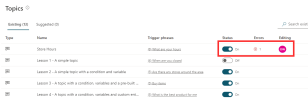
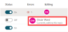
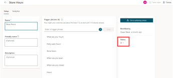
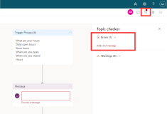

The best way to monitor the status and diagnose the error of your chatbot is at the topic level.

The **Topics** list shows if the chatbot **Status** is on or off, if it has errors, and if it's currently being edited by someone.

> [!div class="mx-imgBorder"]
> 

Hover your mouse over the displayed initial to find the full name of the person who is editing the topic.

> [!div class="mx-imgBorder"]
> 

To diagnose the cause of the error, select the error in **Topics** to go to the **Setup** page, which shows that the error is from the authoring canvas.

> [!div class="mx-imgBorder"]
> 

Selecting the status error number will take you to the canvas, which shows the two errors in the **Topic checker** feature.

> [!div class="mx-imgBorder"]
> 
