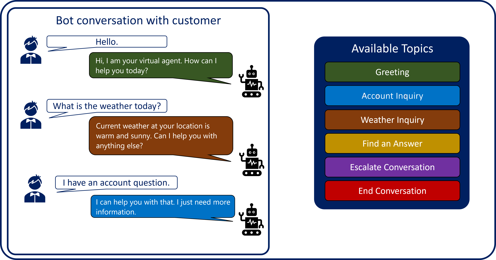

Assisting customers with Intelligent virtual agents, often referred to as bots, is a major business trend today. Bots are being used to help ease agent workloads by handling specific types of calls, help with customer  information gathering, complaint resolution, executing actions, and helping in other scenarios. Microsoft Copilot Studio allows individuals to create bots that are more commonly referred to as Copilots. Copilots help users accomplish specific tasks by using artificial intelligence to identify the customer's intent and present content or execute actions related to that intent. For example, if someone asks what the weather is where they live, a copilot could find out where they live and provide them with a detailed weather forecast for their area. That copilot could also help the customer do things like check their account balance, book a hotel room, or hand them off to live agent that can better assist them. The copilot just needs to know what information to present to the customer based on
what they're asking for.

Think of a customer's interaction with a virtual agent just like a conversation you would have with a person. While each conversation is different, they all have their main parts:

- **Conversation beginning**: Each conversation is initiated by an event such as answering a phone, a face-to-face greeting, or through engagement in other formats.

- **Discussion points**: These represent the specific items that are being communicated during the conversation such as the weather, making or formulating plans, providing life updates, asking questions and so on.

- **Conversation ending**: The conversation ends with an event such as hanging up the phone, shaking someone's hand, driving away, or some other action.

Conversations are different because what you say or what you do is based on feedback you're getting from the person you're interacting with. For example, if they ask you about your new job, you're going to tell them about your job, not about a vacation you just took. Copilots need to be able to work the same way. They need to deliver the correct details and take appropriate action based on what the customer is saying.

Microsoft Copilot Studio’s copilots do this through topics. Think of a topic as a small individual conversation on a specific subject. Multiple topics can be used together in a single bot to provide the customer with an automated
conversation that feels natural and flows appropriately.

For example, a single copilot might contain the following topics:

- Greeting

- Account Inquiry

- Weather Inquiry

- Find an Answer

- Escalate Conversation

- End Conversation

Each of the above topics would have trigger phrases that help the copilot identify when to present that topic to a customer. If the customer asks, "What is the weather," the weather topic is launched. If they state, "I have an account question," the account inquiry topic is launched. By defining multiple topics within a single copilot, organizations can create flexible virtual agents that can be used to engage and interact with customers on a wide variety of individual topics.

> [!div class="mx-imgBorder"]
> 

Throughout this module, we examine how to use topics to create and manage conversation paths in a copilot.
