In Microsoft Copilot Studio, Topics represent paths a customer can be taken on while interacting with a copilot. The topic used, and the path followed within an individual topic, is in response to the data typed in by customers in the conversation panel. Topics are the primary element that dictates how conversations flow. If a customer asks about the weather, the copilot can launch a weather topic. To provide them with the correct weather forecast, the copilot can ask questions defined in the topic, such as what city they live in. The copilot retains that information so it can be sent to a weather service for forecast details. The forecast can be returned to the customer in a personalized message that includes relevant customer information.

Power Virtual Agent topics consist of two primary elements:

- **Trigger phrases**: Phrases, keywords, or questions entered by users that relate to a specific issue.

- **Conversation nodes**: Define how a copilot should respond and what it should do.

As the customer enters information, the copilot’s Artificial Intelligence uses natural language understanding to parse what they're typing and find the most appropriate trigger phrase or node. If a user enters "I need to return a defective product" into your copilot, parts of the text such as "return" or "defective product" could be matched to return a topic that includes those items as trigger phrases.

Once loaded, different conversation nodes in the topic are used to control and define the path the customer takes during the conversation. Messages presented can provide details or instructions. Questions can be asked to identify the type of product they want to return. Actions can be used to help them create a custom return label that could be sent to them to facilitate the return.

## Work with topic triggers

The first thing you need to define in a topic is what phrases the copilot should look for to trigger the topic. Trigger phrases are added by selecting **Edit** next to **Phrases**. A single topic can have multiple trigger phrases defined for it. Having five to 10 trigger phrases is a good starting point but you can add as many as needed. Punctuation can be used in trigger phrases. However, it's best to use short phrases rather than long sentences. Try to think about how a customer might phrase their request. If the topic is used to communicate store
hours, your triggers should relate to being open or closed, time frames, dates, etc. Using phrases like "What are your hours," "When do you open," "Store Hours," and "Hours of Operation" would be good starting phrases. More trigger phrases can be added over time as you identify other ones that would be needed.

> [!div class="mx-imgBorder"]
> [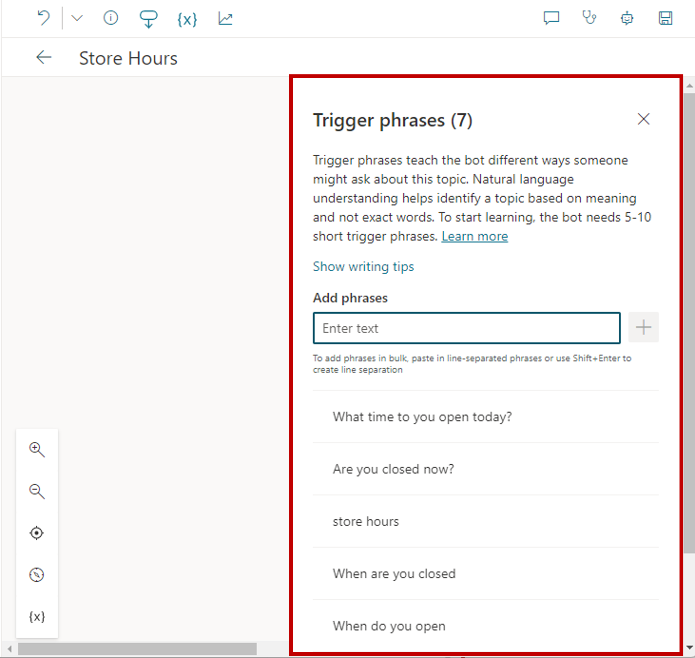](../media/triggers.png#lightbox)

You should also try to make your trigger phrases as unique to the individual topic as possible. This maximizes the likelihood the copilot launches the correct topic as the user types what they need. For example, a copilot might contain two topics. One called "Product Returns" and another called "Product Recalls." It wouldn't be uncommon for each topic to have similar verbiage. If you add 'defective product' as a phrase to both, the application might not understand which topic to load.

One way to handle this would be to add more specific trigger phrases to the topics, such as using 'return defective product' in the "Product Returns" topic and 'return recalled product' in the "Product Recalls" topic.

Another approach could be that you only create one topic that is used for both returns and recalls. When the copilot initiates the topic, additional information could be gathered and used to guide them down a return or recall path. This becomes increasingly important in scenarios where a copilot contains many individual topics. Remember, a single copilot can have up to a maximum of 1000 topics in it. Some simple planning early in the process can prevent frustration in the future.

## Use conversation nodes to design the topic's conversation path

Once you've defined how the topic is triggered, you need to design the flow of the topic as users interact with it. This is called a conversation path. A topics conversation path defines how the customer is interacted with, and what occurs based on customer input. You can edit a topic conversation path by closing the trigger phrases pane. At any point, you can return to the trigger phrase pane by selecting Phrases on the Trigger node.

When a new topic is created, the initial conversation path includes two items. There's a trigger phrase node and an empty message node inserted for you by default. More nodes can be added by selecting the plus (+) icon on the line or branch between or after a node.

> [!div class="mx-imgBorder"]
> 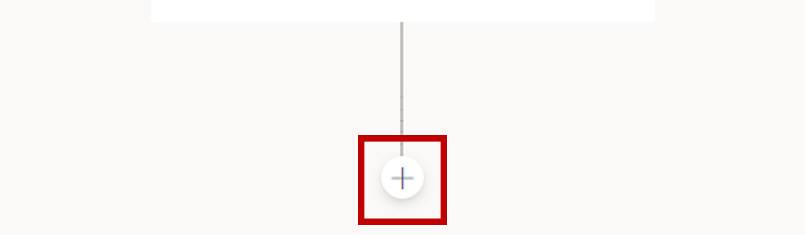

## Work with conversation nodes

Conversation nodes represent customer interactions or actions that can be inserted into a topic's conversation path. They might be used to display a message to the customer, ask them for some additional information, trigger an automation, or trigger an escalation to a live agent.

There are several different node types available:

- **Send a message**: Displays a message to the user. Messages can include some basic formatting and numbering.

- **Ask a question**: Helps the copilot capture information from the user. The captured information can be used to influence the flow of the conversation, or as variables in other parts of the copilot.

- **Ask with adaptive card**:

- **Variable management**:

- **Topic management**: Directs the user to a different topic in the copilot. For example, you might want to send the user to a specific topic about the closure of a store if they ask about store hours for that store.

- **Call an action**: Calls a Power Automate Flow to help interact with external systems or areas. For example, passing customer location details to the MSN weather connector to get the local weather forecast for the customer's location.

- **Advanced**: Ends the conversation and lets you display surveys, or hand over to a live agent.

Depending on the type of node you select, it might have different options that can be defined.

## Work with the question node

Question nodes are often used in conversation paths. They help capture additional information from customers. Information captured from the question can be stored and used in other parts of the copilot or in automation. They can also affect the path the customer is taken on. For example, you might use a question node to capture the city a customer lives in. You could also use a question node to provide the customer with a list of multiple-choice options to choose from, such as a list of cities.

Each question node contains three base fields:

- **Ask a question**: The question text that you want to present to the user.

- **Identify**: Defines what the copilot should be listening for in the user's response. For example, multiple choice options, a number, or a specific string.

- **Save response as**: Defines how you want to save the data captured from the questions so it can be used as a variable later.

There are multiple predefined options that you can choose from in the Identify field. These options can not only make the experience of interacting with the copilot easier, but they also make it easier for the copilot to extract the correct information from the user's response.

One way this can be done is through what are referred to as entities. An entity can be viewed as an information unit that represents a certain type of a real-world subject, like a phone number, zip code, city, or even a person's name. For example, setting the Identify field to City would extract only city information from the user's response. If the user entered something like I live in Seattle, it understands that Seattle is a city. If someone entered, I love NYC, it understands that NYC is an abbreviation for New York City and would store the response of NYC. There are several options like this example such as Email, Date and Time, Person name, Phone Number, and more.

> [!div class="mx-imgBorder"]
> [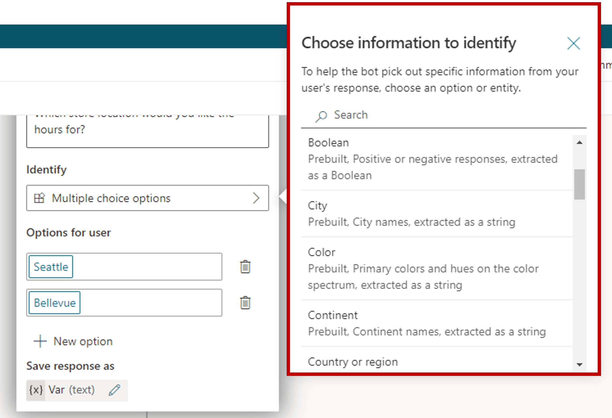](../media/question-node.png#lightbox)

Depending on what you select for the Identify field, other field options might be presented to help provide more details for the item. For example, setting the Identify field to "Multiple choice options," displays "Options for user." Here, you can define the options that you want to have presented to the user. Each option would be presented in the conversation window as a multiple-choice button.

> [!div class="mx-imgBorder"]
> [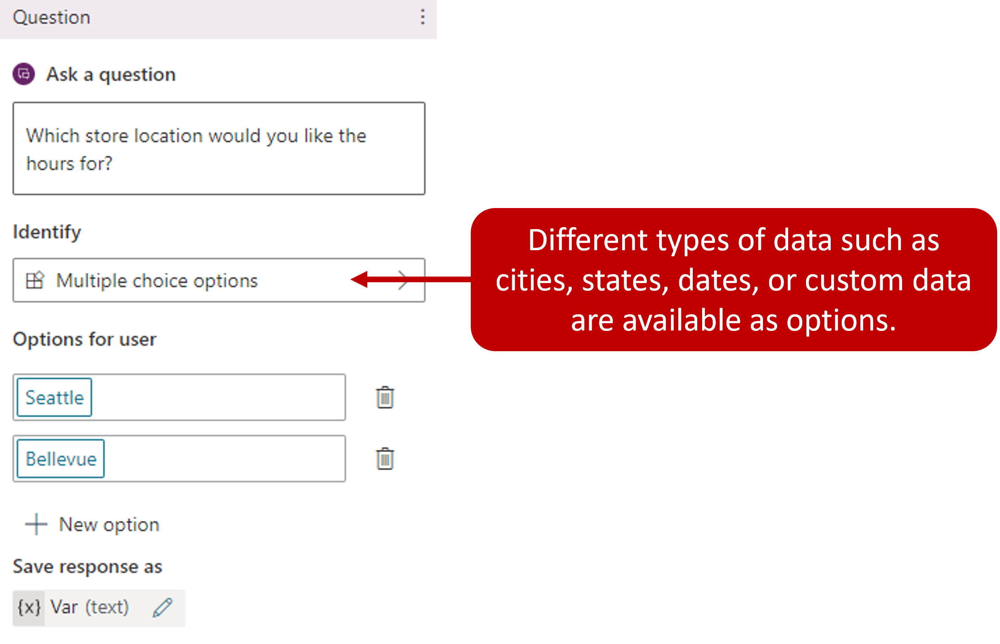](../media/multiple-choice.png#lightbox)

Another advantage to the question node is separate conversation paths can be used based on the customer's response. We'll look at branching in the next unit. Branching helps lead to the appropriate resolution for each user response.

## Configure question behavior

Another aspect of creating questions is defining question behavior properties. These properties provide you with more detailed control over different aspects of the Question node, such as how the copilot handles an invalid response or how it validates user input. For example, when creating a reservation question, you may want to limit the number of people they can request the reservation for. With question behaviors, you can define what that number is, and specify what to do when that number is exceeded.

You access question behavior properties directly from the **Question** node.

> [!div class="mx-imgBorder"]
> [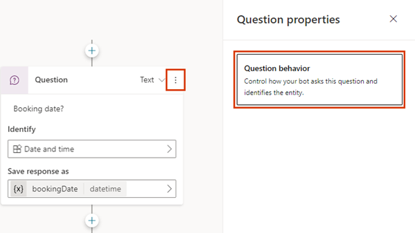](../media/question-behavior.png#lightbox)

> [!div class="mx-imgBorder"]
> [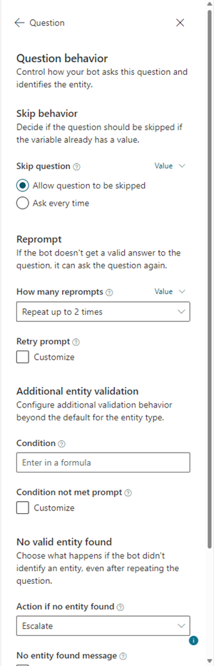](../media/question.png#lightbox)

There are multiple items that you can define while working with the question properties:

- **Skip behavior**: Defines what the copilot should do if the variable associated with the question node already has a value from earlier in the conversation such as being captured in a previous question. There are two options here you can choose from:

  - **Allow question to be skipped**: Skip the question if the variable has a value.

  - **Ask every time**: Ask the question even if the variable has a value.

- **Reprompt**: Defines how the copilot should react if it doesn't get a valid answer from the user. You can tell it to try again once, twice, or move on without getting an answer. You can also create a custom message.

- **Additional entity validation**: Allows you to add criteria to the basic test. For example, you might have a question node that accepts a number, but you might want to make sure it's less than 10. You can also change the prompt to help the user enter a valid response. You can define a Power Fx formula that returns a Boolean value (true or false); for example, Topic.Var1 \< 10

- **No valid entity found**: Defines what to do when your copilot stops trying to get a valid response from the user. You can escalate to a human agent or provide a default value for now. You can also change the prompt to let the user know.

- **Interruptions**: Defines if the user can switch to a different topic during the question.

## Display messages with the show a message node

Message nodes are used anytime you want to provide some details or information back to the user. Messages are simple text messages, but they can also include richer components, such as images, videos, quick replies, and cards as needed.

> [!div class="mx-imgBorder"]
> 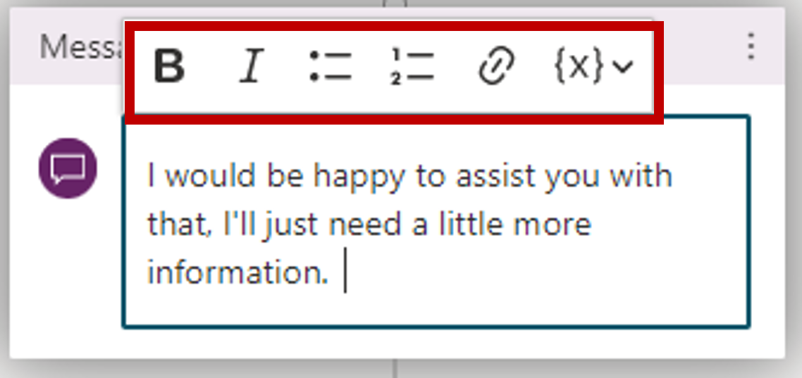

## Use message variations

To provide a more conversational experience to your users, you can specify different message variations. For example, you might add the variations “Sure. I can help you with that”, and “I’ll be happy to help you with that.” When you add message variations, the copilot randomly picks one of them to use each time the node is triggered.

> [!div class="mx-imgBorder"]
> [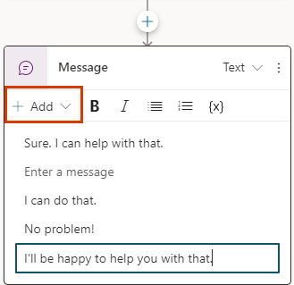](../media/add-message.png#lightbox)

## Add an image

Images and videos can provide a great way to create a more enhanced and useful experience. For example, if you're creating a copilot that is helping with troubleshooting, you might use the image to display a picture of the item they're troubleshooting, of you might link to a video that provides assistance.

When defining an image, you need to provide:

- The URL of your image in the image field.

- A **Title** for the image.

> [!div class="mx-imgBorder"]
> [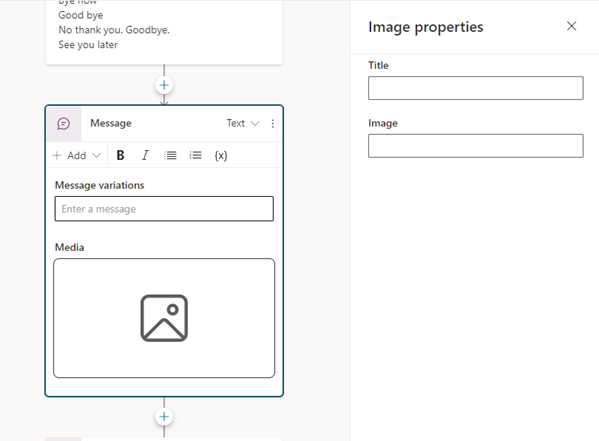](../media/image-properties.png#lightbox)

When defining an image, you need to define:

- **Title**: Specifies the title of your video.

- **Subtitle**: Provides more context about what the video is about.

- **Image**: Provide a URL to a publicly accessible image file that can be used as a thumbnail for your video.

- **Media**: Provide the URL of your video. The URL can either be a direct link to a publicly accessible MP4 file or a YouTube URL.

- **Text**: Allows you to enter any other text you want associated with the video.

- **Buttons**: Allows you to add buttons for interacting with the control.

> [!div class="mx-imgBorder"]
> [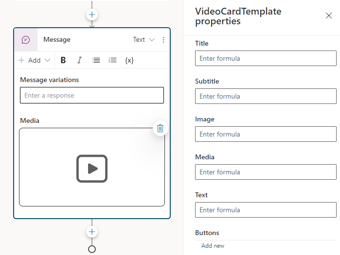](../media/video-properties.png#lightbox)

## Add a basic card

A basic card is a general-purpose card that you can use to add text, images, and interactive elements to copilot responses.

When adding a basic card, you can define the following:

- **Title**: Specifies the title of your video.

- **Subtitle**: Provides more context about what the video is about.

- **Image**: Provide a URL to a publicly accessible image file that can be used as a thumbnail for your card.

- **Text**: Allows you to enter any other text you want associated with the card.

- **Buttons**: Allows you to add buttons for interacting with the control.

> [!div class="mx-imgBorder"]
> [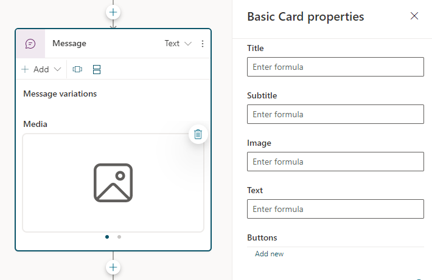](../media/card-properties.png#lightbox)

## Add an Adaptive Card

Unlike basic cards that are static in the details that they present, Adaptive Cards are platform-agnostic cards that you can tailor to your needs. When delivered to a specific app, the JSON is transformed into native UI that automatically adapts to its surroundings. For example, you could create a weather card that includes graphics and animations that display forecasts in more detail.

Cards can be designed using the Adaptive Cards Designer or author the JSON directly. For more information using the Adaptive card designer, see: [Adaptive card designer.](https://adaptivecards.io/designer/?azure-portal=true)

When you design an adaptive card, under **Edit JSON**, enter the JSON for your card. If you need more room, you can open a larger view of the JSON editor, by selecting the **Expand** icon.

> [!div class="mx-imgBorder"]
> [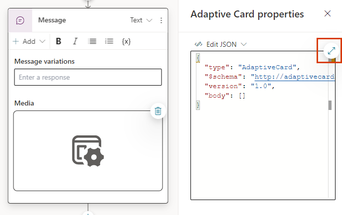](../media/adaptive.png#lightbox)

To learn more about working with adaptive cards, see: [Add an Adaptive Card.](/power-virtual-agents/authoring-send-message?azure-portal=true#add-an-adaptive-card)

## View multiple cards in the same node

Sometimes you might run into a scenario where you need to have multiple cards displayed in the same node. For example, you might have multiple images that need to be presented to the user. When you add two or more cards to a node, you have two different display options that you can choose from for presenting the data.

- **Carousel**: Displays one card at a time, and users can cycle through them.

- **List**: Displays all cards in a vertical list.

> [!div class="mx-imgBorder"]
> [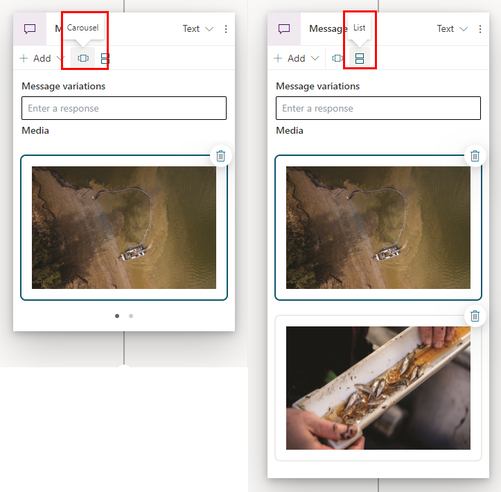](../media/carousel-list.png#lightbox)

## Use quick replies

When designing a copilot, it's important to not only make the experience as simple as possible, but also to ensure that the copilot can easily identify what the user is doing and take the appropriate action. One way you can accomplish this in Microsoft Copilot Studio, is with Quick replies. Quick replies provide suggested responses or actions for the user. When a user selects a quick reply, it sends a message back to the copilot. The quick reply text is shown in the chat history as if the user had typed the message. The quick reply buttons are removed from the chat history when the copilot or user sends another activity.

Users can choose to use a quick reply or ignore it. To require the user to choose an option from a list, use a multiple-choice **Question** node instead.

> [!div class="mx-imgBorder"]
> [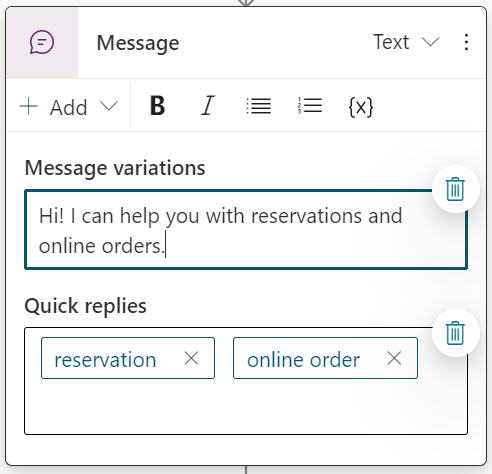](../media/message.png#lightbox)

To learn more about working with Quick Replies, see: [Use quick replies.](/power-virtual-agents/authoring-send-message?azure-portal=true#use-quick-replies)

Message nodes can also include variables in message content. Variables can be used to store information captured from a question. Inserting a variable allows you to provide more personalized messages. For example, you could use a question node to capture the city that an individual lives in. The answer to the questions is stored in a variable used later in a message to the customer such as "currently the weather in "city" is...

> [!div class="mx-imgBorder"]
> 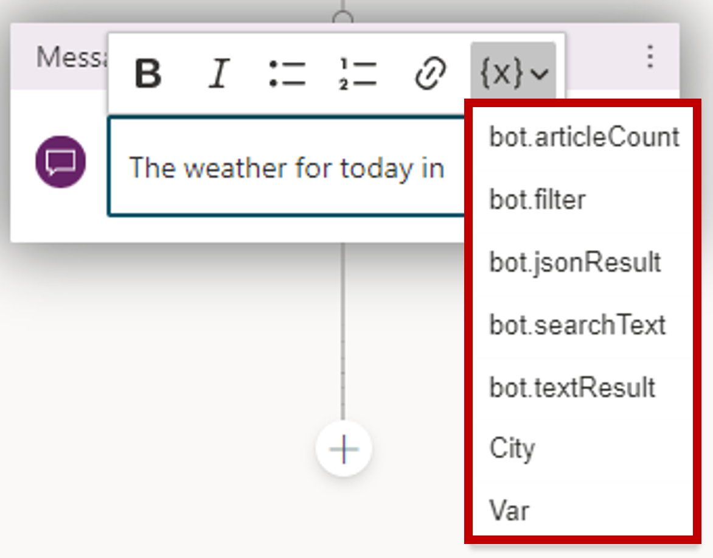

You can learn more about variables here: [Use variables](/power-virtual-agents/authoring-variables/?azure-portal=true)

## Work with the topic management node

Each topic that you include in your copilot is likely going to be specific. For example, a "current weather" topic is only going to provide weather related data, and an "hours of operation" topic is going to focus on when a business is open. Just because they're separate topics doesn't mean that they can't be related or dependent on each other. For example, let's go back to our "Product Returns" and "Product Recalls" example from earlier. Rather than coming up with multiple unique triggers for both topics, we could create a "Recall or Return" topic. The purpose of the topic would be to determine which topic to load next. It contains a question node that asks if this is a return or recall. Based on what the user selects, the go to topic node loads either the "Product Returns" or "Product Recalls" topic.

> [!div class="mx-imgBorder"]
> [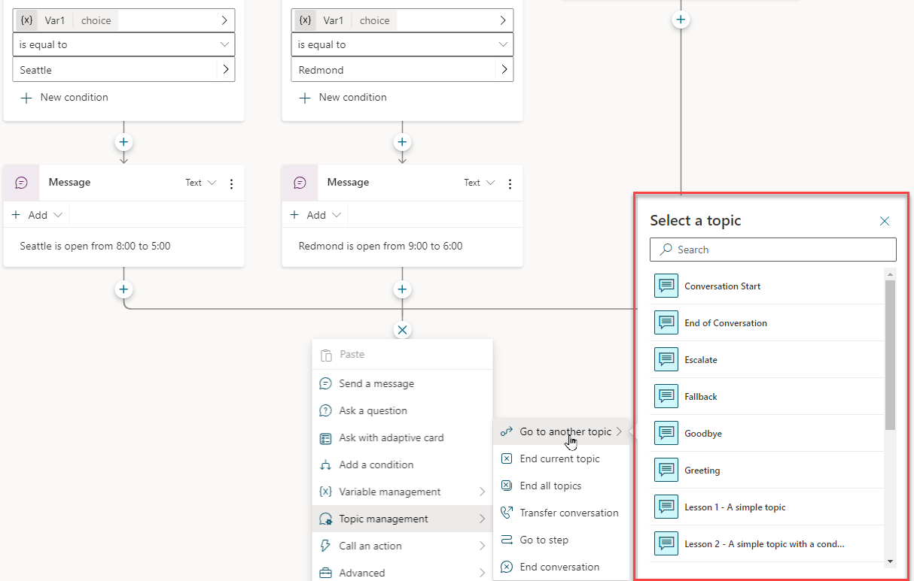](../media/select-topic.png#lightbox)

## End the conversation

Many times, the end of a topic also represents the end of the conversation. The end the conversation node signifies the end of the entire conversation and provides actions that can be initiated. You can have a survey appear that asks the user if their question or issue was answered or resolved correctly. This information is collected under the [customer satisfaction analytics page](/power-virtual-agents/analytics-csat/?azure-portal=true). You could also elect to escalate the conversation [over to a live agent](/power-virtual-agents/advanced-hand-off/?azure-portal=true) if you're using a suitable customer service portal, such as Omnichannel for Customer Service. At the end of a response that resolves the user's issue or answers the question, select End the conversation.

> [!div class="mx-imgBorder"]
> [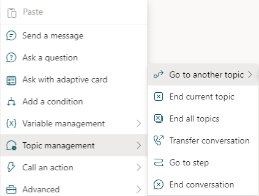](../media/topic-management.png#lightbox)

## Use the call an action node

One of the many advantages to Microsoft Copilot Studio, is the ability to execute actions such as sending emails, locating external data, or creating activities based on data entered in the copilot. The call an action node helps to facilitate this by allowing you to call a Power Automate Flow from the copilot.

For more information on calling a Power Automate Flow from a topic, see [Key concepts - Use Power Automate flows in Microsoft Copilot Studio](/power-virtual-agents/advanced-flow/?azure-portal=true).
