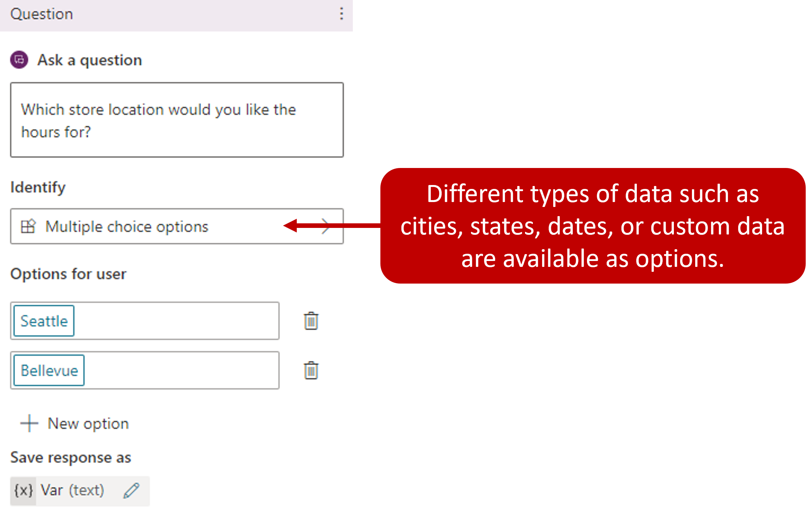

Adding branching into to topic is what truly turns them from a one-way path to a multi-layer conversation. Different forks and paths ensure the customer is provided data and resolutions based on the current situation.

Branching allows you to evaluate conditions to initiate conversation nodes to launch another topic, display a message node, or trigger a Power Automate Flow. You can manually add branching conditions between nodes, such as inserting a branch after you ask a question such as "What country do you live in?" The customer's response to the question is stored as a variable, and branch conditions can be built based on that. This is done by selecting **+** to add a node, and then selecting add a condition and selecting the **Branch based on a condition** option.

> [!div class="mx-imgBorder"]
> 

You select how the copilot conversation should branch at this point. For example, if you have set up [end-user authentication](/power-virtual-agents/advanced-end-user-authentication/?azure-portal=true), then you might want to specify a different message if the user is signed on (which might have happened earlier in the conversation).

> [!div class="mx-imgBorder"]
> 

Depending on what you select in the Identify field of the question node, branching might occur automatically. This is always the case when you select Multiple Choice options. Each option has a branch created for it. For example, if you have a question node that asks a customer for their preferred store location and provides them with "Seattle" and "Bellevue" as options, a condition branch for each option is created. You need to ensure that you're providing a completed path resolution for both items.

> [!div class="mx-imgBorder"]
> 
