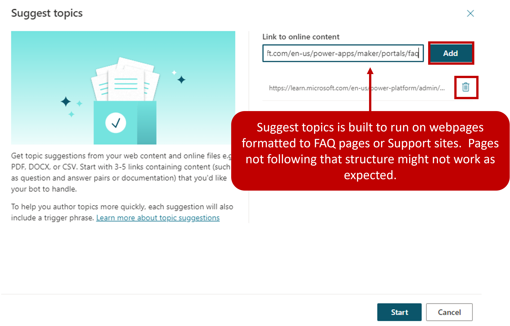
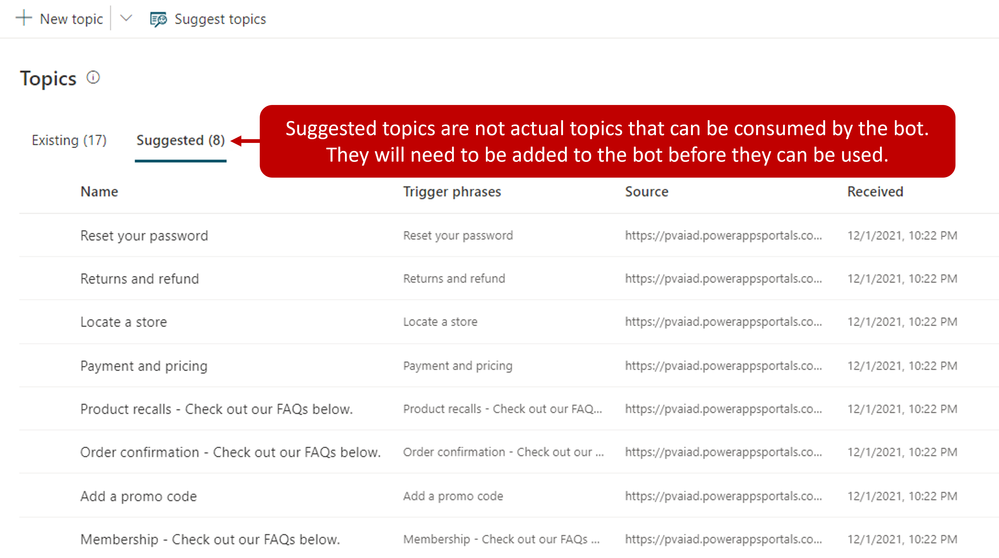
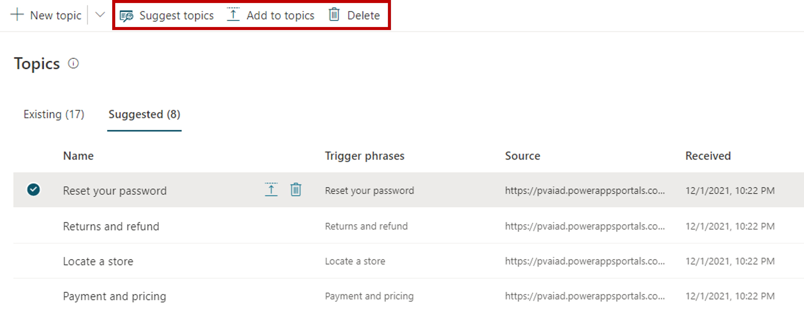
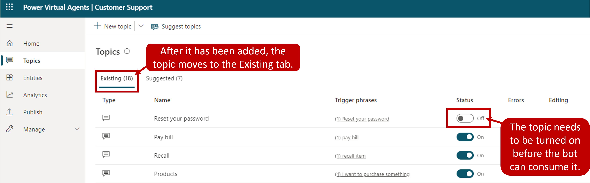

Many organizations want to create bot topics that use existing content. This can provide them with several advantages from the time saved in authoring the topic, to ensuring that topics are aligned with the types of issues that are being reported. One good example of this is for organizations that are using [Dynamics 365 Customer Service Insights](/dynamics365/ai/customer-service-insights/overview/?azure-portal=true).

Customer Service Insights uses artificial intelligence to automatically group your organization's cases into topics. Since topics are already defined based on your organization's caseload, it would make sense to align the topics in a customer support bot with those topics.

Microsoft Copilot Studio uses Artificial Intelligence (AI)-assisted authoring to help organizations automatically extract and insert relevant content from existing web content topics into your bot. This eliminates the need to copy and paste or manually recreate content into topics.

The Artificial Intelligence evaluates the page and determines both the structure and content. It isolates content blocks that relate to a support issue or question and classifies them into topics. Each topic identified follows the same structure as other topics. They contain [trigger phrases identified during the process, and an initial Message node](/power-virtual-agents/authoring-create-edit-topics/?azure-portal=true). These topics appear as suggested topics that can be modified and deleted like other topics.

There are three main steps involved with auto-creating topics:

1. Extract content from existing FAQ or support pages.

1. Add the suggested topics to your bot.

1. Enable the topics in your bot.

## Extract content from webpages

The first step in creating topics from existing content is to extract topic suggestions from existing pages you want to use that contain support content. This is done by using the Suggest topics command in Microsoft Copilot Studio. The Suggest topics command is built to run on webpages that are in the form of FAQ pages or support sites. After the extraction is complete, the suggested topics are displayed for you to review further.

Content can be extracted by selecting the Suggest topics button on the Topics page. When you're first getting suggestions, this page is likely blank. Once topics have been extracted, the list is displayed. To suggest topics, you need to enter a URL for each webpage you want to extract content from. The URLs must be secure (they must start with `https://`). If you add a page by mistake, you can remove it by selecting Delete.

> [!div class="mx-imgBorder"]
> 

Depending on the complexity of the pages and the number of pages you add, it can take some time to extract the content. The message "Getting your suggestions, this may take several minutes" appears at the top of the screen while the extraction is in progress. If any errors are encountered during this process, the tool provides explicit feedback about errors so that you can understand and address the issue. For example, you might be unable to extract content because the site you're referencing is down. Once the content has been extracted, suggestions appear that you can review and decide if they should be added to your bot.

> [!div class="mx-imgBorder"]
> 

## Add suggested topics to an existing bot

Extracted topics aren't automatically added as topics in your bot. After the extraction process has been completed, any topic suggestions will appear on the Suggested tab. This allows you to review them and determine if they're topics that you want to have included in your bot. You can also review the trigger phrases and message nodes that were created and make any edits that you want.

There are three options for dealing with the topic.

- **Add to topics and edit**: Opens the topic so you can edit the trigger phrases or enter the authoring canvas to make changes to the conversation flow. Once completed, the topic are removed from the list of suggestions.

- **Add to topics**: Topic is automatically added to the list of topics and removed from the list of suggested topics.

- **Delete suggestion**: Doesn't add to your list of topics and deletes the topic from the suggested topics.

> [!div class="mx-imgBorder"]
> 

## Enable topics in your bot

Once a suggested topic is added to the Existing tab, the status set to Off. This makes sure that it isn't prematurely added to your bot before you've had time to make the necessary changes to it, such as modifying trigger phrases or adding more conversation nodes to enhance the topic as required. When a topic is ready to be used, set the Status to On.

> [!div class="mx-imgBorder"]
> 
