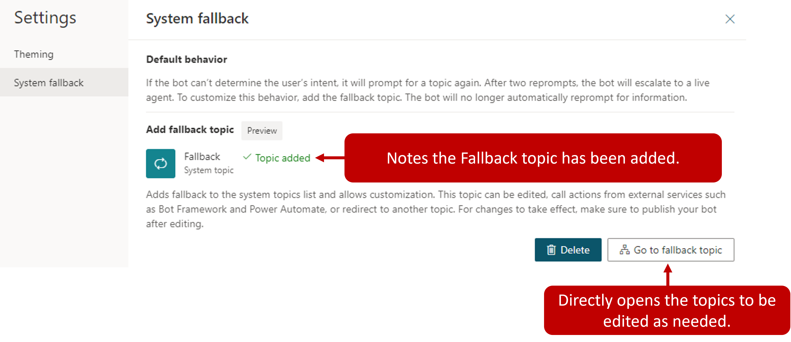

As a copilot engages with customers, it triggers the most appropriate topic based on the user's input. From time to time the copilot might not be able to determine the user's intent based on what they've typed. When this happens, it prompts the user again. After two unsuccessful prompts, the copilot will escalate the conversation to a live agent using the Escalate system topic.

Some organizations might not want to have all scenarios where a topic isn't triggered become escalated. For example, you might want to create a catchall topic that is used whenever the copilot is unable to recognize the intent. Once routed to this topic, it can try to better pinpoint what the customer is looking for by asking them questions, providing category options, or other types of interactions with the customer. When you want to defer to a topic rather than triggering an escalation, you can use a Fallback topic.

System fallback topics are added by selecting the Settings icon from the top navigation, choosing General settings, and clicking System fallback.

> [!div class="mx-imgBorder"]
> 

To enable the system fallback topic, select the Add button. The system fallback topic is added to your copilot. This is the topic the copilot goes to when it either can't find an appropriate topic or doesn't understand the user's input.

> [!div class="mx-imgBorder"]
> 

## Customize the system fallback topic

Once the system fallback topic has been enabled, you see a new Go to fallback topic item on the screen. Selecting **Go to fallback** takes you to the topic. The newly created fallback topic is also available under System Topics in the topic list.

Unlike other topics, the fallback topic doesn't have a trigger phrase, the unrecognized user input is what triggers the topic.

The fallback topic contains two nodes:

- **Message**: Acknowledges the unrecognized input and rephrases it

- **Escalate**: Redirects to a live agent

> [!div class="mx-imgBorder"]
> 

As with any other system topic, the fallback topic can be customized to fit your needs. For example, you present the user with a question such as "what are you looking for assistance with?" The customer could be presented with options such as "Sales," "Service," or "General." Based on what they select they could be redirected to a topic that related to that selection, execute a Power Automate Flow, send an email, or if needed escalate them to an agent. The initial unrecognized text entered by the user is stored in a variable called *UnrecognizedTriggerPhrase* variable.

> [!div class="mx-imgBorder"]
> 

You can use the information stored here to further personalize the experience. For example, you can pass it as input to a [Power Automate flow](/power-virtual-agents/advanced-flow/?azure-portal=true) or [Bot Framework skill](/power-virtual-agents/advanced-use-skills/?azure-portal=true).

## Reset a system fallback topic

If you find that the system fallback behavior isn't what you are looking for, you can reset it to return it to its default behavior. Using Settings, navigate back to **System Fallback** and select **Delete** to remove the fallback topic.

> [!div class="mx-imgBorder"]
> 
