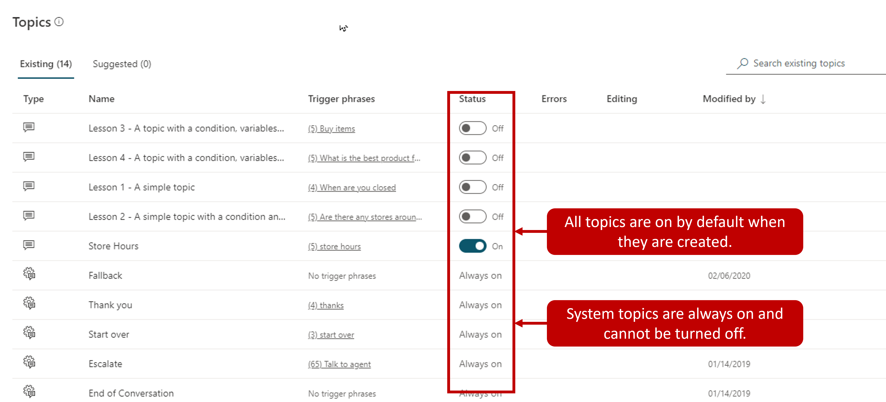
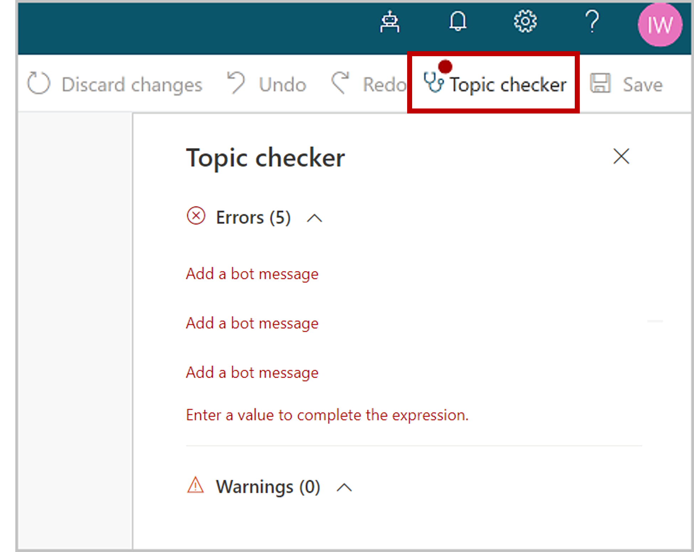
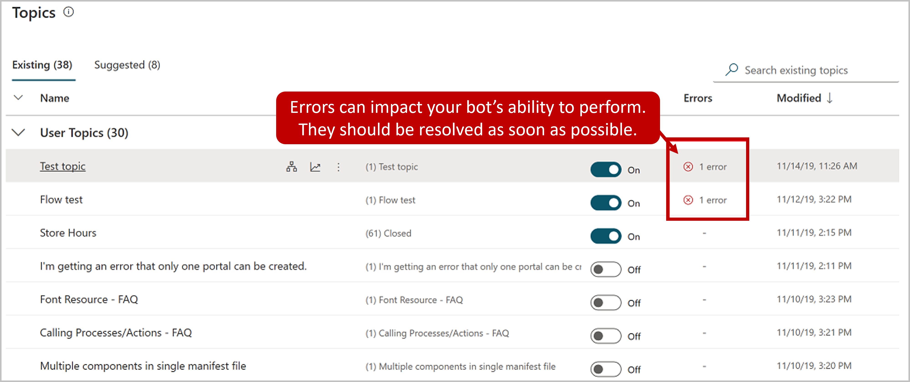
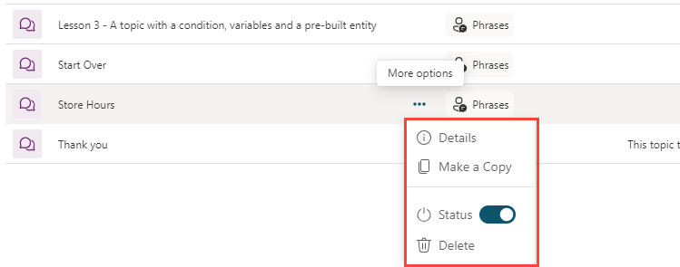

As the number of topics in your copilot grows, it becomes more important be able to effectively manage them. This includes understanding which topics are active and can be used by the copilot, and which ones are still being worked on. Topic management also includes identifying errors that could affect a topic's ability to be used. To help you to effectively manage topics, Microsoft Copilot Studio provides multiple features that help ensure topics are working as intended, and only visible to end users after they have been tested and are ready.

## Manage topic status

Each topic has a status that indicates if the topic can be used in conversation. Non system topics can either be on or off. System topics such as the Greeting, Goodbye, and Escalate topics, are always on and can't be turned off. When a topic is on, it triggers as expected. This could be the result of its trigger phrases or from being redirected to it from another topic. Most topics are in the on state. All topics are set to on when they're created.

> [!div class="mx-imgBorder"]
> 

Topics that are off don't trigger at all. Off topics' trigger phrases don't work, and they aren't redirected to, even if another topic has specified it. The topic is treated as if it doesn't exist. In most scenarios, a topic is set to off while being worked on until it's ready to go live. When a copilot is published, every topic, regardless of whether it's set to on or off, is published. However, any topics that are set to off aren't triggered.

## Work with topic errors

While working on a topic, Microsoft Copilot Studio’s Topic Checker validates your topic and shows any errors or warnings. Errors or warnings can occur for any number of reasons. Warnings indicate that something isn't ideal, but it doesn't prevent the copilot from functioning. Since warnings don't prevent the copilot from functioning, they're ignored while processing. Errors on the other hand need be addressed to avoid unexpected behavior or failure during the chat experience. Errors might occur if a node in your topic is incomplete. For example, not providing a message in a message node, or authentication issues with a Power Automate flow that is being launched in an action are both examples that would cause for errors. The Topic Checker provides details related to the warning or error to make it easier to resolve the issue.

> [!div class="mx-imgBorder"]
> 

There are four types of errors that appear in the topic checker and in the authoring canvas:

- **Node**: The entire node is erroneous and is highlighted red.

- **Field**: The field might be missing required data and is highlighted red.

- **Expression**: The expression might be invalid and is highlighted red.

- **Variable deletion**: A variable in a topic was deleted and is highlighted red wherever it was used. This causes the variable to become "orphaned," and it must either be removed or replaced.

You can also see the error state of a topic on the Topics list page by clicking on the Topics tab. The Errors column indicates the number of errors found during validation. This only indicates errors and doesn't include warnings, since they don't prevent the copilot from functioning. As you fix the errors, they'll disappear from the topic checker, either automatically or after saving the topic. Topics with errors can be saved, however, the errors persist until they're addressed. You can't deploy a topic containing errors to production.

> [!div class="mx-imgBorder"]
> 

## Copy a topic

Once you've created a few topics, you might want to use a previous topic as a baseline when creating new topics. Copying topics saves time a conversation path is already defined. You just need to modify the trigger phrases, and tailor the conversation path to fit your need. On the topic list page, hover on a topic, select the menu icon, and then Make a copy. This creates a duplicate of the selected topic with *(Copy)* appended to the name. All topic content, such as the description, trigger phrases, and the entire conversation, is copied over to the new topic.

> [!div class="mx-imgBorder"]
> 

The new topic appears in the User topics list. All copied topics have a status of Off by default to avoid confusion on which topic triggers, since it has the same trigger phrases as the original topic. Once you have finished editing the new topic, you can turn it On to [test it in the Test copilot](/power-virtual-agents/authoring-test-bot/?azure-portal=true) window and, when ready, publish the new topic.
