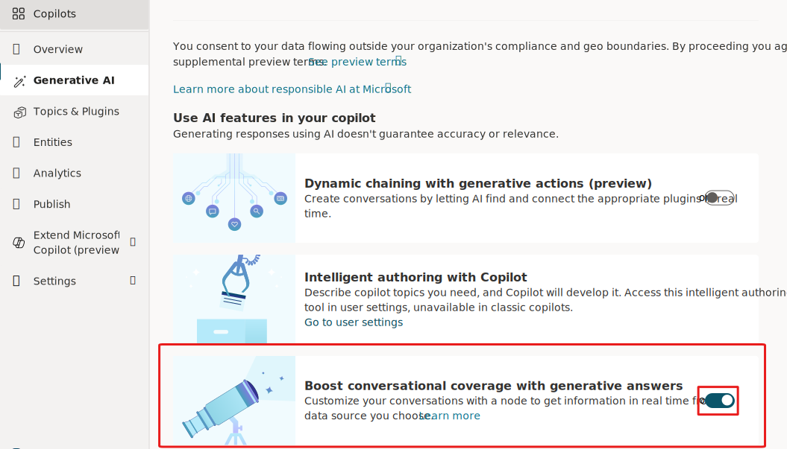
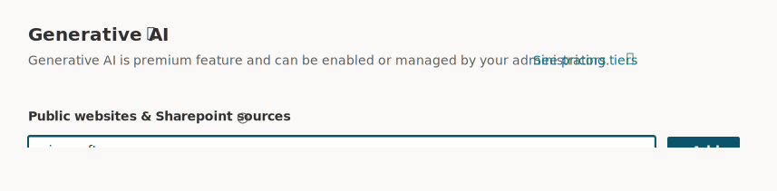
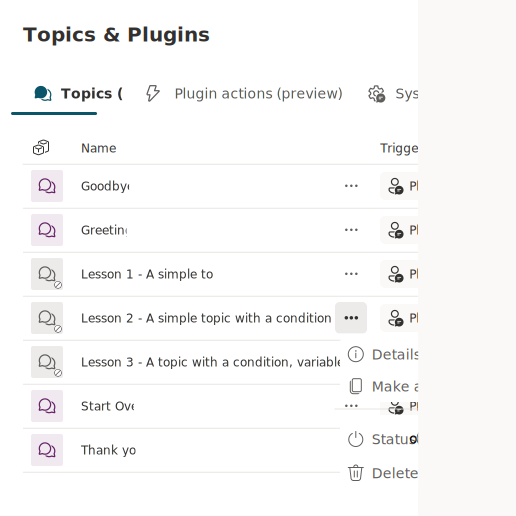
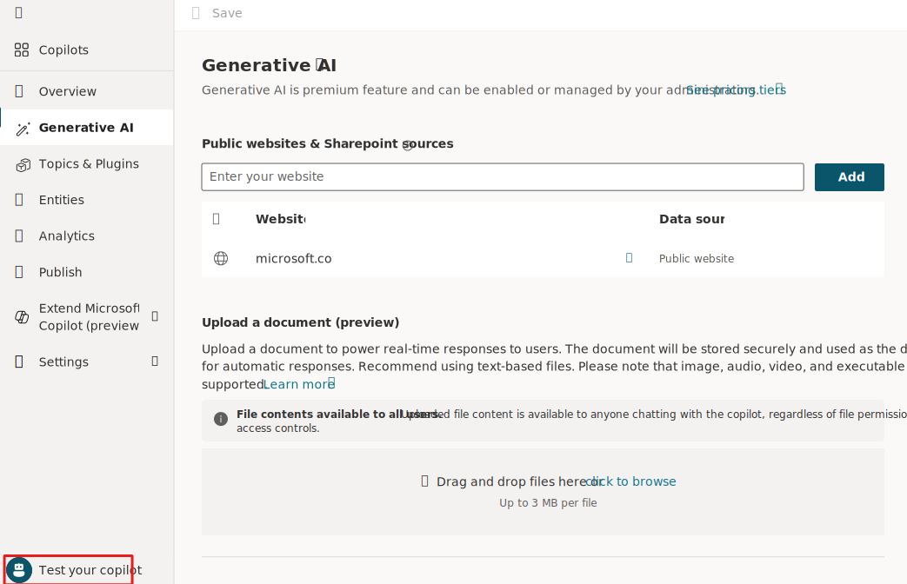
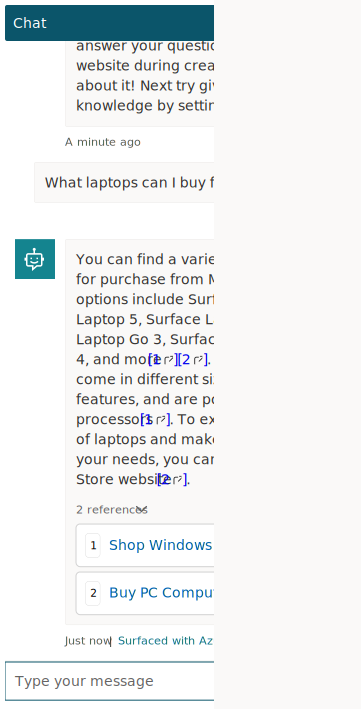

With Microsoft Copilot Studio's generative answers feature, your copilot can retrieve and present information from various internal or external sources without the need for creating specific topics. These answers can serve as the primary source of information for your chatbot or as a fallback when preauthored topics can't address a user's inquiry. This allows for the quick creation and deployment of a functional bot without the need to manually author multiple topics that might not meet your customer's needs.

What is especially important, and why we introduce it before anything else, is to help makers consider what data sources are available that can summarize answers to possible customer or employee questions. Depending on those data sources and if you can use them within Copilot Studio could mean that based on your use case, you might be able to focus on a smaller set of topics to author using the authoring canvas and deliver value to your customers or employees quicker.

1. With your Copilot open in Microsoft Copilot Studio, select 'Generative AI' on the sitemap.

1. Ensure 'Boost Conversational Coverage with generative answers' toggle button is set to 'Yes,' as shown here.

   > [!div class="mx-imgBorder"]
   > 

1. Enter a public facing website in the 'Public websites & Sharepoint sources' text box. For this lab, use `microsoft.com`.

   > [!div class="mx-imgBorder"]
   > 

1. Select **Add**.

1. Select **Save** at the top of the window.

1. Select **Topics** from the sitemap.

1. Select all topics that begin with 'Lesson.' (If you don't have any starting with 'Lesson,' ignore this step.) Turn off those topics by selecting the extended menu '...' when hovering over a topic name, and setting the status flag to off, as shown in this screenshot.

   > [!div class="mx-imgBorder"]
   > 

1. Now open the test panel in Microsoft Copilot Studio, which can be found in the bottom left of the screen, as shown here.

   > [!div class="mx-imgBorder"]
   > 

1. In the test panel, ask the question 'What laptops can I buy from Microsoft?'

1. You should get a generated response based from the data available on the Microsoft.com website. An example of a generated answer is in this screenshot:

   > [!div class="mx-imgBorder"]
   > 

1. You can ask more questions in the test panel and monitor what types of response you get.

This task covered the Generative Answers feature in Copilot Studio. It allows your copilot to find and present information from multiple sources, internal or external, without having to manually author a topic. This functionality can be used as the primary behavior for your chatbot or as a fallback when authored topics are unable to address the user's question.

This fundamentally changes the way that conversational experiences are created. This lab goes through considerations on what use cases you're considering from your business that could be addressed with a copilot or bot experience. Now understanding the fundamentals of Generative Answers, you can think about the datasources that might hold key information. And you can think about whether you can connect and use the data within Copilot Studio, so you can focus on a smaller number of topics to be able to meet your target users need.

For example, your workflow might now look like this:

1. You create a bot and enable the Generative Answers feature, then test it thoroughly

1. After testing, you publish your bot to provide instant answers, assistance, and guidance to your customers or bot users

1. You create individual topics for the most important or frequently asked questions from your customers, based on analytics from previous bots or existing support issues

This workflow might require some time and specialized knowledge, but with generative answers enabled, your bot is up and running from day one.

To learn more about this specific feature, see the Microsoft Documentation on Generative Answers:

- [Generative answers](/microsoft-copilot-studio/nlu-boost-conversations/?azure-portal=true)

- [Generative answers with Search and summarize](/microsoft-copilot-studio/nlu-boost-node/?azure-portal=true)
