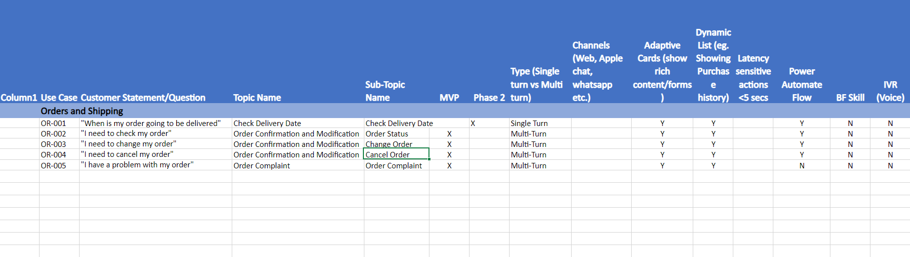

A key part of requirements gathering is topic generation. We recommend that you work with your company to determine the topics of importance to focus on based on your ideation exercise outcome.

For this session, and for the fictional use case of Contoso Coffee, you can write down what the key topics could be based on the data outlined in the previous section's scenario. This action promotes critical thinking and supports you in becoming more experienced in business analysis and requirements gathering. In a real-world scenario, teams would have meetings where everyone can ask questions of key stakeholders, and they’d have access to internal systems to suggest topics or provide automated analytics or generation to help accelerate this process.

1. Open the **Requirements gathering spreadsheet** from the **Bot Building Handbook**, as shown in the following screenshot.

   > [!div class="mx-imgBorder"]
   > 

1. Review the sample data that the spreadsheet is populated with. Note how the data is presented, showing key data within the columns that relates to each topic in the row.

1. Regarding Contoso Coffee, determine the key categories or use case areas that require an authored topic. An example is shown in the previous scenario, where Contoso Coffee expressed that they want customers to have the ability to ask about order status. In that case, a category could be **Orders and Shipping**. Create new sections in the spreadsheet (or tabs) to lay out the different categories (as shown in the blue highlighted rows within the spreadsheet, showing **Billing and Payments** or **Orders and Shipping**).

1. Now that you have key categories, you can identify the list of topics for each category and what a typical customer/user question might be in that topic. You can enter more than one question, and you might want to divide this question into sub topics, as shown in the sample template, depending on how detailed or lengthy your requirements gathering exercise might be. Complete this task for all topics in all categories that you identified. An example of a topic within the sample data is "I need to pay an invoice."

For example, from the previous step, a common customer question under the **Order and Shipping** category might be **What is the status of my order?**, and the topic name might be **Check Order Status**.

> [!TIP]
> No wrong way exists for completing this task, except not logging anything at all. Commonly, makers might skip this stage because these tasks might seem too basic and time-consuming. However, as discussed in the Bot Building Handbook (and in the Introduction presentation, if you’re working through these documents as part of instructor-led training), the requirements gathering process is critical for success during bot creation. This process is where you begin to determine true value for the people whom you’re building bots for through these exercises.

Now that you determined core categories and key topics, you can complete the remainder of the spreadsheet.

1. Open the [**Requirements gathering spreadsheet**](https://github.com/MicrosoftDocs/mslearn-developer-tools-power-platform/blob/master/in-a-day/PVA/PVA_Req_Template_Contoso_Coffee.zip) from the **Bot Building Handbook**. (You should still have this spreadsheet open from the previous task.)

1. Now that you have your categories, topics, subtopics, and customer phrases, you can break down what's critical for the minimum viable product (MVP) delivery and what can be delivered in phases afterward. Select those items that are needed for MVP delivery in the MVP column in the spreadsheet.

1. Determine which topics are single-turn or multi-turn. Single-turn topics provide one single answer for a question. Multi-turn topics allow a customer or user to have an extended conversation by asking further questions on the topic that the bot provides answers for. Complete the other columns in the spreadsheet for those topics that are identified as multi-turn, for example:

    - Goal of the topic

    - What you need from the user in this topic

    - What you need from a data source in this topic (refer to the next section for extended questions in this area)

    - Data that needs to be secured

    - Exit conditions for each goal

1. Consider the channels that are needed for this topic (Microsoft Copilot Studio doesn't support all channels). For more information on the channels that you can use with Microsoft Copilot Studio, see [Key concepts - Publish your bot](/microsoft-copilot-studio/publication-fundamentals-publish-channels?tabs=preview/?azure-portal=true).

1. Consider whether any topics need to get data from a data source. If so, determine where that data is stored and if you could use Microsoft Power Automate to get that data.

At this stage, you completed the basics for requirements gathering by using the template. If you have more time or want to return to this section later, extended scenarios and more data are available for you to complete in this spreadsheet. These extended scenarios and data are outlined in the extra practice section in this module. This practice section covers more in-depth areas, such as how to know when to extend Microsoft Copilot Studio with code, conversational design in Microsoft Visio, and stakeholder approval.
