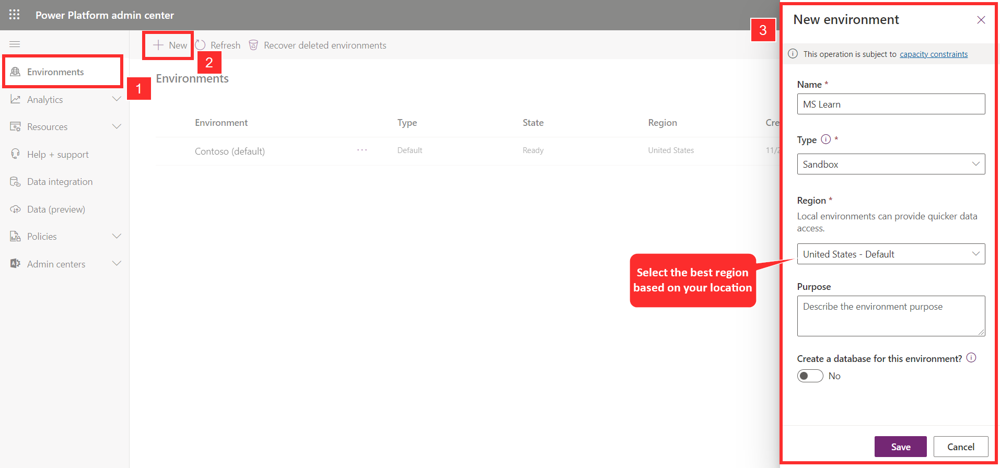

You can obtain a trial license to assist you in completing training and evaluating the product by going to [trial environment](https://powervirtualagents.microsoft.com/?azure-portal=true). Select **Start free** to begin a Microsoft Copilot Studio trial.

> [!NOTE]
> You will need to sign in with a work email address because personal Microsoft accounts are not currently supported.

## Define how to work with environments

Today, many organizations have a global presence and provide service to customers in multiple regions, countries, or continents. This aspect can result in needing different types of interactions based on factors such as different data being available and resolutions that are based on departments or locations. Your organization might need to deploy similar copilots in different regions that interact with systems and data for those areas. Microsoft Copilot Studio accommodates this occurrence by letting you create copilots in different environments and switch between them.

Environments represent space to store, manage, and share your organization's business data. Each copilot that you create is stored in an environment. Items like model-driven and canvas applications and Power Automate flows are also stored in environments. Each environment might have different roles, security requirements, and target audiences. Individual environments aren't created in Microsoft Copilot Studio; they're created in a separate location. After you have created an individual environment, Microsoft Copilot Studio copilots can be created in that environment.

Depending on business needs, organizations can use environments in many ways, including:

- **Departmental** - By creating an environment that corresponds with specific organizational teams or departments, created copilots contain relevant information for that audience.

- **Locational** - Because the displayed data might be different based on geographic regions, you might define separate environments for different global branches of your company.

You only need multiple environments if your company is global and you're supporting regions with specific data privacy and storage requirements like China, Germany, the EU, Singapore, and so on. In that case, you need to establish environments for each region as you would for any other service that uses and stores data for customers in that region.

## Create environments

The first time that you sign in to Microsoft Copilot Studio and create a new copilot, a default environment is created. Unless specified otherwise, any other copilots are created in the default environment. If more environments are needed, such as for different regions, organizational needs, or other circumstances, they can be added through the [Microsoft Power Platform admin center](/power-platform/admin/create-environment/?azure-portal=true).

When in the admin center, you can add environments by going to the **Environments** tab and selecting **New** to open the new environment panel.

For each environment, you need to provide the following information:

- **Name** - A unique name for the environment.

- **Environment** - Defines the type of environment to create, such as production, trial, or sandbox.

- **Region** - Defines the [support data region](/power-virtual-agents/data-location/?azure-portal=true) where the environment is created.

> [!div class="mx-imgBorder"]
> 

If you want to have a Microsoft Dataverse database created for the environment to use entities like accounts, contacts, and other business-related data, you can set the **Create a database for this environment** field to **Yes**. Additionally, you should select **Yes** if you're using Microsoft Copilot Studio with other Dynamics 365 applications. Data from Dataverse can be used in copilots to provide tailored customer experiences. After the Dataverse database has been created, new copilots can be deployed to the environment from the Microsoft Copilot Studio portal.

For more information, see [creating environments](/power-virtual-agents/environments-first-run-experience?azure-portal=true#create-a-new-environment-for-your-bots).
