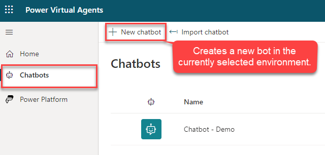

Before you start Copilots, it's important to consider what it's used for. For example, you might use it to handle account inquiries, or you could use it for self-service support cases such as knowledge base access. Knowing how you plan to use the copilot helps you define and plot out conversation paths and determine how many topics the copilot will handle. Other functions that you could consider include using it to look up basic account details, perform more advanced account operations, or implement some type of action. The more scenarios that you initially consider, the easier it's to determine the topics that your copilot needs for you to facilitate it.

You can create copilots by selecting the copilot icon in the Microsoft Copilot Studio interface. Copilots are created for each environment. By default, all copilots are created in the [default Power Apps environment for your organization or tenant](/power-virtual-agents/environments-first-run-experience/?azure-portal=true), unless otherwise specified. You can choose which environment that you want to use by selecting **more options** to see a list of available environments.

> [!div class="mx-imgBorder"]
> 

In the **Create a new Copilot** dialog box, enter a name for your copilot. Select **Create** to begin the copilot-building process, which can take up to 15 minutes for the first copilot that you create in an environment. You can also use generated answers in your copilot, by selecting a website to attach to.

> [!div class="mx-imgBorder"]
> 

## Delete a Copilot

Copilots that are no longer needed can be removed from your environment. This situation might occur when the copilot is being replaced with a different copilot, or if the copilot no longer fits the needs of your organization. Using the copilots menu, select copilot that you want to delete. Select the **Delete** button on the command bar to delete the copilot.

> [!div class="mx-imgBorder"]
> 

## Work with the Microsoft Copilot Studio user interface

The Microsoft Copilot Studio user interface provides you with all the tools necessary to create, test, publish, and monitor the performance of your copilot. When the application is loaded after the copilot has been created, you see multiple areas that can help you throughout process of working with your copilot.

The following image shows an example of what the user interface looks like.

> [!div class="mx-imgBorder"]
> 

The following list describes the Microsoft Copilot Studio user interface features, as indicated in the previous image:

1.  **Environment Settings** - Provides access to different Microsoft Copilot Studio settings, such as fallback topics and transfer to agent settings.

2.  **Copilots**- Provides you with access to the main copilots page where all your copilots are displayed.

3.  **Overview** – Provides access to the home screen of the current copilot that you're working with.

4.  **Generative AI** – Provides access to Generative AI features that are available for your Copilot.

5.  **Topics & Plugins** - Provides access to the different topics & Plugin actions that are available for the copilot.

6.  **Entities** - Provides access to all prebuilt and custom entities that are available to be used by the copilot.

7.  **Analytics** - Provides analytical details that are related to the performance and usage of the copilot.

8.  **Publish** - Provides tools for publishing your copilot and deploying it to different channels.

9.  **Extend Microsoft Copilot –** Provides access to create and import Conversational and AI Plugins that can be used in your Copilot.

10. **Settings** - Toolset that helps with management items such as which channels your copilot is deployed to, copilot authentication, and skills management.

11. **Test/Hide copilot** - Opens the **Test copilot** dialog box, where you can engage with copilot topics in real time.

12. **Test copilot panel** - Lets you test your copilot topics to ensure that  they're performing as expected.