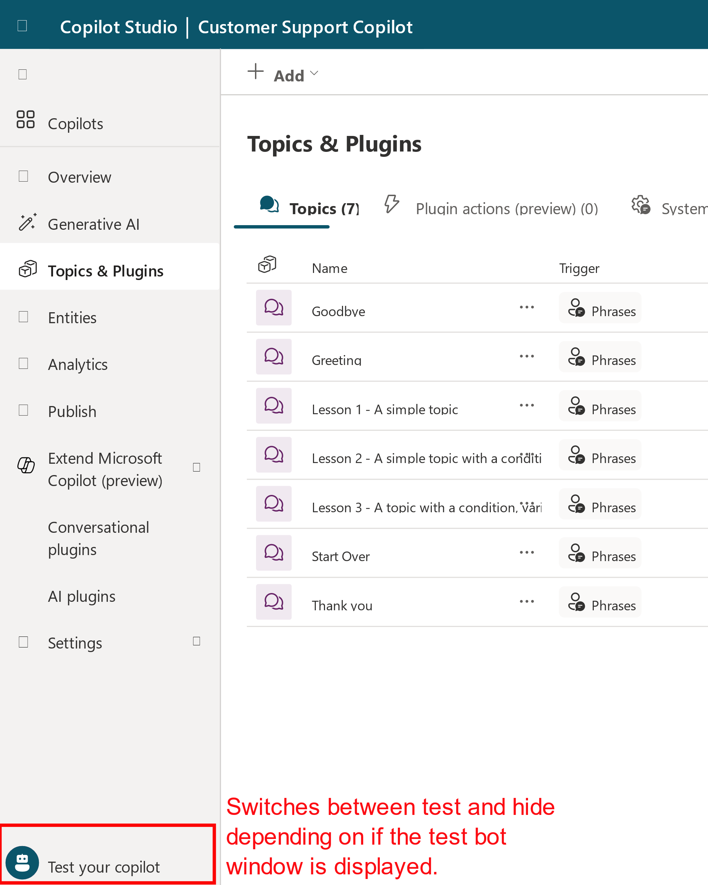
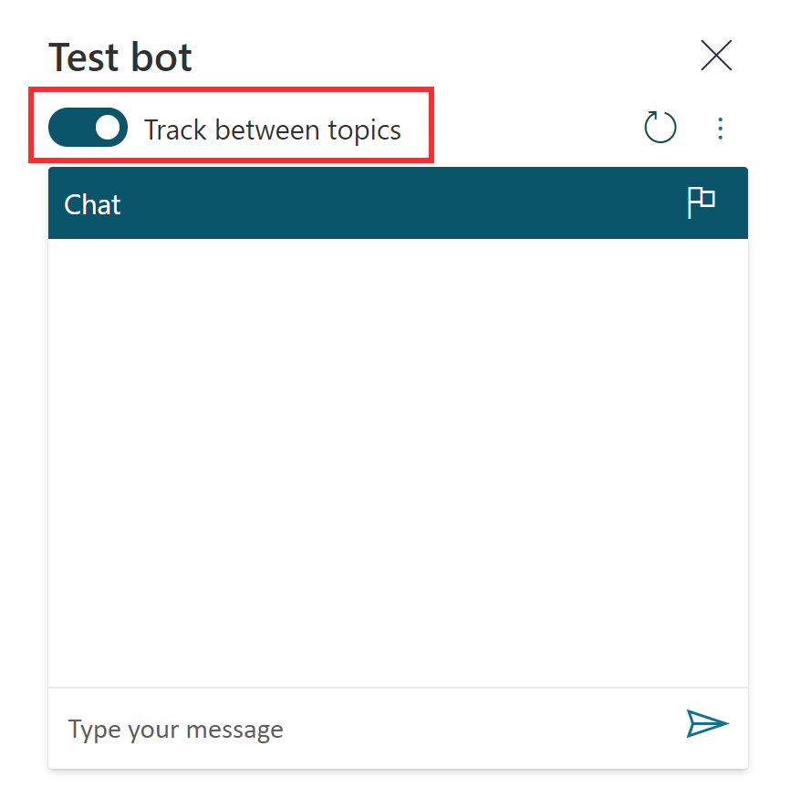
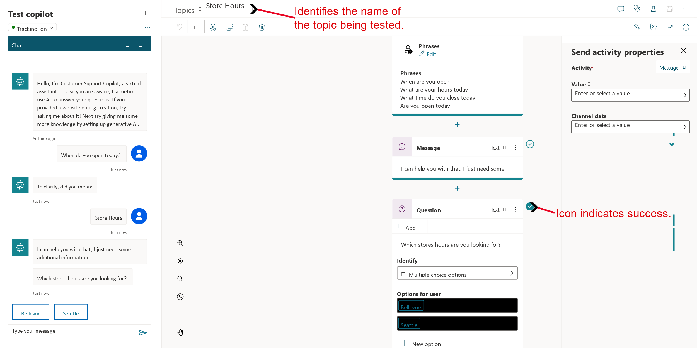

Because a copilot is made up of multiple topics, it's important to ensure that each topic is working appropriately and can be interacted with as intended. For example, if you want to make sure that your Store Hours topic is triggered when someone enters text asking about store hours, you can test your copilot to ensure that it responds appropriately.

You can test your copilot in real time by using the test copilot panel, which you can enable by selecting **Test your copilot** at the bottom of the side navigation pane. When the panel displays, the button name changes to **Hide your copilot** so that you can hide it if more space is needed during the design process.

> [!div class="mx-imgBorder"]
> 

The **Test copilot** window interacts with your copilot topics just as a user would. As you enter text into the test copilot window, information is presented as it would be to a user. Your copilot likely contains multiple topics. As you engage with a specific topic, it might be handy to have the application take you to that topic. You can accomplish this task by setting **Tracking** to on at the top. This option follows along with the copilot as it implements the different topics. For example, typing "hello" would trigger the Greeting topic, and then the application opens the Greeting topic and displays its conversation path in the window. If you type "When are you open?" the application switches to display the Store Hours topic. As each topic is displayed, you can observe how the path progresses, which helps you evaluate how your topics are doing.

> [!div class="mx-imgBorder"]
> 

The following image shows the "When are you open?" message has been sent to the copilot. Notice that you're automatically taken to the Store Hours topic. The conversation path is highlighted in green. The copilot is now waiting for you to respond and has provided two suggestion buttons on how to respond. These suggestion buttons reflect the Seattle and Bellevue user options that were defined when the topic was previously created. In the test copilot, you can select either of these suggestion buttons to continue.

> [!div class="mx-imgBorder"]
> 

As you select an option, you continue down the conversation path until you reach the end. The chat stops when you reach the bottom of this branch.

By testing your copilots often throughout the creation process, you can ensure that the conversation flows as anticipated. If the dialog doesn't reflect your intention, you can change the dialog and save it. The latest content is pushed into the test copilot, and you can try it out again.