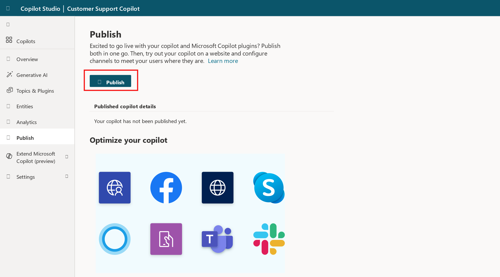
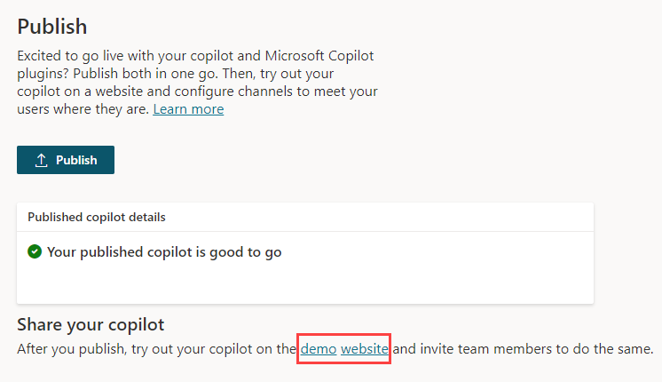
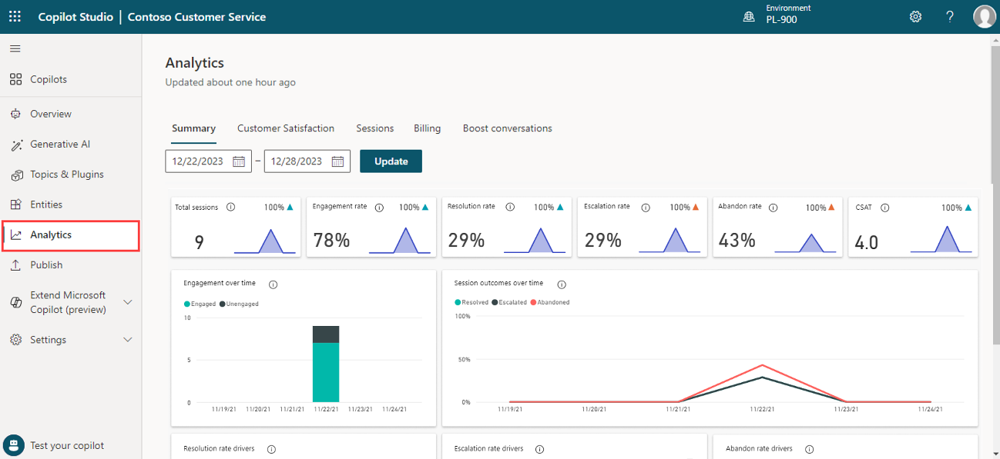

After your copilot content has been created, it needs to be published so that customers can engage with it. Published copilots can be made available across multiple platforms and channels. Before a copilot can be added to channels, interacted with, or used by team members, it needs to be published at least once. For example, a copilot can be deployed to organizational websites, mobile applications, and messaging platforms such as Microsoft Teams or Facebook.

Publishing copilots as you make changes also ensures that customers are engaging with the latest copilot content. For example, if your organization's store hours change, after you have edited the Store Hours topic to reflect the changes, you need to publish it again from within the Microsoft Copilot Studio portal. After the copilot has been published again, the updated content is used by all channels that the copilot is configured on.

## Publish a copilot

When you're ready to publish your copilot, select the **Publish** tab on the side navigation pane. During the publishing process, the copilot is checked for errors. Copilot publishing typically takes a few minutes. When the publish is successful, the top of the page displays a green banner indicating that everything worked correctly. If errors are detected, you're notified through a message that is displayed in the application.

> [!div class="mx-imgBorder"]
> 

Before the copilot is deployed to the different channels that use it, you might want to gain feedback from other team members. When a copilot is first published, it can be made available to the demo website. You can provide the demo website's URL to team members or stakeholders to try it out. The advantage
of using the demo website is that the experience is different than testing the copilot during the design process. The test copilot experience is only intended
to allow copilot authors to test it. So the demo website link increases the pool of users that can test and provide feedback that is related to the overall experience of the copilot.

To add a copilot to the demo website, select the demo website link under **Share your copilot**. This webpage demonstrates what your copilot looks like to a user who comes to your webpage. The copilot canvas is at the bottom. You can interact with it by entering text in the window or by selecting a starter phrase from the provided options.

> [!div class="mx-imgBorder"]
> 

Now that the copilot is published, you can begin to deploy it to other channels.

For more information, see [publishing your copilot](/power-virtual-agents/publication-fundamentals-publish-channels/?azure-portal=true) to other channels.

## Analyze the performance of your copilot

After a copilot is deployed and customers are interacting with it, statistics that are related to the copilot will become available. You can access this information through the **Analytics** tab in the side navigation pane. This pane provides key performance indicators (KPIs) that show:

- The volume of sessions that your copilot has handled

- How effectively your copilot was able to engage users and resolve issues

- Escalation rates to human agents

- And abandonment rates during conversations.

You can also find customer satisfaction information at the KPI level and in the **Customer Satisfaction** tab.

> [!div class="mx-imgBorder"]
> 

You can view detailed session history and transcripts by selecting **Sessions** from the **Analytics** tab. This option enables you to download a file with the full session transcript. It can be a helpful way for you to adjust the performance of your copilot and change the content in your topics to improve your copilot's efficiency.