Welcome to the Contoso Retail Company! We specialize in all the world's retail needs, and with you as our newest Customer Support team member, we have no doubt that together we reach higher levels of success and innovation!

Consumer sentiment is at an all-time high. But with increasing competition, it's more important than ever to minimize costs and focus on customer satisfaction. We need to maintain our competitive edge in having a robust customer base, while continuing to invest back into the customer experience and maximize our customer lifetime value.

Customer support costs have continued to rise as the customer base has grown, and the company can no longer continue to expand the Customer Support team. You have been tasked with finding a solution using Power Virtual Agent.

## Exercise: Build your first copilot

In this exercise, you go through the steps of creating, deploying, and testing your first copilot to handle a common customer request.

### Task: Sign in to create a copilot

1. Go to [https://powerva.microsoft.com/](https://powerva.microsoft.com/?azure-portal=true) and select **Sign in**. Sign in with your own work or school account.

   > [!div class="mx-imgBorder"]
   > [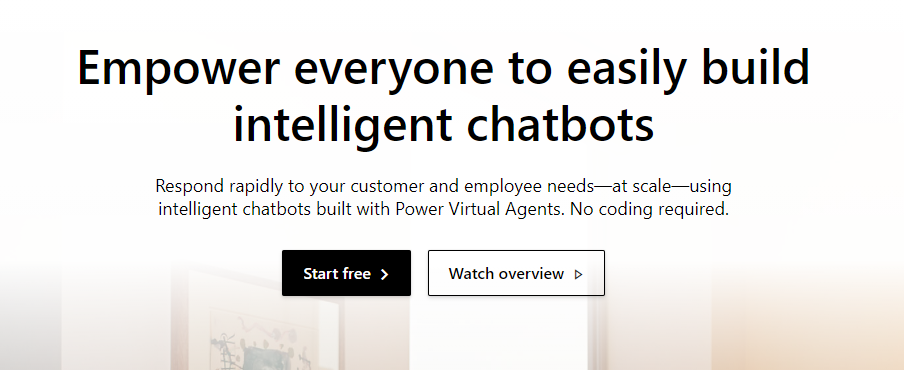](../media/lab-1.png#lightbox)

1. Select the region/country and select **Start free trial** or **Get Started**.

   > [!div class="mx-imgBorder"]
   > [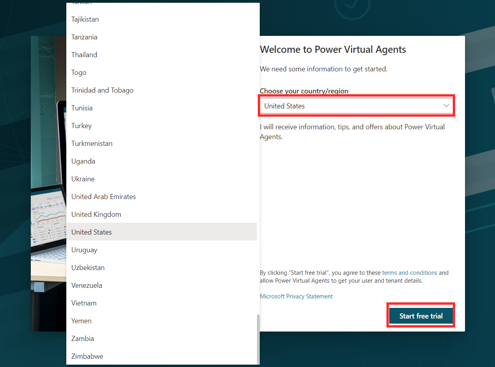](../media/lab-2.png#lightbox)

1. Name your copilot anything you like (such as "Contoso customer service"). Select the **Language**, an **Environment**, and then select **Create**. From here, you can also create a new environment. A copilot environment is where your organization stores, manages, and shares the copilot, business data, apps, and Power Automate flows.

   > [!div class="mx-imgBorder"]
   > 

   > [!NOTE]
   > Once you select **Create**, the process of creating the first copilot within a new environment can take up to 15 minutes. Subsequent copilots will be created much faster.

After you create your copilot, it appears in the list under the copilot icon on
the navigation bar.

> [!TIP]
> If you've created a copilot in this environment before, to create another copilot select the robot icon on the navigation bar, and then select **New copilot**.

### Task: Take a quick tour of the user interface

Microsoft Copilot Studio makes it easy to build your copilot without ever writing a line of code. Let's take a quick tour of the seven main pages:

> [!div class="mx-imgBorder"]
> [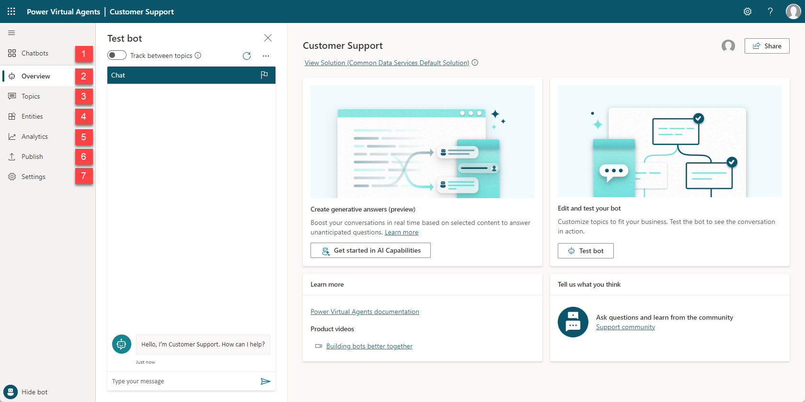](../media/lab-4.png#lightbox)

1.  **Environment Settings** - Provides access to different Microsoft Copilot Studio settings, such as fallback topics and transfer to agent settings.

2.  **Copilots**- Provides you with access to the main copilots page where all your copilots are displayed.

3.  **Overview** – Provides access to the home screen of the current copilot that you're working with.

4.  **Generative AI** – Provides access to Generative AI features that are available for your Copilot.

5.  **Topics & Plugins** - Provides access to the different topics & Plugin actions that are available for the copilot.

6.  **Entities** - Provides access to all prebuilt and custom entities that are available to be used by the copilot.

7.  **Analytics** - Provides analytical details that are related to the performance and usage of the copilot.

8.  **Publish** - Provides tools for publishing your copilot and deploying it to different channels.

9.  **Extend Microsoft Copilot –** Provides access to create and import Conversational and AI Plugins that can be used in your Copilot.

10. **Settings** - Toolset that helps with management items such as which channels your copilot is deployed to, copilot authentication, and skills  management.

11. **Test/Hide copilot** - Opens the **Test copilot** dialog box, where you can engage with copilot topics in real time.

12. **Test copilot panel** - Lets you test your copilot topics to ensure that they're performing as expected.

## Exercise: Try out a conversation in the Test Bot pane (Hello!)

Now let's try out the bot using one of the four prebuilt lessons included when you create a new bot.

> [!div class="mx-imgBorder"]
> [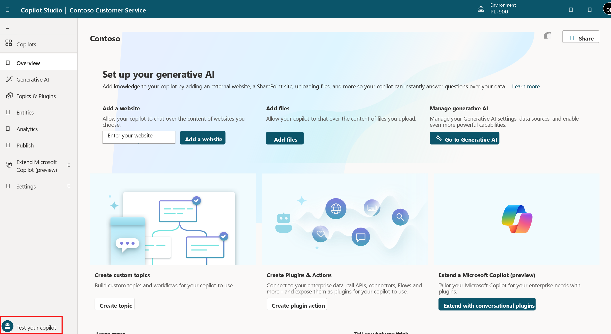](../media/lab-5.png#lightbox)

1. To show the Test bot, in the bottom-left corner of the screen, select Test your copilot. (If the button says "Hide copilot," then your Test bot is already showing.) At the top of the Test copilot, turn on **Tracking**.

1. At the **Type your message** prompt at the bottom of the Test copilot, type: **Hello** and then select the **Send** button.

   > [!div class="mx-imgBorder"]
   > [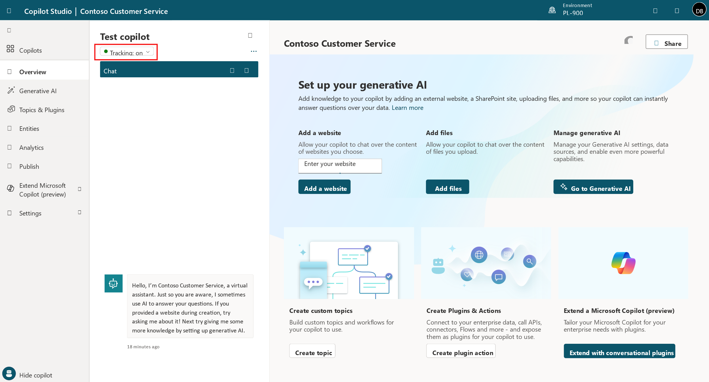](../media/lab-6.png#lightbox)

   The copilot offers a greeting in the Test copilot pane.

   Additionally, the **Topics** page opens (no matter which page you were on before) and you can see the greeting topic open in the authoring canvas window, with green outline and a checkmark added for each part of the conversation design when it's used in the test chat. (This is what the **Tracking** feature does; if you didn't turn this on, you don't see any changes to the page selection and you see the green highlights in the greeting topic only if you already opened it from the Topics page.)

   > [!div class="mx-imgBorder"]
   > [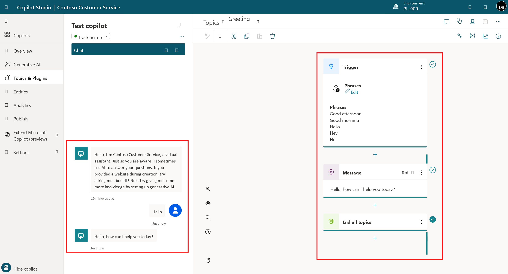](../media/lab-7.png#lightbox)

1. In the Test copilot, enter the following message and press **Send**: **stores near me**.

   Notice that a new topic opens in the authoring canvas. You have triggered one of the prebuilt topics (Lesson 2).

   Now, in the test chat, pick the store location you want.

   > [!div class="mx-imgBorder"]
   > [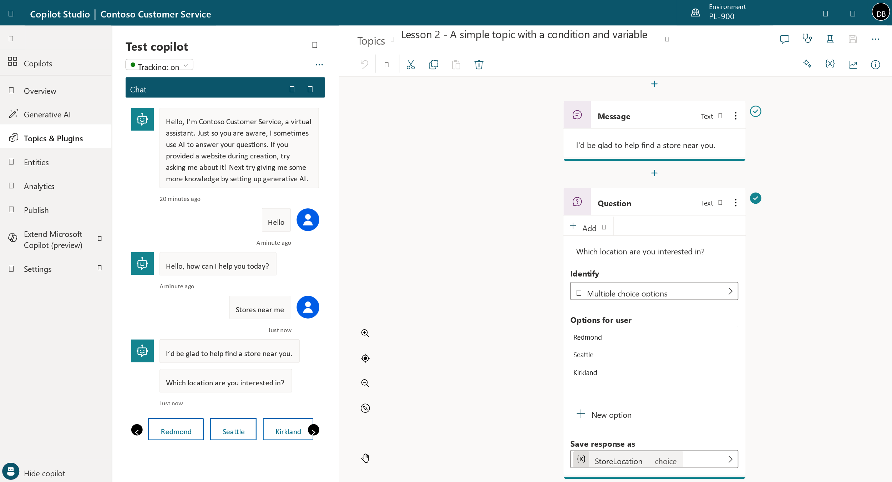](../media/lab-8.png#lightbox)

## Exercise: Edit your conversation

Now, let's make a change to that conversation by adding another store location. We make a copy first so that later you can go back to the Lessons as they were written if you want to.

### Task: Make a copy of the topic

1. At the bottom left of the page, select **Hide copilot** to put the Test copilot out of your way for now.

1. Toward the top left of the page, select the **Topics & Plugins** tab to open the **Topics** list.

1. Hover your mouse over the row for the prebuilt topic **Lesson 2 - A simple topic with a condition and variable**. Select the **More actions** icon,
    then **Make a copy**.

   > [!div class="mx-imgBorder"]
   > [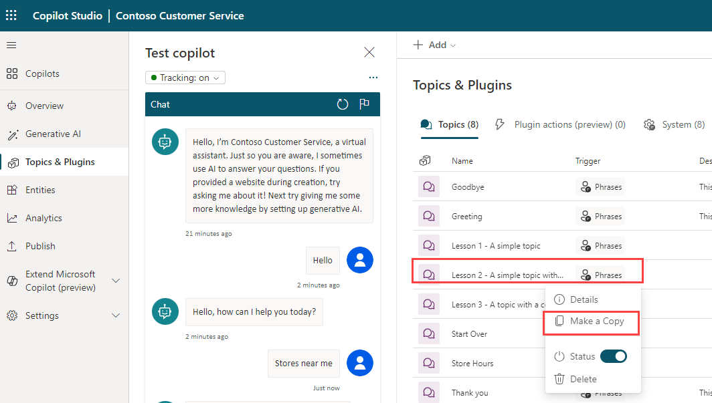](../media/lab-9.png#lightbox)

A copy of the topic appears at the top of the Topics list and its **Status** is set to Off. We turn it on later when we're ready to test our changes.

### Task: Edit the copy of the topic

1. Select the name of the copied topic (the one at the top of the **Topics** list) to open the topic.

   You're now looking at the **Setup** page for the topic. This page is where you enter the topic **Name** (which appears to your customers), **Description** (which doesn't appear to your customers but is for your own use), and **Trigger phrases** (we go into detail about trigger phrases later).

1. Select the current text in the **Name** field, delete it, and type to rename the topic to **Get store locations**.

1. Select **Save** in the upper right corner of the page.

   > [!div class="mx-imgBorder"]
   > [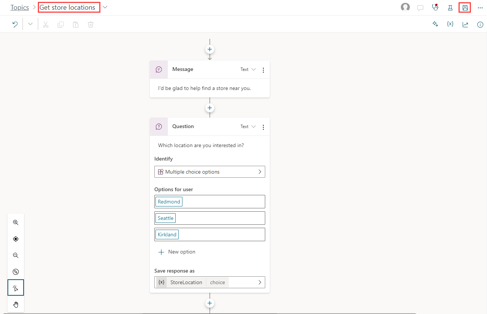](../media/lab-10.png#lightbox)

   Let's imagine you opened a new store in Bellevue. To add the store info to your copilot, you need to edit the topic design in the authoring canvas. The authoring canvas contains all the text and logic for the conversation about store locations. At the top, you see a reminder of the trigger phrases, which are added and edited on the **Setup** page.

   > [!div class="mx-imgBorder"]
   > [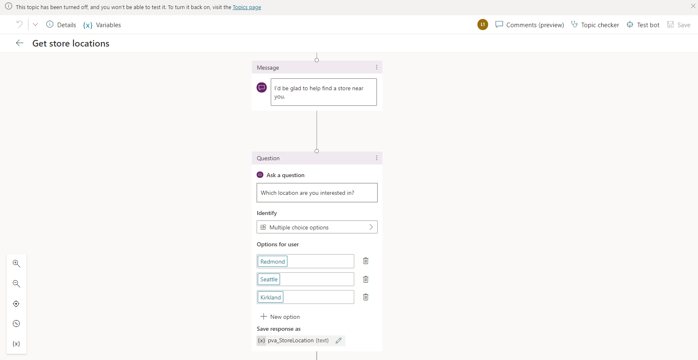](../media/lab-11.png#lightbox)

1. Scroll down the page to see the conversation design.

   Each of the connected boxes you see is called a "node." You can see that the copilot displays a message in a **Message** node that it's happy to help find a store location and then asks in a **Question** node which location the user is interested in. (You can reopen the test copilot to see that this is the same as the conversation you had in Exercise 2. Then close the test copilot again.)

1. Scroll to the Question node that asks "Which location are you interested in?" We're going to add another option here.

1. Under "Redmond" "Seattle" "Kirkland," select **+ New option**.

   > [!div class="mx-imgBorder"]
   > [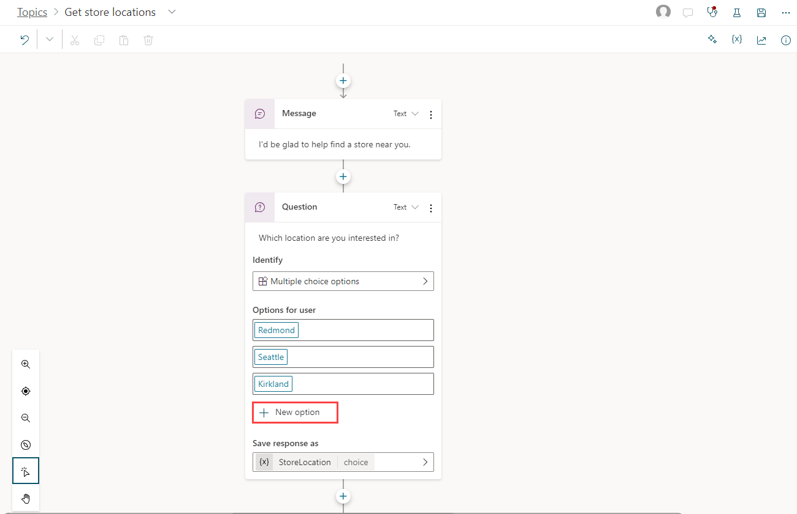](../media/lab-12.png#lightbox)

   A new **Condition** node is added under the Question node.

1. In the Question node (**NOT** in the Condition node), type **Bellevue** in the newly added empty box under **Options for user**.

   **Bellevue** is automatically added for you in the Condition node too.

   > [!div class="mx-imgBorder"]
   > [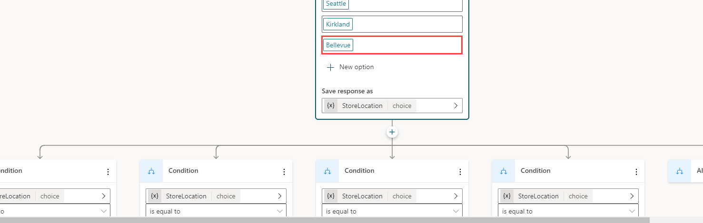](../media/lab-14.png#lightbox)

   > [!NOTE]
   > The **Options for user** section controls what buttons are visible to users in the chat window, and always need to be matched with a condition, or the button won't work. The Conditions, however, can handle the user typing something that is not shown in a button. So for instance if you wereto delete the Bellevue **Options for user** button, it would not delete the Bellevue Condition node, which would be used if the user types "Bellevue" when asked for a location.

   Now tell the copilot what message to display if the user selects **Bellevue**.

1. Select the + icon underneath the Bellevue condition node. From the options that appear, select **Send a message**.

   > [!div class="mx-imgBorder"]
   > [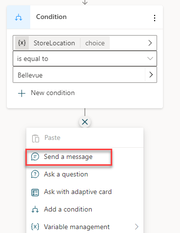](../media/lab-15.png#lightbox)

   This adds a new Message node connected to the Bellevue condition.

1. In the Message node, enter the store location info: **Our Bellevue store is in 1234 Bellevue Way, Bellevue, WA 98123**.

   > [!div class="mx-imgBorder"]
   > 

   > [!NOTE]
   > You can format the message text using the formatting buttons that appear while you're typing. You can even replace the name of the location with the value of the pva_StoreLocation variable by using the {*x*} control.

   You're now going to end the conversation. Since the conversation ends the same way no matter which location the user chose, we're going to link to a shared **End of conversation** node. This node starts the **End of conversation** system topic.

1. First, zoom out if necessary to see the **End of conversation** node on your screen. (**Zoom out** is in the utility bar on the left of the authoring canvas.)

   > [!div class="mx-imgBorder"]
   > [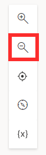](../media/lab-17.png#lightbox)

1. At the top right of the page, select **Save** to save the changes you made.

### Task: Turn on your topic and test your changes

You might recall that when we made a copy of the Lesson 2 topic, the copy was created in an Off state. This means you can't trigger the topic in the test copilot (and if you published your copilot, your users couldn't trigger it either). We're ready to turn on the edited topic now.

1. Select the **Topics** tab in the left navigation to return to the Topics list.

1. Select the **Status** toggle from On to **Off** for **Lesson 2 - A simple topic with a condition and variable** and select the **Status** toggle from Off to **On** for **Get store locations**. Now, you can test the conversation you edited.

   > [!div class="mx-imgBorder"]
   > [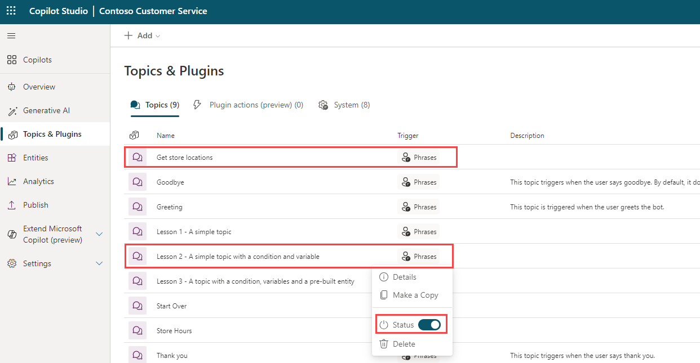](../media/lab-19.png#lightbox)

1. In the bottom-left corner of the page, select **Test your copilot**. Make sure the **Tracking** toggle is set to the **On** position. In the test copilot, enter **Is there a store near me?** and select the **Send** button.

   > [!div class="mx-imgBorder"]
   > [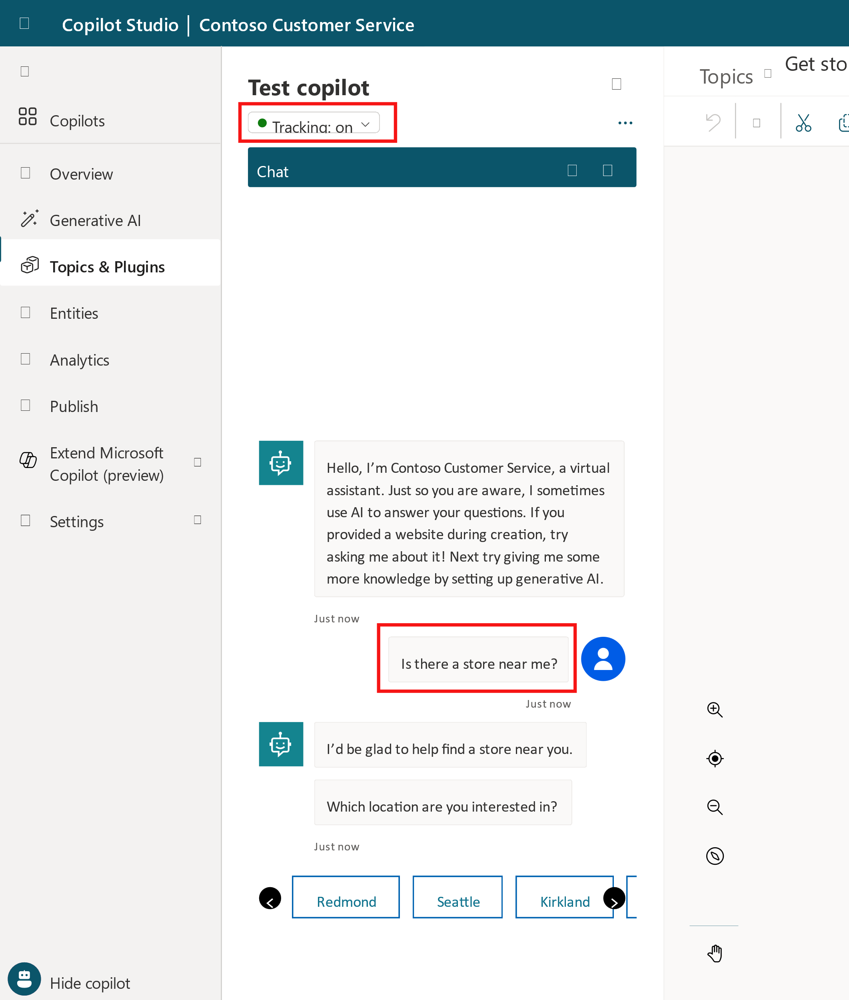](../media/lab-20.png#lightbox)

   Notice that even though it isn't exactly the same as the trigger phrases in the topic, "Is there a store near me?" works to trigger the topic because Microsoft Copilot Studio understands that it means the same thing as the trigger phrases.

1. When asked to select a location, select the **Bellevue** location in the test chat. (You might need to use the onscreen right arrow to see the Bellevue option.)

> [!div class="mx-imgBorder"]
> [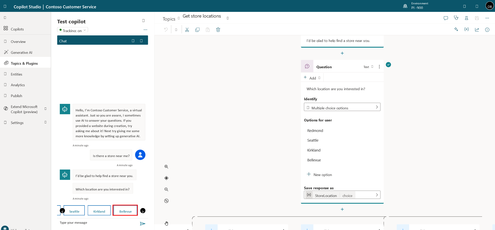](../media/lab-21.png#lightbox)

The copilot replies with location info for Bellevue store. Notice that the conversation continues in the **End of conversation** system topic. Feel free to keep chatting with the test copilot.

## Exercise: Publish your copilot to the demo site for testing

Microsoft Copilot Studio provides a demo website so that you can invite anyone to test your copilot by sending them the URL. This demo website is useful to gather feedback to improve the copilot content before you activate the copilot for your real customers.

1. Go to the **Publish** tab on the left navigation pane.

1. Select **Publish** to push the latest copilot topics to the demo website. You need to do this before you use the demo site the first time. You also need to publish after you make changes to the copilot topics that you want people to test on the demo website. (When you've created your real copilot, you publish each time you want to make updated topics available to your customers.)

   > [!div class="mx-imgBorder"]
   > [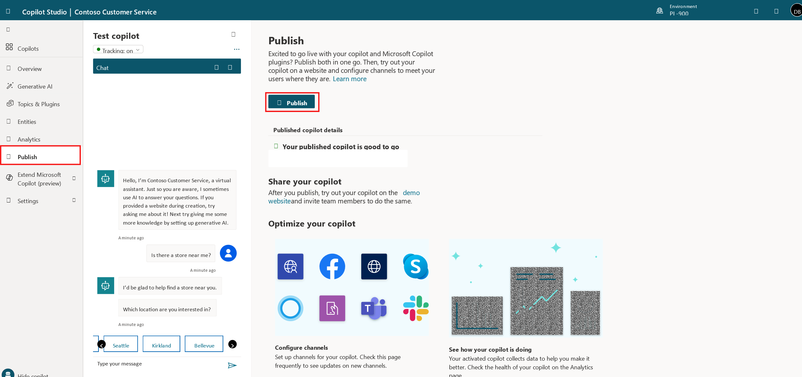](../media/lab-22.png#lightbox)

   The publishing process checks for errors in the copilot topics whose Status is On. Publication should take only a few minutes.

   You see a message at the top of the screen when publishing is complete.

1. Select the link for the **demo website**.

   > [!div class="mx-imgBorder"]
   > [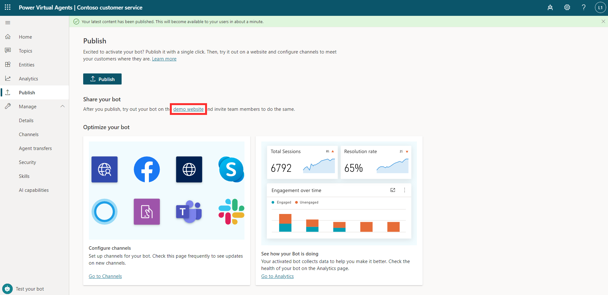](../media/lab-23.png#lightbox)

1. When the demo site window opens, you can interact with the copilot canvas by typing at the **Type your message** prompt or by selecting a starter phrase  from the provided options.

   > [!div class="mx-imgBorder"]
   > [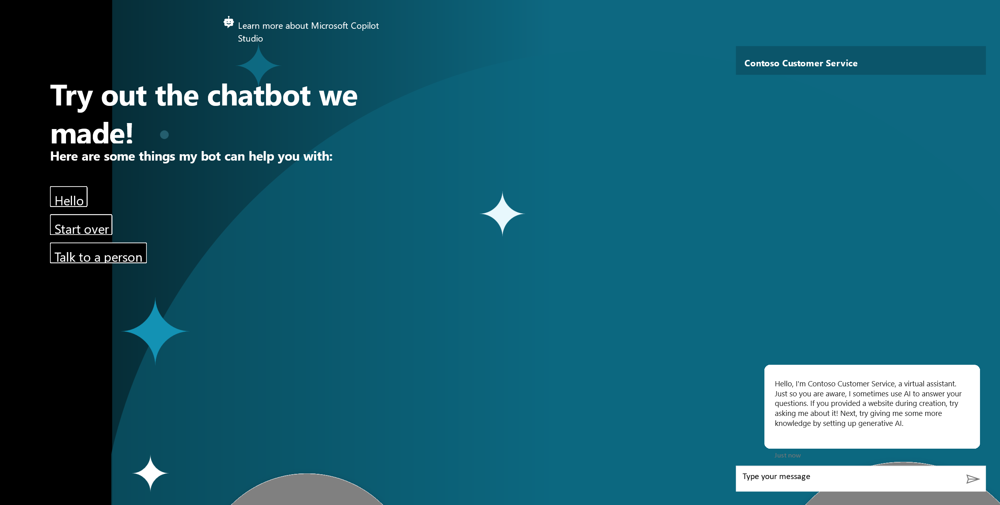](../media/lab-24.png#lightbox)

1. You can share the URL of the **demo website** with your team.

Congratulations! You have built and published your first copilot!
