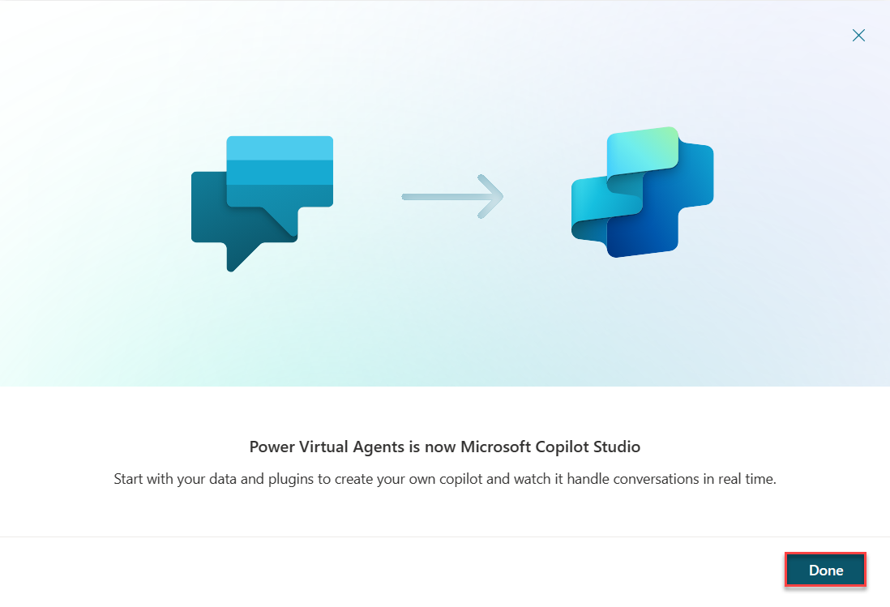

Microsoft Copilot Studio helps you quickly create AI-powered solutions to some of your customer support challenges; no developers or data scientists are required.

In this exercise, you'll create, deploy, and test your first Copilot by using a topic that you planned in the **Plan your first Copilot** module. If you didn't complete that module, you can use the sample material in the Microsoft Excel file provided as part of the exercise materials.

## Task: Sign in to create a Copilot

Your first task is to sign in so that you can create your Copilot.

1. Go to [https://copilotstudio.microsoft.com/](https://copilotstudio.microsoft.com/) and type in your email that you'll use to build the Copilot. Sign in with your work, school, or developer account if you aren't working with an instructor.

   > [!NOTE]
   > Your account might already have been set up. If screens similar to the following images don't show, you can skip to step 7.

1. Select **Next**.

   > [!div class="mx-imgBorder"]
   > 

1. Select **Get started**.

   > [!div class="mx-imgBorder"]
   > 

1. Select **Get started** under **Confirmation details**.

   > [!div class="mx-imgBorder"]
   > 

1. Select your country/region and then select **Start free trial**.

   > [!div class="mx-imgBorder"]
   > 

1. After selecting **Get Started** the following message will show on the screen. Select **Done**. 

   > [!div class="mx-imgBorder"]
   > 

   > [!IMPORTANT]
   > Skip to here if your account was already set up.

1. You should be redirected to `copilotstudio.microsoft.com`. If not, go to the maker environment URL for Microsoft Copilot Studio: `copilotstudio.microsoft.com`. An **Environment selector** box is located in the upper-right corner. An environment is where your organization stores, manages, and shares the Copilot, business data, apps, and Microsoft Power Automate flows. You can select the **Environment selector** button to display the Copilots within that environment.

   > [!div class="mx-imgBorder"]
   > 

1. If you're working with an instructor, confirm now with your instructor the environment to use, if you didn't already do so. If you aren't working with an instructor, and you're using your own environment, for the purposes of this course, you can use the default environment. Alternatively, if your tenant allows, an admin can create your own environment to use in `admin.powerplatform.com`.

   For more information, see [Manage default environment](/power-platform/guidance/adoption/manage-default-environment/?azure-portal=true).

1. With the correct environment selected, continue setting up the copilot in the **Create a copilot** section.

   > [!div class="mx-imgBorder"]
   > 

   > [!NOTE]
   > The **Create a copilot** options screen should have immediately shown after finishing setting up your Copilot account. 

1. This screen allows you to set up your Copilot by naming it, selecting the language, and also optionally choosing if you want to boost your conversations with generative answers, and other advanced options.

   > [!NOTE]
   > You can select **Edit advanced options** to choose the Copilot icon, choose to include lesson topics, and also select the solution that the Copilot is created in. You can also choose the schema name (which automatically uses the publisher prefix of the selected solution). For more information about solutions and deployment processes within Microsoft Power Platform, see [**Authoring export and import Copilots**](/microsoft-copilot-studio/authoring-export-import-bots/?azure-portal=true).

   > [!NOTE]
   > For this exercise, ensure that the **Lesson topics** box is checkmarked. You can find this option by selecting **Edit advanced options**.

1. Name your Copilot `User 1 Contoso Customer Service`. Select your **language**. At the time of this writing, these exercises are written by using an English (US) selection. Then, select the **Create** button in the bottom right corner of the screen.

   > [!div class="mx-imgBorder"]
   > 

   > [!NOTE]
   > After you've selected **Create**, the process of creating the first Copilot within a new environment can take up to 15 minutes. Subsequent Copilots are created much faster.

   > [!NOTE]
   > After creating the Copilot, a pop-up window may appear showing new features in Power Virtual Agents. To continue past this, click **Next** three times and **Done** at the end.

   After you create your Copilot, it appears in the list under the Copilots menu item on the left navigation bar.

   > [!TIP]
   > If you've created a Copilot in this environment before, to create another, select the Copilots menu item on the navigation bar and then select **New Copilot**.

1. Within the **Copilots** menu, you can select from the Copilots that are available to you. By selecting a Copilot, the contextual menu appears, which gives you access to controls such as open the Copilot, export the Copilot, and delete. You can also select the name of the Copilot, which opens it.

   > [!div class="mx-imgBorder"]
   > 

> [!TIP]
> In the **Copilots** menu area, a Copilot isn't open, so you won't be able to view the extended menu options in the site map that you might be familiar with when you have a Copilot open. The preceding screenshot shows that you only can view the **Home**, **Copilots**, **Plugins**, **Prompts**, **Models**, and **Power Platform** menu items.

## Task: Take a quick tour of the user interface

Microsoft Copilot Studio makes it easier for you to build basic to advanced Copilots. The following section reviews the six main pages of the maker experience for Microsoft Copilot Studio.

Because the **Copilot** area was explained in the preceding section, the ensuing section will cover the six main options that are available after you select a Copilot.

> [!div class="mx-imgBorder"]
> 

**A. Overview** page - Displays your home page, including links to test your Copilot, publish your Copilot, and to documentation.

**B. Generative AI** page - This feature runs on Azure OpenAI service and Bing Search to your data flowing outside your organization's compliance and geo boundaries. 

**C. Topics & Plugins** page - Where you can view, delete, create, and edit conversation topics.

**D. Entities** page - Where you can view and create entities that Microsoft Copilot Studio can recognize in customer conversations and then load into variables.

**E. Analytics** page - Where you can view metrics to monitor how well your Copilot is serving your customers and find ways improve it.

**F. Publish** page - Where you can publish the Copilot for team testing or to engage with your customers.

**G. Extend Microsoft Copilot (preview)** - Where you can add different types of plugins to give the Copilot the ability to retrieve specific information or perform tasks on behalf of a user. The two types are **Conversational plugins** and **AI plugins**.

**H. Settings** page - Where you can select different options such as the following: 

  - **Copilot details** - Change your Copilot's name and image, and get data, such as environment ID, Tenant ID, and Bot app ID. 

  - **AI Integration tools** - Use to extend your Copilot's conversational capabilities.

  - **Channels** - Select one of these options (such as your website or Facebook) that you want customers to interact with your Copilot.

  - **Agent Transfer** - Set up the connecting of Microsoft Copilot Studio to engagement hubs.
  
  - **Security** - Set up to let your users sign in to their account with you when they're using the Copilot.
