In this exercise, you'll use the planning that you completed from the first exercise in the **Plan your first Copilot** module to create your first topic. This topic is basic for creating a simple experience and then testing and publishing to a demo website. The **Publish demo** exercise in this module goes into more detail on the authoring capabilities that are available for you to expand and build on the topic that you create in this exercise.

If you haven't completed the exercises in the **Plan your first Copilot** module, you can use the suggested examples in the planning sheet that's provided in the Microsoft Copilot Studio in a Day materials so that you can move along in the tasks.

## Task: Create a new topic manually

In this first task, you manually create a new topic by following these steps:

1. Select **Topics** in the left menu within Microsoft Copilot Studio.

1. From the **+ Add** drop down at the top of the screen, select **Topic** and then the **From blank** option.

1. Select **Edit** on the **Phrases** section of the trigger and then enter at least five phrases that you created in your planning document. If you're uncertain, use the sample phrases that are included in the requirements gathering template as part of this material. These phrases are added on the right side panel (as shown in the following screenshot). The phrases are also visible in the Trigger Phrases node.

   > [!div class="mx-imgBorder"]
   > [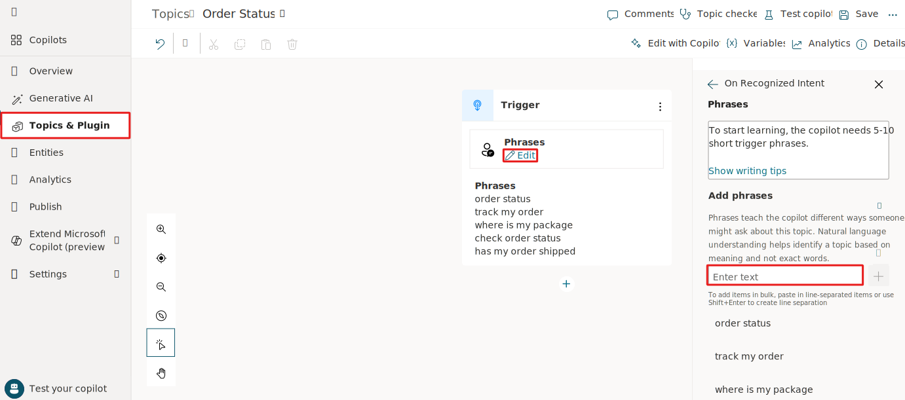](../media/trigger.svg#lightbox)

1. Select the **Details** button within the top right corner to open the Topic Details pane. Rename your topic to `Check Order Status`, and then select **Save**.

   > [!div class="mx-imgBorder"]
   > [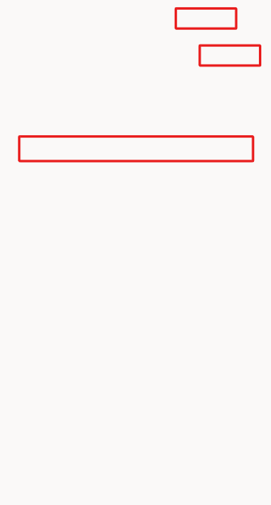](../media/rename.svg#lightbox)

## Task: Review the topic UI

Now that you created your first topic, albeit without content except trigger phrases, you can explore the authoring user interface (UI) to become more familiar with it.

   > [!div class="mx-imgBorder"]
   > [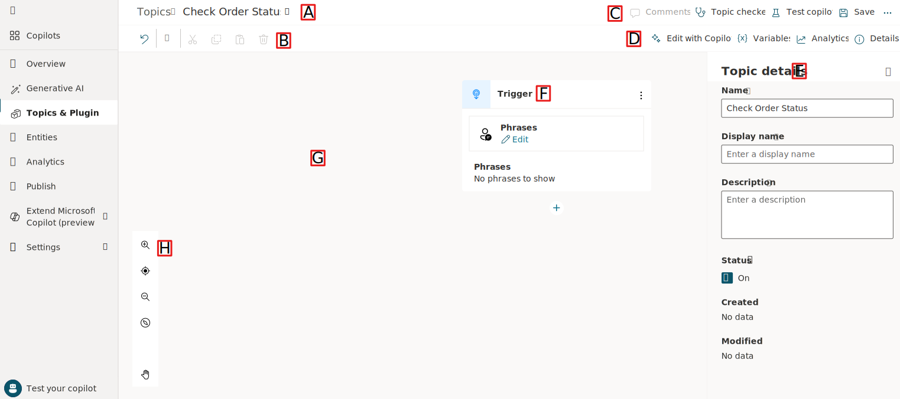](../media/authoring.svg#lightbox)

**A. Topic title** - The name of the topic that you're currently creating, which is visible on the **Topics** page.

**B. Productivity bar** - Where you have access to productivity tools, such as copy and paste, which is available in Preview.

**C. Comments, Topic checker, and the Test and Save buttons** - This area includes the **Topic checker**, which you can run anytime from the authoring canvas to check if errors have occurred in your topic that the platform can detect, including missing messages in message nodes. Selecting the **Test** option will open the Copilot testing panel on the left side of the screen. Selecting the **Save** icon, which is available when unsaved changes are present, will save the topic. With the extended menu button (**...**), you can open the code editor in Microsoft Copilot Studio preview, allowing users to switch from the graphical view and the code view seamlessly.

**D. Edit with Copilot, Variables, Analytics, and Details buttons** - The options in this area provide three areas where you can access all **variables** that are available in this topic and globally. Selecting **Analytics** shows key metrics that are tracked within a time period, including sessions and abandon rate. Selecting the **Details** menu allows you to change the name and description of the topic and turn on or turn off the topic.

**E. Properties pane** - This area offers an extended menu item that allows for extra information or control, depending on what you select. Some items don't have extended options, so this area can be empty on occasion. Alternatively, by selecting a question node's properties (for example), you have more options to choose from in this section, such as **Question Behavior**.

**F. Nodes** - This section shows nodes, which are referred to as the items within an authoring canvas in Microsoft Copilot Studio. Often, nodes have a type that drives what options are available and required. Examples include the message node, question node, or topic node.

**G. Authoring canvas** - The area where you'd create your topic. This area is referred to as a canvas due to the empty space that it gives you to build and connect nodes. It might look empty to begin with, but when you start adding nodes, such as conditions, the canvas fills up quickly.

**H. Authoring canvas controls** - You can use these controls to navigate the authoring canvas, which can become large for extensive topics. The included controls are zoom, grab, and selection.

## Task: Add content to your topic

This exercise doesn't cover how to add a large amount of content to your topic; rather, it provides the steps to add a single question node, message node, and topic redirection so that you can become familiar with the overall process of creating a topic, testing, and publishing in Microsoft Copilot Studio. The **Publish demo** exercise in this module covers a more in-depth review of the authoring capabilities in Microsoft Copilot Studio.

The next section of this exercise covers foundational knowledge for understanding the central components of Microsoft Copilot Studio and creating topics.

## Fundamental knowledge: Question node

As a Copilot author, you should use the **Question** node when you're expecting a response from the user and you want to do something based on that information. The user response is stored in a variable, and question nodes can also use entities and slot filling features, both concepts that are covered later in this exercise.

The Question node uses many functions that a Message node does, such as rich text, speech authoring, and rich text response types such images, videos, and adaptive cards.

1. In the topic that you have open from the previous task, select the **Add node** button below the existing node in the canvas and then select **Ask a question** to add a new Question node.

1. Enter `What would you like to do with your order?` in the field and then make sure that the **Identify** value is set to **User's entire response**. This node is asking the question after the topic is triggered about what the user wants to do. The **Publish demo** exercise extends this task to using entities and slot filling.

   > [!div class="mx-imgBorder"]
   > [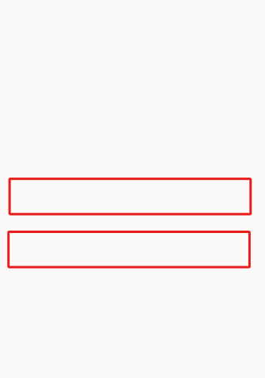](../media/question.svg#lightbox)

## Fundamental knowledge: Message node

You can use the **Message** node to display a message to the user. This message can be simple based on the topic of the conversation. In direct contrast to the Question node, the Message node doesn't expect or store an answer from the user. The Message node has rich text options that you can display in text. You can also use variables within message nodes in the body of text displayed to the user, which is dynamic based on the data stored within them. This capability allows messages to be more personal, such as *Hello {name}, I can get those order details for you, one moment*. Variables can also store data to perform automation or calculations on them. Later exercises cover variables more in depth.

> [!div class="mx-imgBorder"]
> 

1. Add another node. Select the **Add node** button below the Question node. Then, select **Send a message**. Enter a message that acknowledges the customer's question, such as `Thank you for your question!`.

   > [!div class="mx-imgBorder"]
   > [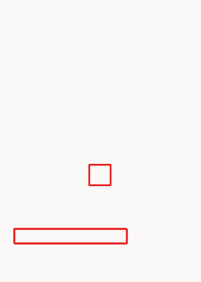](../media/thank-you.svg#lightbox)

1. End the conversation for the customer in this demo scenario. Select the **Add node** button below the message node within the authoring canvas. Hover over the **Topic Management** option, and then select **End conversation** to end the conversation.

1. Then, within the top right hand corner of the screen, select the **Save** button.

Other ways to end a conversation exist, such as directing to a feedback topic or transferring the conversation, but they aren't covered in this exercise.

   > [!div class="mx-imgBorder"]
   > [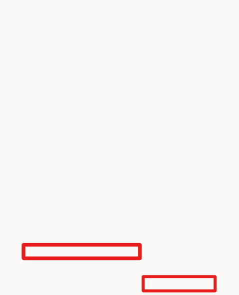](../media/end-conversation.svg#lightbox)

## Task: Use Copilot in Microsoft Copilot Studio to create a topic

Creating topics in Microsoft Copilot Studio is more effortless than before. Now, you can create a topic in Microsoft Copilot Studio by using natural language to describe what you want the topic to do. Then, you can select **Create** for the **Copilot** feature to automatically build that topic, reducing some manual steps that you experienced from the first task in this unit. In this task, you'll learn how simple and quick creating a topic by using **Copilot** can be.

1. Select **Topics** from the navigation pane to the left of the screen.

1. Select the **+ Add** drop down, and choose **Topic** and then **Create from description**. A new window appears, asking you to **Name your topic** and enter a description in the **Create a topic to** space.

   > [!div class="mx-imgBorder"]
   > [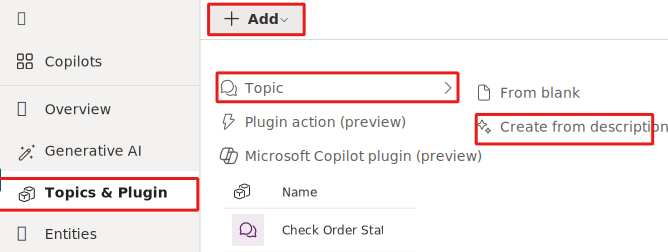](../media/copilot.svg#lightbox)

1. Enter `Order Status` in the **Name your topic** field.

1. In the **Create a topic to** space, enter `Create a topic that provides the status of an order for a customer, asking them their name, order number, and when it was ordered`.

1. Select **Create**.

   > [!div class="mx-imgBorder"]
   > [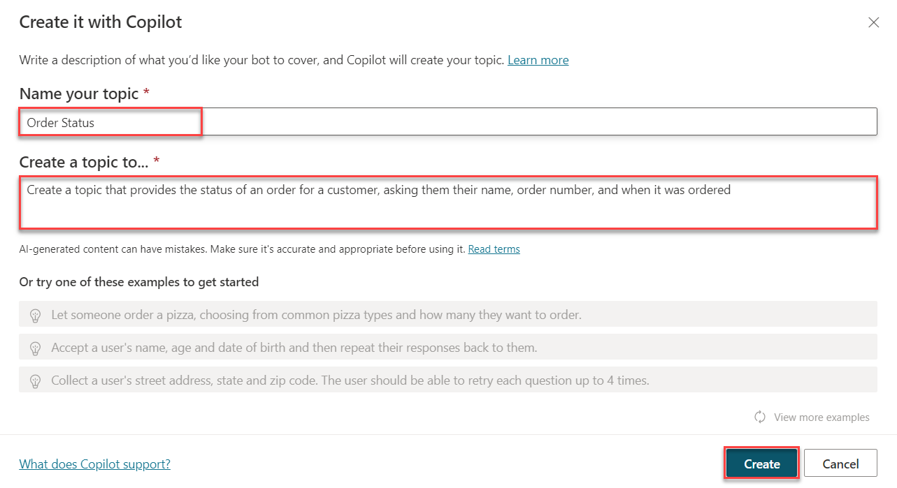](../media/create-copilot.png#lightbox)

   Copilot creates your topic, including the trigger phrases, question nodes, entity selection, variable naming, and message node confirmation.

1. Select the **Edit with Copilot** button in the upper part of the authoring canvas (if the **Edit with Copilot** panel isn't open already).

1. Within the **Edit with Copilot** panel, in the field **What do you want to do?**, enter `Ask a question to find out the user's preferred contact method, choosing from  email, phone or SMS`. Then, select **Update**.

   > [!div class="mx-imgBorder"]
   > [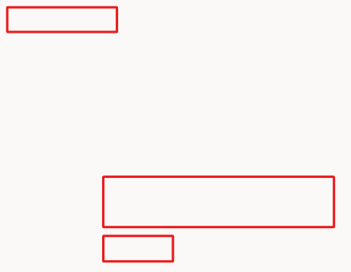](../media/variations.svg#lightbox)

   Copilot automatically adds a question node, which both asks the customer for their contact method, and stores their choice in a variable.

   > [!div class="mx-imgBorder"]
   > 

The Copilot feature in Microsoft Copilot Studio drastically reduces authoring time, allowing you to create new topics and edit topics by using natural language. Additionally, the **Edit with Copilot** panel shows what updates have been created, and it provides suggestions for what you can update in your topic. Additionally, Copilot in Microsoft Copilot Studio can create Adaptive Card JSON. Try it by asking Copilot to summarize the information that you've gathered from the user in an Adaptive Card.

To complete the exercise, **save** this topic. Within the **Topics** menu in Microsoft Copilot Studio, turn off the topic by switching the **Status** toggle to **Off**, as shown in the following screenshot.

   > [!div class="mx-imgBorder"]
   > [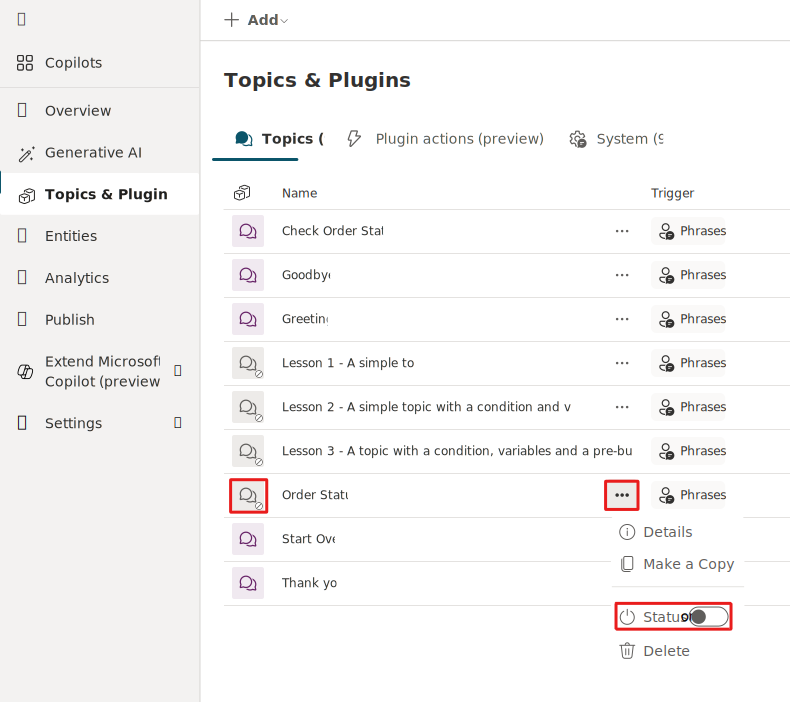](../media/topic-off.svg#lightbox)

## Task: Test and publish your Copilot

Now, you test the topic that you created in the test pane first and then publish those changes.

1. Select the **Test your copilot** button in the lower left corner of the screen to open the testing panel.

   > [!div class="mx-imgBorder"]
   > [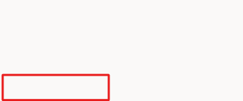](../media/test.svg#lightbox)

1. The **Conversation Start** message appears, and your Copilot starts a conversation. In response, enter a trigger phrase for the topic that you previously created in the exercise. Remember, after turning off the previous topic, it won't be available in the **Test Copilot** area.

   > [!div class="mx-imgBorder"]
   > 

Your message appears, and your Copilot responds as instructed by the topic designed in the previous steps. Now, the topic is working as it should, and it's time to publish your Copilot.
