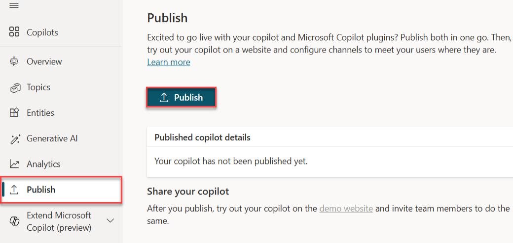
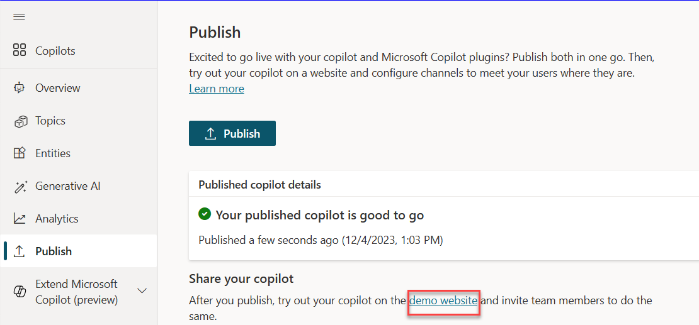
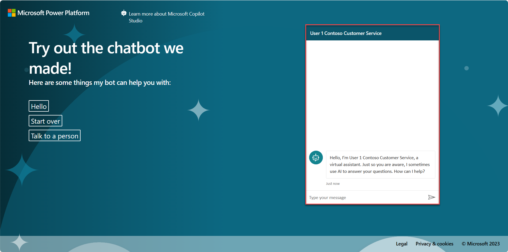

Microsoft Copilot Studio provides a demo website so that you can invite anyone to test your Copilot by sending them the URL. This demo website is useful for gathering feedback to improve your content before you activate the Copilot for your real customers.

1. In Microsoft Copilot Studio, select the **Publish** page within the navigation pane to the left.

1. Select **Publish** to push the latest topics to the demo website. You'll need to complete this action before you use the demo site the first time and after you make changes to the topics that you want people to test on the demo website. (When you've created your real Copilot, you'll publish whenever you want to make updated topics available to your customers.)

1. Then, select **Publish** again within the publish latest content pop-up dialog. 

   > [!div class="mx-imgBorder"]
   > 

   > [!div class="mx-imgBorder"]
   > 

   The publishing process checks for errors in the topics whose **Status** is **On**. Publication should take only a few minutes.

   After you've selected the **Publish** option, a green banner notification will show at the top of the screen when publishing is complete.

1. Select the link for the **demo website**, as shown in the following screenshot.

   > [!div class="mx-imgBorder"]
   > 

1. When the demo site window opens, you can interact with the Copilot by typing at the **Type your message** prompt or by selecting a starter phrase from the provided options.

   > [!div class="mx-imgBorder"]
   > 

1. Share the URL of the **demo website** with your team.

Congratulations, you've now built and published your first Copilot.