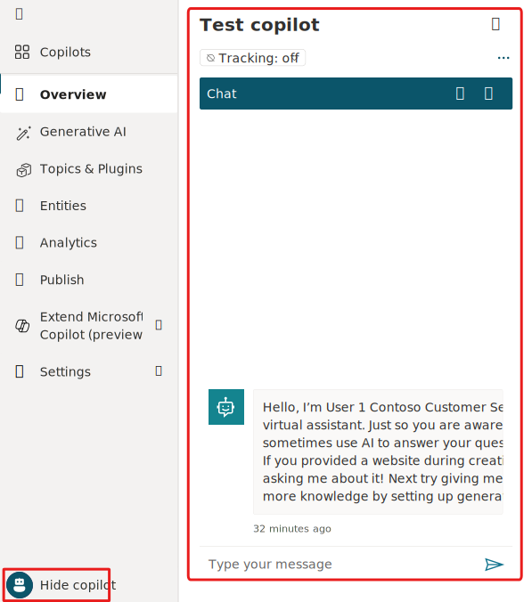
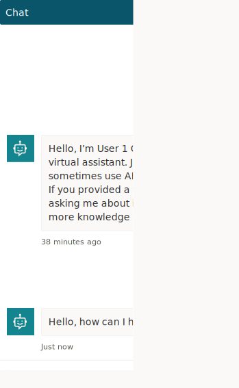
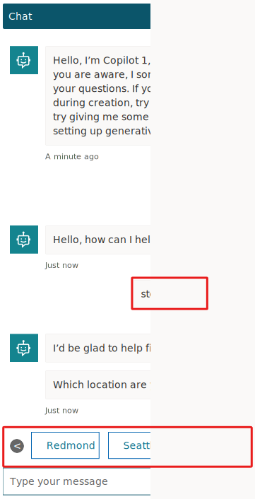

In this next exercise, you'll try out the Copilot by using one of the four prebuilt lessons that are included when you create a new Copilot.

1. To show the **Test copilot** pane, in the lower-left corner of the screen, select **Test your copilot**. (If the button says **Hide copilot**, then your **Test copilot** pane is already showing.)

   > [!div class="mx-imgBorder"]
   > 

1. The **Test copilot** pane shows that a message has already been sent to you from the Copilot. This message was sent from the **Conversation Start** topic, which begins automatically. At the **Type your message** prompt, at the bottom of the **Test copilot** pane, enter `Hello` and then select the **Send** button.

   > [!div class="mx-imgBorder"]
   > 

   The Copilot will offer a greeting in the **Test copilot** pane.

1. In the **Test copilot** pane, enter `stores near me` as the message and then select the **Send** button. One of the prebuilt topics (Lesson 2 Topic) will be triggered in the Copilot, and it will ask you what location you're interested in.

1. In the test chat, select the store location that you want. The Copilot will respond with specific information based on your selection.

   > [!div class="mx-imgBorder"]
   > 

Now that you've reviewed an existing topic, you can move on the next exercise to create a new topic.
