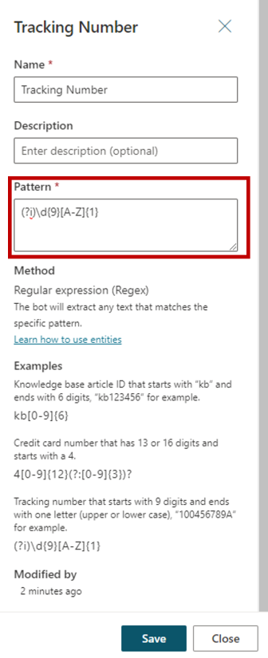

The prebuilt entities discussed in the previous unit will cover many common information types. However, there will be occasions where an organization might require language understanding for more unique scenarios. For example, let's say you've been asked to build a copilot for an outdoor store. It's likely the copilot might need to acknowledge different types of outdoor products. A custom entity called **Outdoor Store Categories** could be created. The entity could store all the different outdoor products the store provides. The entity will help ensure that when someone types an outdoor product such as fishing, skiing, or boating the copilot will be able to direct them to the right spot.

Custom entities are created by navigating to the **Entities** tab on the side navigation pane and selecting new custom entity. When you create a custom entity, you'll need to define the type of entity you want to create.

There are two types of entities that you can create:

- **Closed list:** Used to define a small list of items such as a list of sizes, departments, or locations.

- **Regular expression (regex):** Used to define a specific logical pattern, such as an ID number, credit card number, or IP address.

> [!div class="mx-imgBorder"]
> 

## Closed list entities

Closed list entities are best used when you want to define a small list of items that might be useful when interacting with a customer, such as the outdoor company example we mentioned earlier. In the image below, we created a closed list custom entity called Outdoor Store Categories. We added a list of outdoor product category names.

> [!div class="mx-imgBorder"]
> 

As a user interacts with a chat session, the system will look for the values defined in the list. If we have created topics specific to the items on the list, the user could be easily taken to one of those topics. For example, if a user enters **I have a baseball question**, the system will identify the baseball item on the list and based on configuration, could display a baseball topic.

## Working with smart match

As customers are interacting with copilots, it isn't uncommon for them to mistype something, or enter a phrase that is slightly different from what is defined in the entity. For example, a customer might enter **softball** instead of **baseball**. Both sports use the same type of equipment. In terms of product categories, **softball** should be considered the same as baseball. Smart matching lets the copilot take in user input in a fuzzy way based on the list items given to the entity. This means that it doesn't have to find an exact match. When smart matching is on, the copilot will automatically autocorrect misspellings and expand the matching logic semantically, such as automatically matching softball to baseball.

## Working with synonyms

The synonym option is like smart matching, except they aren't automatic like smart matching. Synonyms are entered manually. They expand the logic to include words with similar meanings or considered similar by nature. For example, it isn't uncommon for sports such as skiing, snowboarding, and snowshoeing to be grouped together based on the fact they're all snow sports. To accommodate for this in our list, the **Skiing** product category could have both **Snowboarding** and **Snowshoeing** added as synonyms. If a user enters either snowboarding or snowshoeing, the copilot will understand that these are related to the skiing category. For other activities like **Yoga**, you might add **Pilates**. Smart match and synonyms seamlessly work together to make your copilot even smarter.

> [!div class="mx-imgBorder"]
> 

## Regular expression (regex) entities

Regular expression (regex) entities let you define logical patterns that you can use to match and extract information from an input. Regex entities are great for complex pattern matching against a user's input, or if you need to allow for specific variations in how a user might format or enter their input in a conversation.

For example, you could use a regex entity to identify items such as a tracking ID, a license number, a credit card number, or an IP address from a string the user enters into the copilot.

When you select a regex entity, you'll need to define the following:

-   **Name:** Defines the name of the Regex entity.

-   **Description:** Optional description that defines more details about the entity.

-   **Pattern:** Defines the pattern that will be used to extract text.

> [!div class="mx-imgBorder"]
> 

In the image above, we're creating a regex expression entity called **Tracking Number**. The syntax entered specifies that the tracking number will start with nine digits and end with one letter in either upper or lower case. (Ex. 100456789A)

Regex entities use the .NET regular expressions syntax.

You can learn more about creating .NET regular expression syntax's using the links below:

-   .[NET regular expression syntax](/dotnet/standard/base-types/regular-expressions/?azure-portal=true)

-   [Regular Expression Language - Quick Reference](/dotnet/standard/base-types/regular-expression-language-quick-reference/?azure-portal=true)
