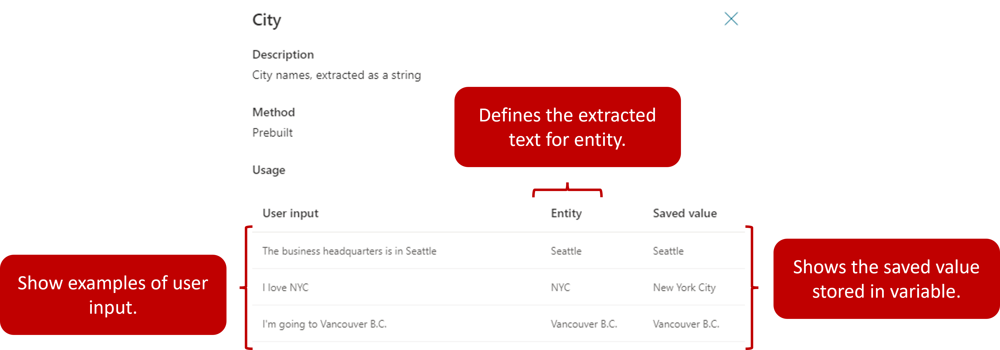
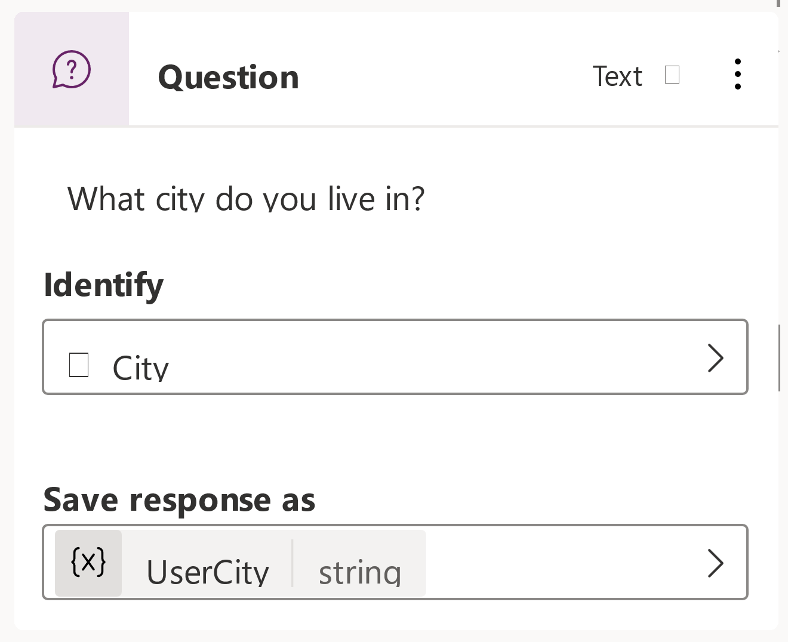

Copilot conversations use natural language understanding to identify a user's intent based on what they input into the conversation window. For example, if a user enters the text **I tried to use my gift card, but it doesn't work**. Natural language understanding helps to identify and route the user to the topic related to gift cards that aren't working, even if that exact phrase isn't listed as a trigger phrase.

A key aspect of natural language understanding is to identify the entities being used in a user dialog. Think of an entity as an informational unit that represents a certain type of real-world subject such as a phone number, postal code, city, or a person's name.

Microsoft Copilot Studio comes with a set of prebuilt entities out-of-the-box. These represent some of the most used information in real-world dialogs such as
age, colors, numbers, and names. The knowledge granted by entities allows the bot to recognize the relevant information from user input and save it for later use.

Let's use the prebuilt entity city. It, like other prebuilt entities can be accessed from the entities tab. When you examine the entity, you can see an explanation, and the ways it can be used.

> [!div class="mx-imgBorder"]
> 

For example, when a user inputs **Our business headquarters are in Seattle**, using this city entity the bot knows **Seattle** represents the **city type** of
information. When the bot extracts this entity and saves it to a variable, it will save Seattle as the city, even though the surrounding information was text.

When you insert a question node into a topic, you can use entities in the identify section of the question. For example, in the example below, we're asking the user what city they live in. By setting the identify field to City, the bot will extract the user's city from the text they type in.

> [!div class="mx-imgBorder"]
> 

The user's city will be stored in a variable called **UserCity** that can be used later in the topic or in the conversation. We'll cover variables in more detail later.

Now we've examined some of the prebuilt entities that are available, let's examine how you can build your own custom entities as needed.
