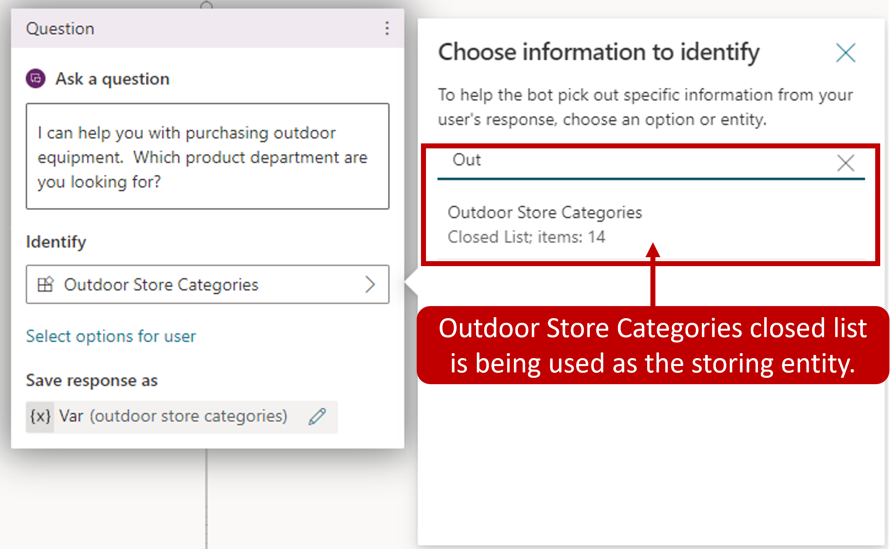

Once your entities have been defined, they're available to be used when constructing copilot conversations. The easiest way to use them is by opening the authoring canvas for a topic and adding an Ask **a question** node.

> [!div class="mx-imgBorder"]
> 

When presented with this question in the conversation, the user simply needs to type the department they're looking for. The item will be compared to and matched to an item on the list.

> [!div class="mx-imgBorder"]
> 

In the image above, the user has expressed interest in **Trekking** which is another way of saying **Hiking**. The copilot recognizes this, and displays information related to **Hiking**.

In some cases, an organization might decide they would rather display buttons to users to simplify the selection. For example, if you would like some of the
category items to display as buttons users can select as their input, choose select user options and then pick from the list. While in a conversation, a customer can either select the item button they want or enter a different category manually as text.

> [!div class="mx-imgBorder"]
> 

## Working with slot filling

Slot filling is a natural language understanding concept that saves an extracted entity to an object. In simple terms, slot filling matches what is input by a customer and stores it appropriately in a variable. For example, when asked for a category type, the customer might select **Hiking**, or they might type in something like **Trekking** as shown in the image below. Since **Trekking** was defined as a synonym, it should still be considered as the user entered hiking. Slot filling ensures that even though something else was entered, it's associated with the correct category. The extracted entity **Hiking** will be used as the values for the product category variable.

> [!div class="mx-imgBorder"]
> 

> [!div class="mx-imgBorder"]
> 

Another concept is known as *Proactive slot filling*. This is where the user can specify multiple pieces of information that map to multiple entities. The copilot understands what information belongs to which entity automatically.

In the example below, the user wrote **I want to buy some trekking gear**. This includes the trigger phrase that the customer wants to buy gear, but it also provides a second piece of information, the actual type of gear. In this case, the copilot fills in both the entity for buying gear, and the type of gear. This in unlike the previous example where the copilot needed to prompt the user for the type of equipment. The copilot takes the user input and intelligently skips the question asking for the product category.

> [!div class="mx-imgBorder"]
> 

The copilot is always actively listening to user input, remembering information upfront so it can skip unnecessary steps as appropriate.

Let's restart the testing again and try another case. In this round, we added a few more question nodes asking for things like the type of hiking gear, and the price range (using the Money entity).

This time when the product category question is presented, instead of telling the copilot only the product category, the user can say **I want to buy a pair of hiking boots under \$100**. In this example, the copilot isn't only able to route to the correct hiking product category path, but also actively fill the slots asking for the type of hiking gear and the target price range information.

> [!div class="mx-imgBorder"]
> 

Proactive slot filling can be manually controlled at the node level. If you would like to always prompt for the question within a specific node, regardless of whether the slot has been filled from previous user responses, you can disable the **Skip question** option for that question node.

> [!div class="mx-imgBorder"]
> 