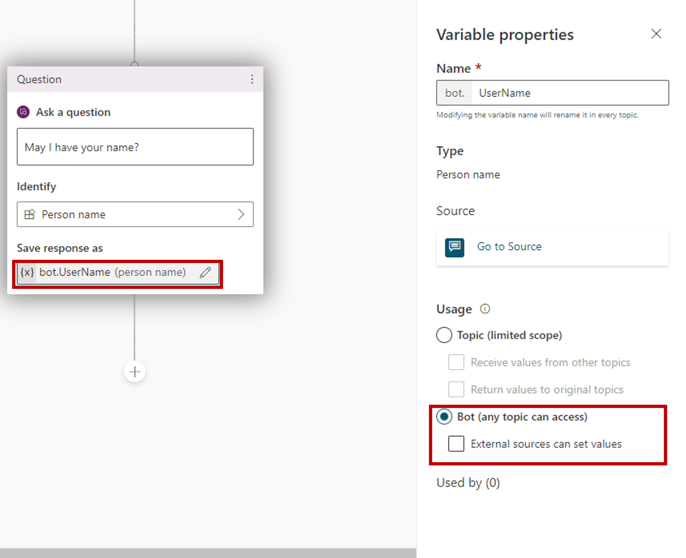
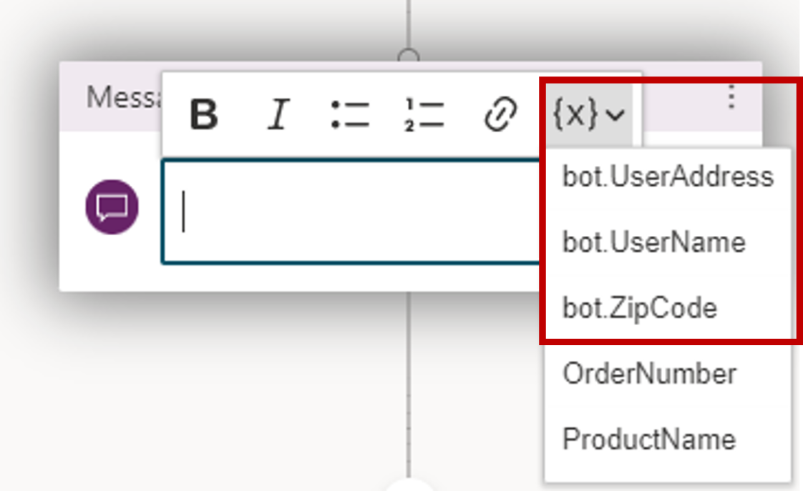
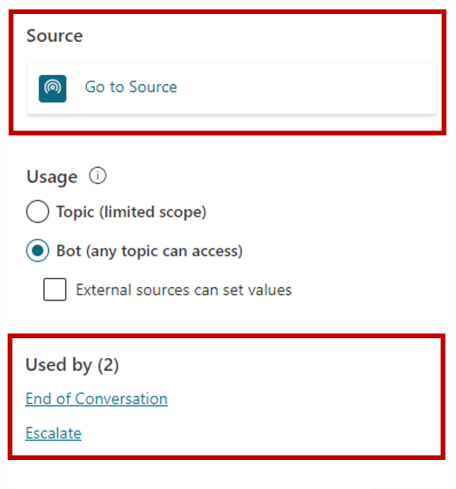
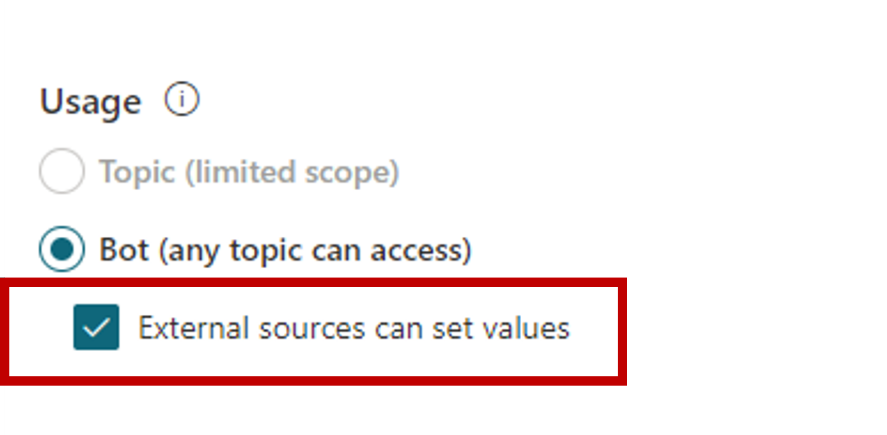

By default, a variable's value can only be used in the topic where that variable is created. For example, if you create a variable **UserCity** in a Check Weather topic, you can only include it in items like message nodes within the Check Weather topic. These are referred to as **Topic (limited scope)** variables. However, there might be scenarios when you want to use the same value across multiple topics. Copilots can remember a variable context when a conversation spans multiple topics. For example, a **Welcome** topic could ask for the customer's name and email. When the conversation goes to another topic, such as an **Appointment booking** topic, you might want the copilot to remember the customer's name and email address. In Microsoft Copilot Studio, these variables are referred to as **copilot variables**. They can be accessed by any topic in the copilot.

Copilot variables apply during the current chat session. They can't be carried over from one customer chat session to another. You can specify which variables should be treated as copilot variables to distinguish them from topic-level variables.

## Create a copilot variable

To define a variable as a copilot variable, open it in the authoring canvas. Open the **Ask a question** node that stores the variable that you want to work with. On the **Variable Properties** pane, under **Usage**, select **Copilot (any topic can access)**. The variable name gets a prefix string of **copilot** to differentiate it from the topic-level variables.

> [!div class="mx-imgBorder"]
> 

For example, the variable **UserName** is now shown as **bot.UserName**. When you convert a variable to a copilot variable, make sure that the variable name is unique across all topics. If a name conflict is encountered, you need to rename the variable before saving your change.

For more information, see [Use global variables across topics within a copilot](/power-platform-release-plan/2020wave1/power-virtual-agents/use-global-variables-across-topics-within-bot/?azure-portal=true).

## Set copilot variables

Once a copilot variable is created, it's available to all topics. While working with a message or question node, select the **{x}** button. This displays a list of all the variables available in this topic. Variables are sorted in alphabetical order, so all copilot variables are grouped together in the variable menu because they all begin with copilot.

> [!div class="mx-imgBorder"]
> 

When you use a condition node, a flow action node, or a skill node, you can also see copilot variables available there.

## Manage copilot variables

After you create a copilot variable to use across multiple topics, you should understand where it's being used. You can easily see where the variable was first defined (Source) and the other topics that are using it. This can be useful if you're working on a new copilot, or if you have multiple variables and complex topic branching.

There are two primary items that are available from the **Variable Properties** pane.

-   **Go to the source:** Goes to the node where the variable was initially created.

-   **Used by:** Displays all topics where the variable is used, so you can go straight to that topic and node.

> [!div class="mx-imgBorder"]
> 

## Set a copilot variable's value from external sources

You can set a copilot variable to be initialized with an external source. This lets the copilot start the conversation with some context.

For example, a customer brings up a chat from your website. If the user is logged into your website, you already know the customer's name. By passing that information to the copilot before starting the conversation, it can have a more intelligent conversation with the customer without having to ask for their name again.

You can specify that a variable can get its values from an external source. Open the **Variable properties** pane, and in the Usage section, select the **External sources can set values** box.

> [!div class="mx-imgBorder"]
> 

For more information on working with copilot variables, see [Reuse variables across topics](/power-virtual-agents/authoring-variables-bot/?azure-portal=true).
