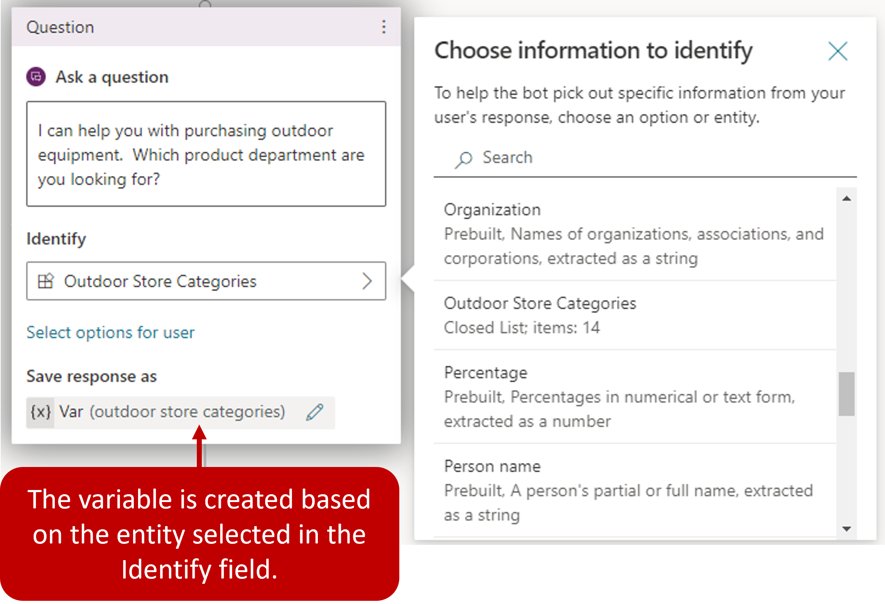
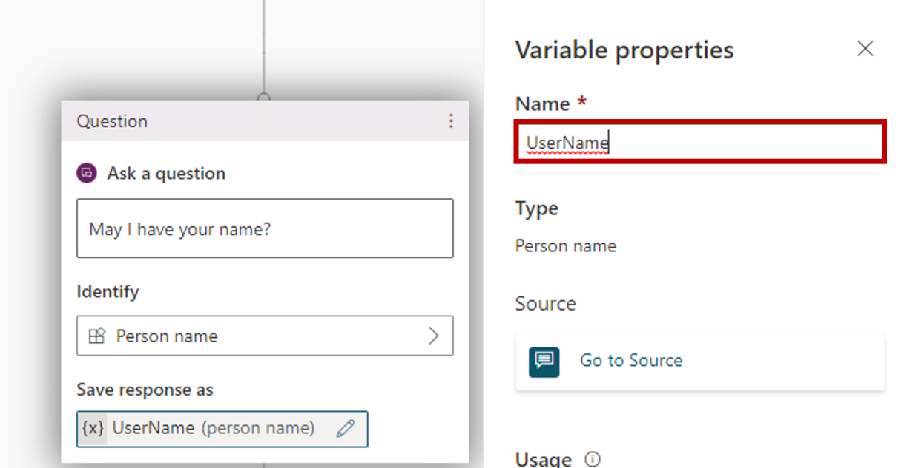
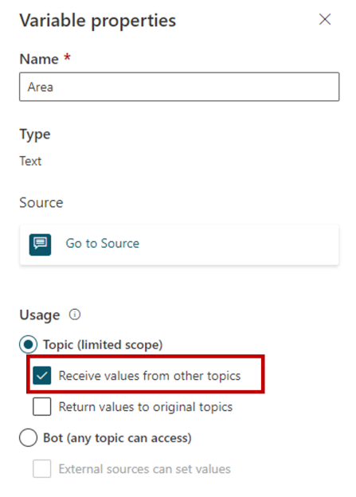
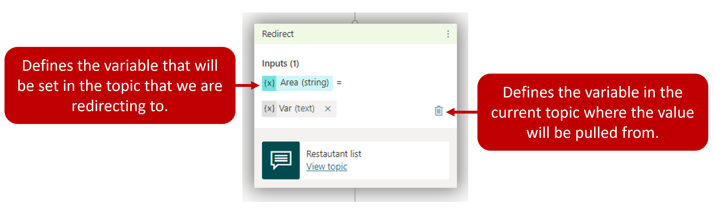
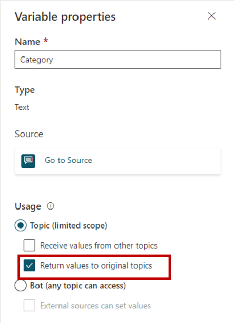

Microsoft Copilot Studio allows you to store important information entered by the customer for later use by using variables. For example, you can save a customer's name in a variable called **UserName.** This variable can be inserted into conversation nodes to create a more personal experience for the customer, such as inserting it into a message node to allow the copilot to address the customer by name as the conversation continues.

Variables can be used to dynamically route customers down different conversation paths. They can also be fed into [Power Automate](/power-virtual-agents/advanced-flow/?azure-portal=true) Flows or [Bot Framework Skills](/azure/bot-service/bot-builder-skills-overview/?azure-portal=true) as input parameters. For example, the city the customer lives in could be stored in a variable. When a Power Automate Flow is executed, the variable could be passed through as an input parameter to ensure the weather service is getting the correct forecast.

Many variable types are associated with out-of-the-box and custom entities defined in the copilot. For your reference, a complete [list of entity and variable types](/power-virtual-agents/authoring-variables?azure-portal=true#entity-and-variable-type) are available.

## Creating variables

Variables are created automatically when you add a question node to a topic. By default, when a question node is inserted, it will be created using **Multiple choice** options. However, any prebuilt or custom entity by can be used by selecting it under identify.

> [!div class="mx-imgBorder"]
> 

## Rename a variable

When a variable is automatically created, it will be given a default name or something like var. This isn't descriptive. If desired, you can rename a variable by selecting it and entering a new name. This will make it easier to identify later when needed.

> [!div class="mx-imgBorder"]
> 

## Passing variables between topics

One common action in a Microsoft Copilot Studio copilot is to redirect from one topic to another such as sending someone to the Store Hours topic after they're greeted. When you redirect to another topic, you can pass values into variables in the destination topic. You can also pass values back to variables in the original topic. Passing variables between topics is especially useful when you already have information that the topic needs. Users will appreciate not having to answer the question again. For example, if you've already captured the user's name in the **Greeting** topic, and you know that the username will be used in the **Store Hours** topic that you're redirecting to. You can easily pass the username to the Store Hours topic when you redirect to the topic.

## Receive values from other topics

When you define a variable in a topic (for example, by inserting a question node), the user's answer to the questions is populated to the variable associated with that question. Since you already have the value, there's no reason to ask the question again. In these cases, you can define the variable as **Receive values from other topics**.

> [!div class="mx-imgBorder"]
> 

This means when another topic redirects to this one, it can pass a variable into this variable and skip the question. The experience for the user talking to the copilot is seamless.

When configuring your redirect node, you'll need to define what variable you want to populate in the destination topic. After you specify which variable you want to set in the destination topic, you'll specify which value in the current topic will be used. For example, in the image below, we're redirecting to a topic called Restaurant list. The **Area** variable in the Restaurant list topic is being set to a text variable called **Var** from the redirecting topic.

> [!div class="mx-imgBorder"]
> 

For more information and step-by-step instructions on receiving values from other topics, see [Receive values from other topics](/power-virtual-agents/authoring-variables?azure-portal=true#receive-values-from-other-topics).

## Return values to original topics

When a topic asks a question or obtains a variable from an action in some other way, the variable can be returned to the original topic that redirected to it.

In this case, the variable also becomes part of the original topic and can be used like any other variable. This helps you construct the topic so that information the copilot obtains is available across topics, reducing the need for global variables. We'll discuss global variables in the next unit.

> [!div class="mx-imgBorder"]
> 

For more information on and step-by-step instructions, see [Return values to original topics](/power-virtual-agents/authoring-variables?azure-portal=true#return-values-to-original-topics).

To learn more about working with variables see [Use Variables](/power-virtual-agents/authoring-variables/?azure-portal=true).