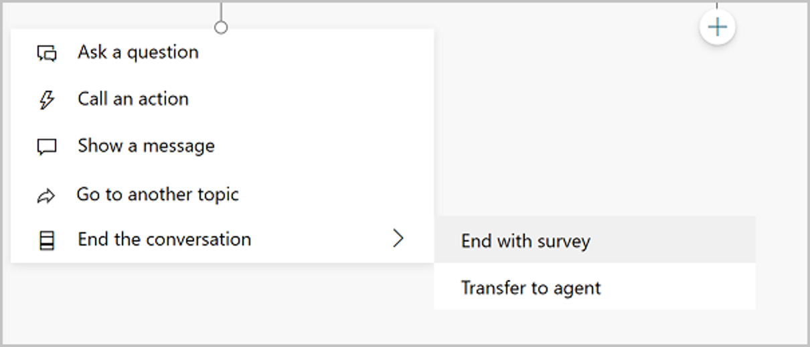
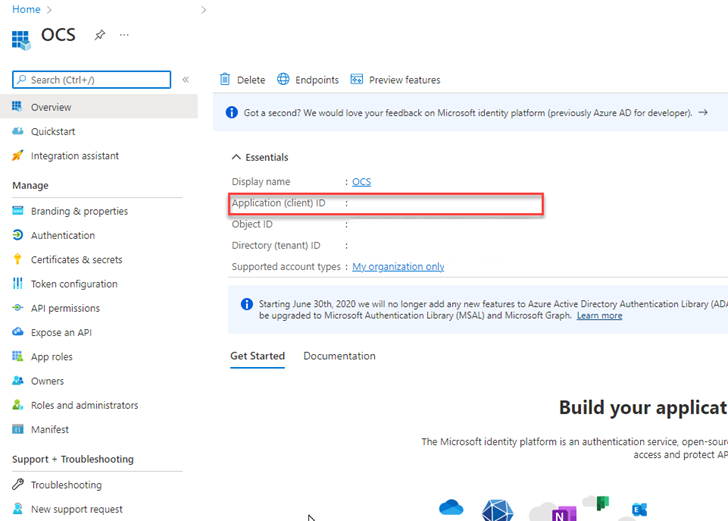
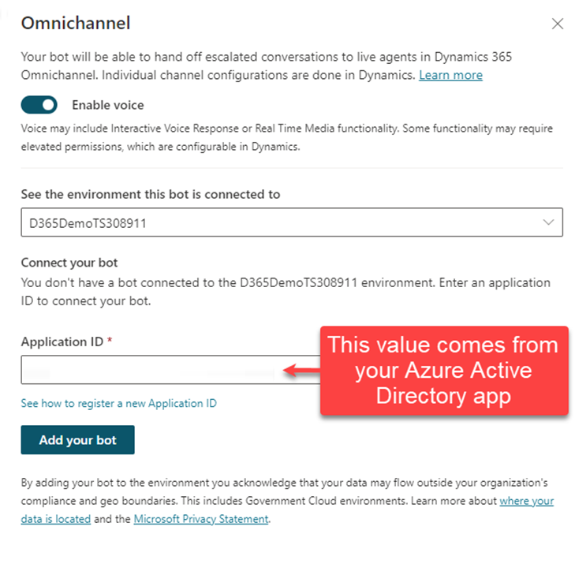

When a customer engages with your organization, a customer service application such as Dynamics 365 Customer Service, will initially receive the item and then will route it to an individual or to a virtual agent that's being backed by your Microsoft Copilot Studio bot. Depending on the channel that the customer engages in, the item will be routed appropriately. To do so, the system needs to know how to engage with the bot. Organizations that use Omnichannel for Customer Service can create a bot user in the Omnichannel for Customer Service application. Essentially, a bot user in Omnichannel for Customer Service is a user that's supported by an application. In this case, the application will be a Microsoft Copilot Studio bot. When conversations are routed to the application user, the Microsoft Copilot Studio bot takes over and provides the necessary interaction with the customer. 
   
Because the bot is an application user, the application that will support the bot needs to be registered in Microsoft Entra ID. Microsoft Entra ID authenticates the application in the same way that it would a human user. Before a bot can be integrated, you'll need to create an application registration in Microsoft Entra ID. After the application registration has been defined, you can associate a Microsoft Copilot Studio bot with the registered application.

Only users who have necessary permissions can add items in your Azure tenant and make the necessary application registrations. To create the application registration, follow these steps:

1. Go to the [Microsoft Azure portal](https://portal.azure.com/?azure-portal=true).
2. Register your apps. Go to **Microsoft Entra ID** and create a new registration under **App registrations**.
3. Define the three primary areas to create the application registration as follows:
    - **Name** - User-facing name of the application. You can change this information later if necessary.
    - **Supported account types** - This area defines who can access the application.
    - **Redirect URI (optional)** - This option is the URL where the app is located. This information isn't mandatory.
    
        > [!div class="mx-imgBorder"]
        > 

4. After you've defined the necessary information, select the **Register** option.

For more information, see [Use the portal to create an Microsoft Entra ID application](/azure/active-directory/develop/howto-create-service-principal-portal#create-an-azure-active-directory-application/?azure-portal=true).

This process will create the initial application registration. For the purposes of this learning module, these steps fulfill the necessary requirements to deploy the Microsoft Copilot Studio bot to the application. However, depending on your deployment scenario, technology being used, security policies, and so on, you might need to set up other items in the application, such as:

- **Assign a role to the application** - Allows the application to access extra resources in your Azure subscription. For more information, see [Assign a role to the application](/azure/active-directory/develop/howto-create-service-principal-portal/?azure.portal=true#assign-a-role-to-the-application).

- **Certificates and secrets** - Helps manage authentication and controls application security. For more information, see [Certificates and secrets](/azure/active-directory/develop/howto-create-service-principal-portal/?azure-portal=true#certificates-and-secrets).

- **Access policies on resources** - Allows you to define extra permissions that your application might need. For more information, see [Configure access policies on resources](/azure/active-directory/develop/howto-create-service-principal-portal#configure-access-policies-on-resources/?azure-portal=true#configure-access-policies-on-resources).

Now that you've created an application registration, you can build the Microsoft Copilot Studio bot and then set up the bot to hand off conversations to Omnichannel for Customer Service.

## Transfer conversations to agents

The two primary components that you need to consider when a bot transfers to an agent are:
- How to tell the bot when to transfer the conversation to an agent.
- How to tell the bot where, or to which queue, to transfer the conversation.

## Tell the bot to transfer the conversation to an agent

How a Microsoft Copilot Studio bot tells the bot that it's time to transfer a conversation to an agent is always the same. Microsoft Copilot Studio includes a *conversation node* called **End the conversation**. Conversation nodes are used to interact with the customer. They can display a message, ask customers a question, or direct them to a different topic. The **End the conversation** node signifies the end of the entire conversation and provides two actions that the user can initiate:

- **End with survey** - A survey appears that asks the user if their question or issue was answered or resolved correctly.
- **Transfer to agent** - Escalates the conversation [to a live agent](/power-virtual-agents/advanced-hand-off/?azure-portal=true).

    > [!div class="mx-imgBorder"]
    > 

Bot authors can end a conversation and transfer to an agent from within a specific topic. For example, if a customer indicates to the bot that their entire point-of-sale system is down, the bot can automatically call the **End the conversation** node and transfer it to an agent. Another way for the bot to accomplish this task is by escalating the topic. All bots include a conversation topic called **Escalate**. The **Escalate** topic includes a message that's presented to the customer and then it calls the **End the conversation** node to transfer to an agent. The **Escalate** topic automatically triggers when someone types a phrase like "speak to agent." The customer can also trigger the **Escalate** topic from within another topic by selecting **Go to another topic** and then selecting **Escalate**.

## Set up where to hand off the conversation

The second part of facilitating the transfer to an agent is to set up the bot to send the conversation to a specific Omnichannel for Customer Service instance. You can only use bots that have been published to ensure that the end-to-end capabilities will work as expected. Make sure that you've [published your bot](/power-virtual-agents/publication-fundamentals-publish-channels/?azure-portal=true) prior to validating the integrated experience.

Additionally, you can only set up each bot to send conversations to one Omnichannel for Customer Service instance. You can define the Dynamics 365 instance in the individual bot. If you need conversations from multiple bots to be sent to a specific Dynamics 365 environment, you'll need to set up each bot individually.

The primary component that you need to provide is the application ID for the app that you previously registered in Microsoft Entra ID. Omnichannel for Customer Service will model bots as application users in the application. Modeling bots as application users will ensure that the bot can have conversations sent to it like a human agent would. It's important that the application ID is unique to your organization (your Microsoft Dataverse organization or environment). Each bot that will interact with the same Omnichannel for Customer Service environment will need to use a different application ID. You might need to create multiple application registrations to support multiple bots.

1. In the [Azure portal](https://ms.portal.azure.com/?azure-portal=true), go to **Microsoft Entra ID** and select **App registrations**. All registered applications will display.
2. Select the application that you want to use with the bot. The **Application ID** field will be on the application's overview page.
3. Copy the ID and paste it into the Microsoft Copilot Studio **Application ID** field.

    > [!div class="mx-imgBorder"]
    > 

 
## Set up the handoff

To set up the handoff, follow these steps:

1. Expand the **Manage** node and select **Agent** transfers. This screen allows you to define how the bot will facilitate handoff to different applications, such as Omnichannel for Customer Service.

3.	Select the Omnichannel for Customer Service tile to begin the configuration process.

    > [!div class="mx-imgBorder"]
    > 

 
	The Omnichannel setup screen has multiple items that you can set up.
   
4.	To ensure that your bot can interact through voice, such as Interactive Voice Response (IVR) or real-time media functionality, select **Enable voice**.

    > [!IMPORTANT]
    > Make sure that you've installed all necessary extensions in your environment.  

5. When setting up the connection, provide the following information:
    - **See the environment this bot is connected to** - Use in scenarios where the bot was previously connected to a Dynamics 365 instance. Likely, this information will already be filled in. Make sure that you select an environment where the Omnichannel for Customer Service instance is provisioned. The list shows all available environments, even if Omnichannel for Customer Service isn't provisioned.
    
    - **Application ID** - The Application ID that you copied from Microsoft Entra ID.
    
    > [!div class="mx-imgBorder"]
    > 

6. After the connection has been established, select the **View details in Omnichannel** link to go to the Omnichannel for Customer Service instance and finish the bot configuration. For more information, see [continue configuring the bot connection in Omnichannel for Customer Service](/dynamics365/customer-service/configure-bot-virtual-agent/?azure-portal=true).

## Remove the Omnichannel for Customer Service connection

If you no longer want to hand off conversations from a bot to your Omnichannel for Customer Service environment, you can disconnect it from the environment. If you need to remove the connection with Omnichannel for Customer Service, you can select the **Disconnect bot** option.

> [!div class="mx-imgBorder"]
> 

## Work with content display issues

As you work with the handoff integration, you might find that some items, such as emojis and certain types of notes or variables, might not render as intended. One reason could be limitations within Omnichannel for Customer Service or the integration between them.

For more information on Omnichannel for Customer Service issues and limitations, see [Omnichannel for Customer Service issues and limitations](/dynamics365/customer-service/configure-bot-virtual-agent/?azure-portal=true#limitations).

For more information on known limitations with Microsoft Copilot Studio integration, see [known limitations with Microsoft Copilot Studio integration](/power-virtual-agents/configuration-hand-off-omnichannel/?azure-portal=true#known-limitations).
