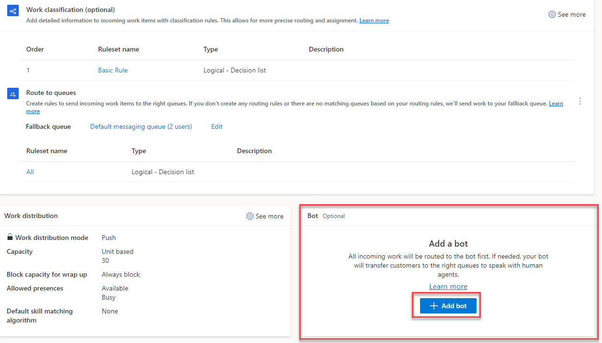
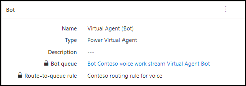

Now that you have the necessary extensions in place, and you've set up the handoff to your preferred customer service application, you're ready to set up the bot for voice. From a design standpoint, you don't need to do anything differently when you create the bot. Items such as topics, entities, and other elements are designed the same way. The only real difference is that, because the bot is enabled for voice, the text will be spoken to the customer instead of presented on a screen.  

For more information about getting started building Microsoft Copilot Studio bots, select the following links: 

- [Get started with Microsoft Copilot Studio bots](/training/modules/power-virtual-agents-bots/?azure-portal=true)
- [Manage topics in Microsoft Copilot Studio](/training/modules/manage-power-virtual-agents-topics/?azure-portal=true)
- [Manage Microsoft Copilot Studio](/training/modules/implement-power-virtual-agents/?azure-portal=true)
- [Enhance Microsoft Copilot Studio bots](/training/modules/enhance-power-virtual-agents-bots/?azure-portal=true)

The simplest way to set up a bot for voice is from the Customer Service admin center or the Omnichannel admin center. The focus of Customer Service admin center is to administer Dynamics 365 Customer Service and omnichannel functionality, while the Omnichannel admin center focuses on administrating omnichannel functionality. Whatever you do in the Omnichannel admin center, you can do in the Customer Service admin center.  

To learn more about both administrative experiences, select the following links: 

- [Get started with Customer Service admin center](/dynamics365/customer-service/cs-admin-center/?azure-portal=true)
- [Get started with Omnichannel admin center](/dynamics365/customer-service/oc-admin-center/?azure-portal=true)

To set up a bot for voice, open a voice channel workstream that has been previously created. For more information, see [Deploy a Voice channel in Dynamics 365 Customer Service](/training/modules/get-started-voice-channel/?azure-portal=true). In the **Add a bot** section, select the **Add a bot** option, where you'll specify the bot that you want to use.  

> [!div class="mx-imgBorder"]
> 

After you've specified the bot, detailed information about the bot that's associated with the item will be displayed in the **Bot** section.  
 
> [!div class="mx-imgBorder"]
> 
