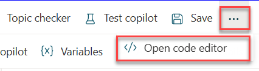
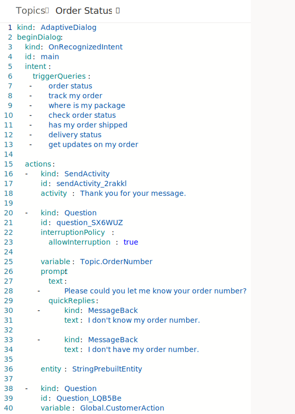
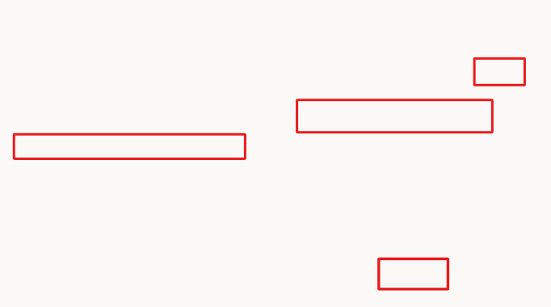
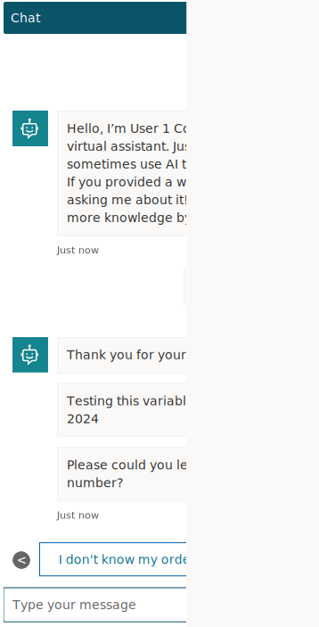

Now that you're more familiar with the authoring fundamentals in Microsoft Copilot Studio, you can explore some extended capabilities that you can use to set up and further customize the Copilot experience. The following sections cover two capabilities: **code view** for pro developers and **Power Fx** (for Microsoft Power Platform makers and professional developers).

Microsoft Copilot Studio now has the capability to view the code behind a topic. This capability is incredibly useful for pro-code developers, where they can view and edit the syntax directly within the web browser, and when saved, the syntax is immediately visible in the graphical authoring canvas. As a result, the process of creating topics is faster and easier, empowering developers to extend beyond the authoring canvas if necessary.

## Task: Access the code editor
Follow these steps to access the code editor.

1.  Open the topic that you've been working with in this lab titled **Check Order Status**.

1.  In the upper right of the topic, next to the **Save** icon, select the extended (**...**) menu and then select **Open code editor**, as shown in the following screenshot.

	> [!div class="mx-imgBorder"]
	> 

1.  The code editor should open, where you can view your dialog in the code view (YAML code).

	> [!div class="mx-imgBorder"]
	> 

1.  Select **Close code editor** in the upper right after exploring this feature.

## Task: Use Power Fx across Microsoft Copilot Studio unified authoring

Power Fx is now available in the preview release of Microsoft Copilot Studio. With Power Fx, you can add functions, similar to how makers currently do in canvas apps from Microsoft Power Apps, within the Microsoft Copilot Studio authoring canvas. You can use Power FX in **Message** and **Question** nodes, when you're using the variable node, and in other areas such as **Question behavior** and **Adaptive cards**. This feature gives you greater control over the data that's displayed to customers and users within the conversational interface. Additionally, it allows you to perform common operations in the runtime of Microsoft Copilot Studio.

The following task goes through a basic scenario of using Power Fx within a variable and then displaying the value to the user.

## Task: Use Power Fx to modify how the date is displayed
Follow these steps to use Power Fx to modify how the date is displayed.

1.  Open the topic that you've been working with during these labs.

1.  Create a new **Set a variable value** node after your first **Message** node in the topic. Create a new variable called **EstDeliveryDateCurrent**.

1.  On the **Set variable value** node, under **To Value**, select the flyout menu and then select **Formula** to open the **Enter formula** panel. Select the expand icon.

1.  In the formula bar, enter the following function and then select **Insert**, as follows:

	`Text(Now(), DateTimeFormat.LongDate)`

	> [!div class="mx-imgBorder"]
	> 

	This function takes today's date and time, which has a specific date and time format (9/01/2022 08:00 AM), and stores it as a datetime value type. Then, the function uses the DateTimeFormat function to convert the format to a long date (for example, Monday the 1st of September) and displays it as text. This approach is important if you want to display simple date formats that are customer or user-friendly or if you want to store the date as a string in text format.

1.  For demo purposes, you can add a new **Message** node. By using the variable feature, you can add the variable name into the **Message** node to display the output of the function in the conversation so that you can view the output when you're testing the Copilot. Test your Copilot by opening the testing pane, trigger the topic, and then follow the topic prompts to reach your **Message** node, as shown in the following screenshot.

	> [!div class="mx-imgBorder"]
	> 

Congratulations, you've successfully worked through all labs on the central authoring features in Microsoft Copilot Studio unified authoring.
