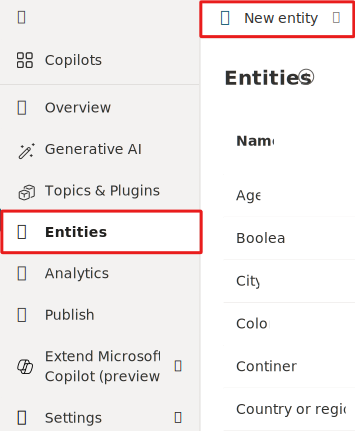
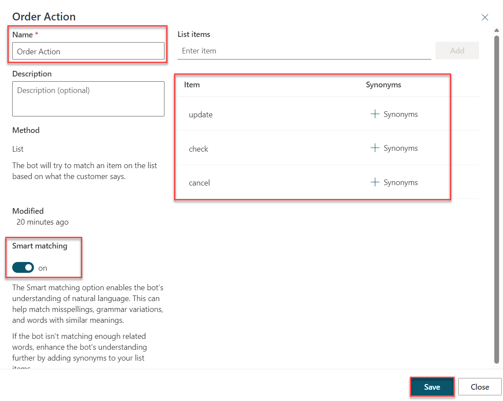
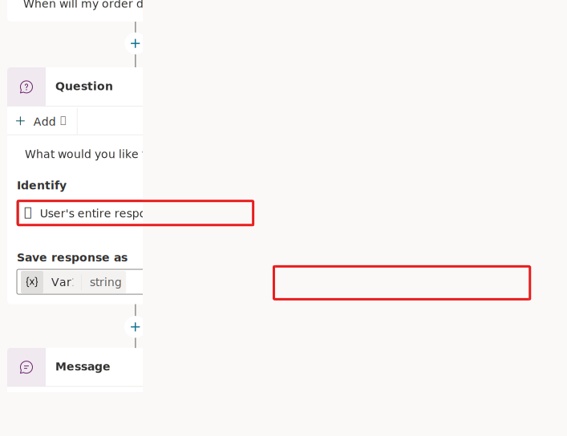
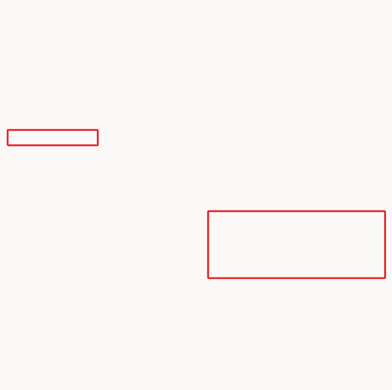
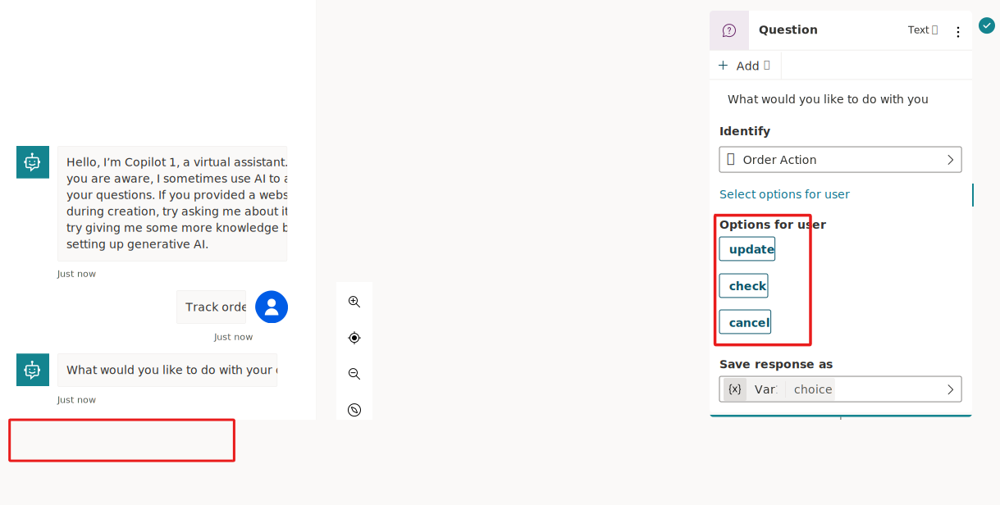

Microsoft Copilot Studio identifies and uses entities to interpret what the user is saying. For example, if the user says, "I tried to use my gift card, but it doesn't work," the Copilot knows to route the user to the topic that's related to gift cards not working, even if that exact phrase isn't listed as a trigger phrase.

Natural language understanding (NLU) helps the Copilot identify entities in a user's input. An entity represents a real-world subject, such as a phone number, zip code, city, or person's name. Your Copilot can recognize the relevant information from user input and then save it for later use.

For example, if the user types, "I want fifty red coffee machines," the AI can understand that:

-   "Fifty" is the number "50," and it's also the number of products to purchase.

-   "Red" is a color and is the color of the products to purchase.

-   "Coffee machine" refers to the product that the person wants to purchase.

In Microsoft Copilot Studio, some subjects (such as numbers and colors) have already been taught to the AI for Copilot. The Copilot author needs to specify other subjects, such as the fact that "coffee machine" is a product or that "red" is the color of a product, as demonstrated in this lab. 

Two types of entities are:

-   **Prebuilt** - Represent the most-used information, such as age, color, number, and name. Microsoft Copilot Studio can recognize these entities automatically. These entities are shown within the **Entities** list in Microsoft Copilot Studio.

-   **Custom** - Are the entities that you make. While the prebuilt entities cover commonly used information types, you'll occasionally need to teach the Copilot's language understanding model some domain-specific knowledge. For instance, you might need to create a custom entity for your product types.

Smart match and synonyms can make your Copilot more intuitive:

-   **Smart match** - Provides you with the flexibility to let the Copilot match the user's input to an entity that's a near match but not perfect. Specifically, it lets the Copilot autocorrect misspellings and expands the matching logic semantically, such as automatically matching "softball" to "baseball." You can turn off this feature if you need a match to be perfect, such as if the entity contains model numbers or error codes.

-   **Synonyms** - Allow you to recognize that something that the user has typed matches an option that you provided. For example, for "free shipping," you can add "complimentary shipping" as a synonym. For "expedited shipping," you can add "two-day shipping" or "overnight shipping" as synonyms. If the user types any of these phrases, they're matched appropriately.

The following tasks show you how to create a custom entity and use an entity within the topic that you've already created.

## Task: Use entities and slot filling
In this task, you'll learn how to use entities and slot filling. 

1.  With your Copilot open in Microsoft Copilot Studio, on your left navigation screen, select **Entities** within your site map and then select **+ New entity** (not the drop-down).

	> [!div class="mx-imgBorder"]
	> 

1.  Within the Create an entity dialog, select **Closed List**.

1. Within the **Name** field of the Order Action pane, enter the name `Order Action`.

1.  Add three options within the **List items** called `update`, `check`, and `cancel`.
You can also choose to add synonyms by selecting synonyms for each option (*optional for this task*).

1.  Turn on the **Smart matching** toggle and then select **Save**.

	> [!div class="mx-imgBorder"]
	> 

	This action creates a new entity called **Order Action** that you can use with the **Question** node in your topic to place **User's entire response** with **Order Action**.

1.  Return to the topic that you created in the second lab, called **Check Order Status**, and select the **Question** node that you created to originally identify the user's full response. Select **Identify**, and a slide-out menu will display on the right, where you can select an entity from the list.

	Search for and select the custom entity that you created in the previous step called **Order Action**.

	> [!div class="mx-imgBorder"]
	> 

1.  Select the **Options for user** option and then select all options to display to the user.

	> [!div class="mx-imgBorder"]
	> 

You have successfully set up a custom entity for your **Question** node.

Default behavior for question nodes is, if the variable that the question response is stored in has a value already, then the question is skipped and not asked. Save your topic and then use the test pane to try how entities and slot filling work by entering one of your trigger phrases, such as "Can I check on an order?" 

If you're using the demo scenario and sample data, you'll observe the process working because the user has triggered this topic with the intent to "check" an order, and the entity has been slot filled into the variable from the follow-up question after the trigger phrase. As a result, the question isn't asked because you've used entities and slot filling to retrieve the information from the first question that the user has been asked. This approach avoids you needing to ask the user a question that they've already provided information for.

> [!div class="mx-imgBorder"]
> 