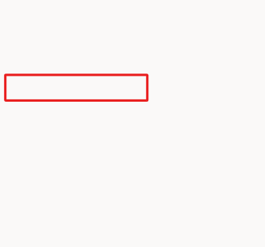

You can use the **Message** node to display a message to the user. Fundamentals of the **Message** node were covered in a previous lab and previous task in this lab. **Message** and **Question** nodes also support message variations. A **Message variation** allows you to add up to 15 messages in a single node so that, when the Copilot is triggered, it randomly selects a message variation. Message variations allow a Copilot author to add different styles of sentence in the same **Message** node, where at runtime, Microsoft Copilot Studio will randomly select one message variation when the topic is triggered. This feature provides authors with the ability to create natural sounding interaction and provides customers with a more natural sounding experience when they're interacting with Copilots over time.

> [!TIP]
> Because message variations are selected randomly when a topic is triggered, you can add multiple versions of the same message if you want to provide an experience that leans on a certain style while providing smaller degrees of probability that still offers differentiation on some occasions.

In the following exercise, you'll add a **Message variation** node on an existing **Message** node.

> [!div class="mx-imgBorder"]
> 

1.  Open the topic that you've been working with in this lab. Select the **Message** node that you want to add a **Message variation** to, such as the one in the **Condition** branch shown in the preceding image.

1.  Within the **Message** node, select **Add > Message variation**.

	> [!div class="mx-imgBorder"]
	> 

1.  Add at least one message variation of your choice, or you can use the following example to observe how message variations stack in the message node: `Absolutely. One moment and I'll get the order for you.`

	> [!div class="mx-imgBorder"]
	> 

Congratulations, you've now completed the basics of using the **Message** node. Now, you can practice testing your message variations by selecting the **Test your copilot** option and then trigger the condition multiple times to observe it working.

The **Message** node has other properties, which is an advanced feature that's not covered in these labs.
