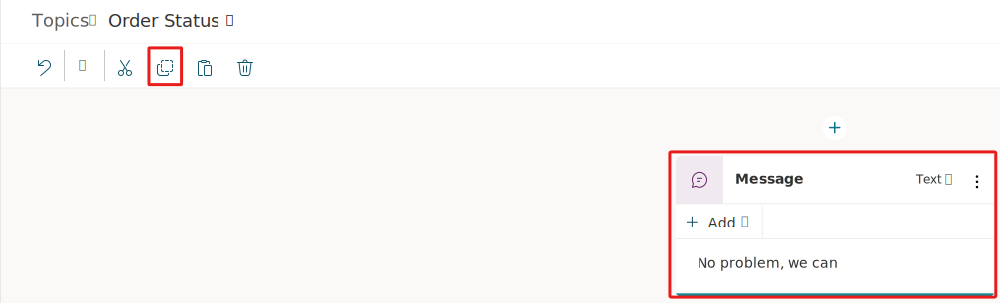

Currently, you can use familiar operations, such as copy and paste, within the Microsoft Copilot Studio authoring canvas. This capability can help accelerate the authoring experiences and make it easier for you to build logic for more complex topics. In this task, you'll practice using this capability in the topic that you have opened from the previous task.

1.  Select a node within your open topic so that the blue outline appears.

1.  On the productivity bar near the upper left of the authoring canvas, select the **copy** icon.

	> [!div class="mx-imgBorder"]
	> 

1.  Now that you've copied a node, choose one of two possible actions:

	-   Don't select a node 
	
	-   Select a node 

On the productivity bar, select the **paste** icon. If you didn't select a node, the copied node would have been pasted at the bottom of the dialog tree in the canvas. If you did select a node, it would have been pasted beneath that node and seamlessly added into the dialog tree.

Congratulations, you've now completed the basics of using the productivity features in Microsoft Copilot Studio. At this point in the labs, you should be familiar with the central authoring nodes and types of responses that you can use to interact with your customers and users.
