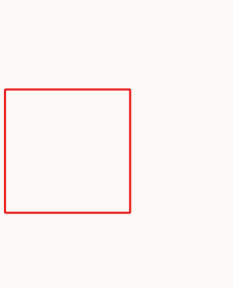
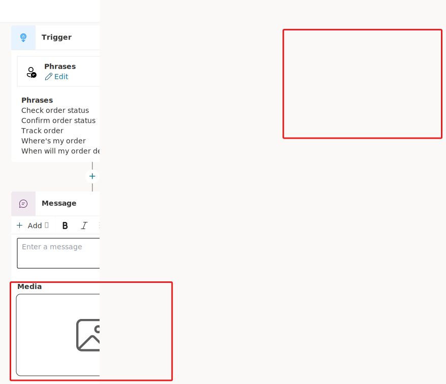
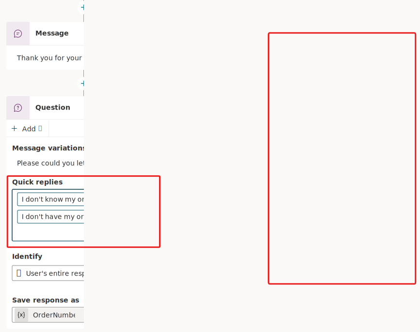

Microsoft Copilot Studio includes several extended capabilities for creating Copilots, and it provides positive conversational experiences for customers. One central feature is the rich text authoring capabilities that are available for the **Message** and **Question** nodes.

> [!div class="mx-imgBorder"]
> 

The types of rich text authoring options that are available include:

- **Image** - You can add an image, which is displayed on the card. Add the URL of the image and a title (optional).

- **Video** - You can add a video URL, which needs to be a publicly available MP4 or a YouTube video URL.

- **Basic card** - This option includes simple cards that provide adaptive cards, such as visuals; however, this option requires standard input such as the title, messages, and the ability to add buttons with basic actions.

- **Adaptive card** - You can add adaptive cards, which are platform-agnostic cards that are designed to be flexible to suit the needs at the time, including requesting action, displaying information so that it's displayed with emphasis on specific information, or more. Microsoft Copilot Studio supports Adaptive Cards v.1.3 at the time when these labs were written.

- **Quick reply** - This option allows users to select from specific options rather than needing to enter the response in text-based scenarios. Quick replies are optional, so a user can still type or speak their own response. You should use these replies to provide common suggestions or to help give the user ideas about the type of information that's being asked.

Message variations are covered in the next task. Now, you set up a few of these options so that you can become familiar with their behavior.

## Task: Use rich text capabilities in a message node

In this task, you learn how to use rich text capabilities in a message node.

1. In the topic that you have open from the previous task, add a new **Message** node below the trigger phrases. Select the **Add** drop down, and then choose **Image**. Select the image block that appears, as shown in the following screenshot. The **Title** and **Image** text boxes display. You need to enter the Image URL to a publicly available image, and you can name the image by using the **Title** field.

   > [!div class="mx-imgBorder"]
   > 

1. Remove the image by selecting **Delete** when you hover over the image property inside the message.

1. Replace the image with the following message: `Thank you for your message.`

1. Add a **Question** node below this message and then add the question `Please could you let me know your order number?` Also, change the **Identify** property to **User's entire response**.

1. From the **Add** drop down within the Question node, select **Quick reply**. A **Quick replies** box appears within the **Message** node. Enter at least two options to your question, as shown in the following screenshot. Options begin to appear on the right side of the screen for those quick replies so that you can set up the associated message behavior, such as send a message text or open a URL, text, and title.

   > [!div class="mx-imgBorder"]
   > 

**Next steps:** Take some time to repeat this process with the following different rich response types to become familiar with the different properties before you move on to the next task. For more information, see [Send a message](/power-virtual-agents/authoring-send-message/?azure-portal=true).

- Image

- Video

- Basic card

- Adaptive card

- Quick reply
