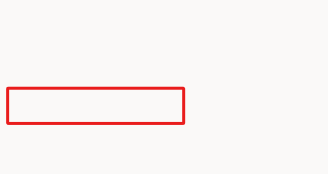
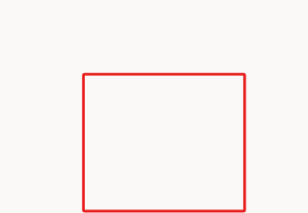

Within Microsoft Copilot Studio, Copilot makers can use Speech Synthesis Markup Language (SSML) tags in **Message** and **Question** nodes so that they can extend the behavior when they're using Microsoft Copilot Studio for speech-enabled Copilots. You can use Microsoft Copilot Studio for text authoring and speech authoring. By default, on voice-enabled channels, the message text that's entered in the message node will be used for text display and voice. You can override this behavior by providing different behavior for text and speech. For example, you'd override the behavior when you want to provide more emphasis on certain areas of a sentence or on an image message because you want to provide an alternative description that can be read aloud.

For more information, see [Speech Synthesis Markup Language](/azure/cognitive-services/speech-service/speech-synthesis-markup/?azure-portal=true).

In the following task, you'll learn about the options for adding SSML within a message node. Though you'll follow the steps to add SSML, you won't test or show the Copilot by using voice at this time.

## Task: Become familiar with adding SSML
Follow these steps to become familiar with the process of adding Speech Synthesis Markup Language (SSML) tags within a **Message** node.

1.  Within your topic, create a new **Message** node.

1.  On the message, select the **Text** dropdown menu and then select **Speech**, as shown in the following screenshot.

	> [!div class="mx-imgBorder"]
	> 

1.  A message will appear, as shown in the following screenshot. Select **Add** to add a new **Message variation**, as you've done previously. Add what you would want the Copilot to say, and then add multiple message variations for speech in the same way that you'd add them for text.

	> [!div class="mx-imgBorder"]
	> 

1.  When using SSML, you can set up how the text will be converted to synthesized speech to ensure that it sounds like natural speech. When using SSML, you can use SSML tags, such as **Audio**, **Break**, **Emphasis**, and **Prosody**, to change the behavior of how your sentence is spoken. In this lab, you won't create a speech-enabled Copilot; you're only reviewing the available options, as follows. **Delete** this message before continuing forward.

	> [!div class="mx-imgBorder"]
	> 

	-   **Audio** - Add prerecorded audio.
	
	-   **Break** - Insert pauses or breaks between words.
	
	-   **Emphasis** - Add levels of stress to words and phrases.
	
	-   **Prosody** - Specify changes to pitch, contour, range, rate, and volume.

> [!TIP]
> The preceding options automatically add SSML; however, Microsoft Copilot Studio supports any SSML that Microsoft speech service supports.

Congratulations, you've completed the exercise to cover extended functionality that's now available within the web authoring canvas for Microsoft Copilot Studio. The following section is recommended, but optional.
