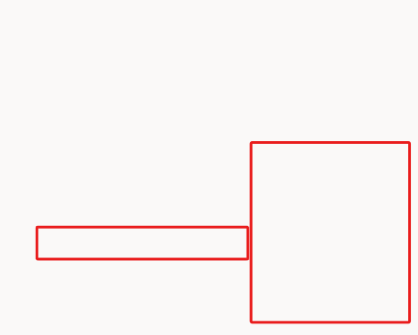
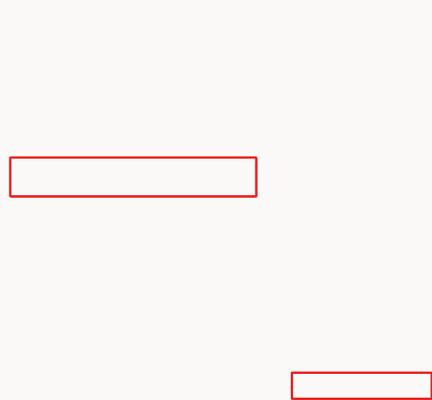
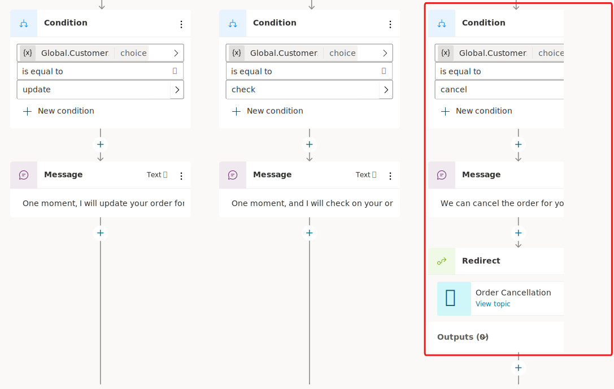

Microsoft Copilot Studio allows authors to redirect to another topic, such as an escalation topic. Typically, topics are set up to trigger based on what users are typing or saying to the Copilot that triggers an intent match, or based on events such as an escalation, conversation start, and other system topics with event-driven triggers. Users can also direct other topics within an authored conversation where it makes sense to do so, or they can perform loops within the current topic to another node.

## Task: Become familiar with topic type nodes

In the topic that you've been working on during previous exercises for this lab, select the plus (**+**) icon to add a new node and then select **Topic management**. A list of available commands displays, as shown in the following screenshot.

> [!div class="mx-imgBorder"]
> 

In the **Topic management** menu, you can select from the following options:

- **Go to another topic** - This node has an extended flyout menu where you can go to another topic that you need to select.

- **End current topic** - Selecting this option ends the current topic. Typically, you'd use this option where the topic was called from another topic. It would be returned to where it was originally called from. You can also use this option in branching conditions. If you select this option to end an entire topic of a branch, the behavior operates similar to the **End all topics** node.

- **End all topics** - This node ends all active topics. The next message from the user is considered as a new conversation, and triggers the most appropriate topic based on that user message, starting a new active topic.

- **Transfer conversation** - Select this option to transfer to an agent and send a contextual message. (*This option isn't supported in preview.*)

- **Go to step** - Allows a Copilot author to navigate to another node in the open topic. This option is useful for looping scenarios or if you want to gather more information from the user.

- **End conversation** - Confirms that the customer had their query answered.

Now that you're familiar with the basics of the topic management functions, you can practice using the **Go to another topic** node for the next task. The **Go to another topic** node is useful when you want to apply other topics from conditions based on what the user asks for in the dialog.

## Task: Use the Go to another topic node

In this task, you learn how to use the **Go to another topic** node.

1. In your topic, ensure that you completed the last task and that you have a **Condition** node in your authoring canvas.

1. Return to the **Topics** page where all your topics are displayed in a list view. Create a new blank topic called **Order Cancellation**. Don't add trigger phases at this time; instead, add a single **Message** node that acknowledges the cancellation and then save this topic. (For this task, this basic topic is for redirection; typically, the topic would be fully created. If you have time, you can add more nodes to this topic or return to it later.)

   > [!div class="mx-imgBorder"]
   > 

1. Save this topic then return to the original topic that you created called **Check Order Status** that has the **Condition** branch within it. Within the branch that had the condition set as **Cancel**, create a new node beneath the **message** node and then select **Topic management**. Then, in the flyout menu, select **Go to another topic** and then find and select your **Order Cancellation** topic in the list, as shown in the following screenshot.

   > [!div class="mx-imgBorder"]
   > 

1. The three conditions from the previous task should display. The **Cancel** conditional branch should contain a redirect to another topic, which sends an acknowledgment message by redirecting to the new topic that you created. Test the behavior by saving your topic and then selecting the **Test your copilot** option.

   > [!div class="mx-imgBorder"]
   > 

Congratulations, you're now familiar with the available actions under the **Topic management** menu. It would be useful for you to review the other options under **Topic management** before you continue; however, it's not essential for moving on to the next exercise.
