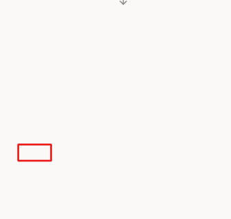

Your topic has currently been updated from the second lab with entities and slot filling capabilities, and it's using dynamic data to store variables and reuse those variables in messages to provide a dynamic authoring experience. Now, you'll use the same variable in a condition statement in Microsoft Copilot Studio.

With condition statements in Microsoft Copilot Studio, a Copilot author can determine behavior under certain conditions that can be true, false, or something else (for example, if it's blank). Condition statements allow and promote flexibility in the authoring canvas, allowing you to provide great customer or user experiences based on the needs while limiting the need to create several similar topics. After you begin to use conditions, you'll create *branches*, which create separate flows that the person who's using the Copilot can be directed to. These branches can have their own conditions, depending on what behavior you want to create.

For more information on conditions, see [Authoring Using Conditions](/power-virtual-agents/preview/authoring-using-conditions/?azure-portal=true).

## Task: Create a condition by using variables

In this task, you'll create a condition based on the three variable options that were used in the custom entity in the first exercise.

1.  In your authoring canvas, under the **Message** node that you modified in the previous task, select the plus (**+**) icon to add a new node and then select **Add a condition**.

	> [!div class="mx-imgBorder"]
	> 

1.  Two new nodes will appear, one is your **Condition** and the other is an exception for **All other conditions**.

	In your **Condition** node, select the **Select a variable** option and then select your **Customer Action** global variable.

	> [!div class="mx-imgBorder"]
	> 

1.  Keep the condition operator as **is equal to** and then select the empty box beneath to display the three available options from the selected variable. Select the **update** option.

	> [!div class="mx-imgBorder"]
	> 

1.  A completed condition should now show: if the **CustomerAction** is equal to **update**.

	> [!div class="mx-imgBorder"]
	> 

1.  Create two more conditions in this branch for the two other options for the **Customer Action** variable (check and cancel). Select the plus (**+**) icon to add a node above the condition and then select **Add a condition** to add another conditional branch.

	> [!div class="mx-imgBorder"]
	> 

1.  Repeat the previous steps by selecting your **Global.CustomerAction** variable and then select the **check** and **cancel** options in two other conditions so that you'll have a conditional branch with three options (including **All Other Conditions**), as shown in the following screenshot.

	> [!div class="mx-imgBorder"]
	> 

1.  Under each condition node, add a **Message** node that will display different text depending on the condition, as shown in the following example.

	> [!div class="mx-imgBorder"]
	> 

1.  Save your topic and then select the **Test your copilot** option to explore the different trigger phrases and conditions that lead the user to view different message outcomes.

Conditions are foundational tools that help you create tailored experiences based on what the user has selected or answered in previous questions. You can nest conditions within other conditions for more complex logic.

Congratulations, you've now completed the basics of using conditions and using variables as parameters within them.
