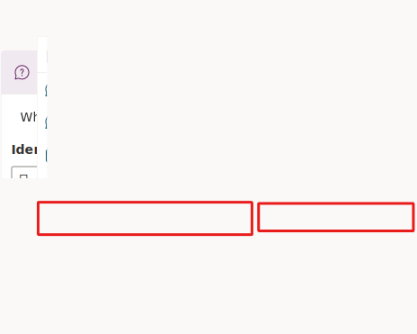
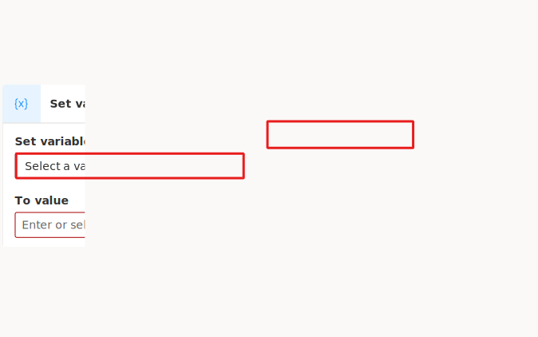
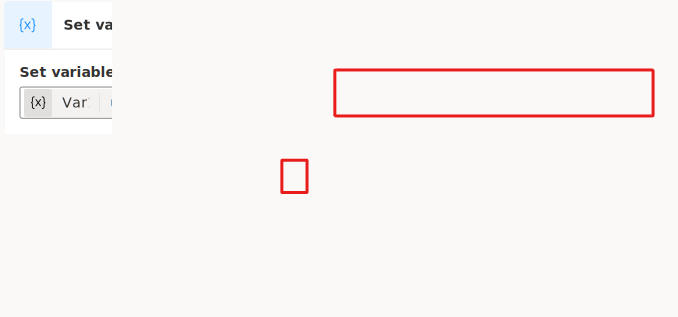
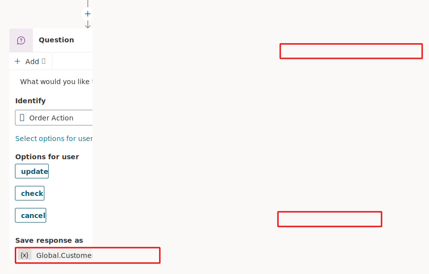
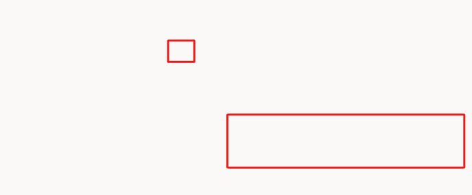
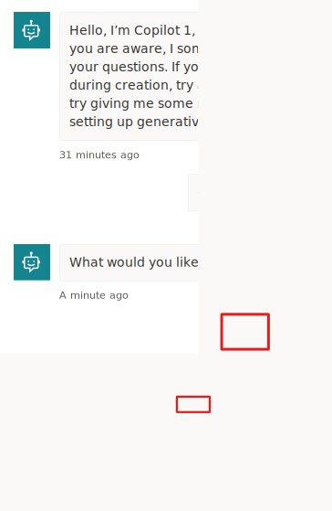

You're beginning to enhance the topic that you created in the second lab. In the previous section, you used entities and slot filling to automatically detect the data from a user's sentence and store specific data in a variable. Now, you'll learn how to use the data that you obtained from the question in a variable and then display it within a message by using Microsoft Copilot Studio unified authoring.

## Task: Learn about variable types

Variables let you save responses from your customers to help guide the conversation (such as determining whether to provide different instructions for returns based on the purchase price of the item). And you can use them directly in the conversational response from the Copilot (for example, "I can help you return the {variable_ProductName}").

By default, you can only use a variable's value in the topic where the variable is created. However, if you want the Copilot to reference the same value across other topics, you can choose to make it a *global* variable (you might know this concept from other applications). Basically, when the conversation moves to a different topic, the Copilot can remember and use variable values that have been filled in from previous topics in the conversation. In Microsoft Copilot Studio, you can set up variables by using Microsoft Power Fx functions and outside of a **Question** node by using the **Set a Variable value** node.

Different types of variables in Microsoft Copilot Studio include:

- **System** - These variables are normally populated with system data, and you can use them in conditions. System variables aren't user made and are part of the platform. You can access system variables in the authoring canvas from the variable selection under **System**.

- **Topic** - These variables are user made from the **Set a Variable Value** node or the **Question** node. These variables are by default limited in scope and available only in the topic that's being created and no other topics. Two options are available to expand this scope for topic variables if they can receive values **from** other topics and return values **to** other topics. With these options set, a topic variable is no longer limited to only being used in the topic, but other topics can use it. You can access **Topic** variables in the authoring canvas from the variable selection under **Custom**.

- **Global** - These variables are available from any topic, and they're a good way to store data that multiple topics use to help the conversation, regardless of how many topics are triggered within it. You can access **Global** variables in the authoring canvas from the variable selection under **Custom**.

You can use variables in several places, including the **Questions**, **Conditions**, and **Set Variable Value** nodes. The variable can be a custom value that uses Power Fx, a user-entered value, a response from a question, or system variable values.

Use this first exercise to become familiar with the **Set Variable** node and to review the different types of variables. This task involves creating a new node, creating a new variable, renaming the variable, and determining other variables that you can use within Microsoft Copilot Studio at the system level. At the end of this task, you'll delete this node.

1. In your topic, create a **Set variable** node anywhere in the canvas by selecting the add node button. Then, select **Variable management > Set a variable value**. This step is for exploring variable options, so it isn't critical that you add the variable in a specific location. It's deleted later.

   > [!div class="mx-imgBorder"]
   > 

1. A new **Variable** node is created. Select the **Select a variable** menu under the **Set variable** section within the node. A flyout panel opens on the right side. Select the **Create new** button.

   > [!div class="mx-imgBorder"]
   > 

1. Your new variable is made and is, by default, called **Var1** (or a different number if you already created a variable with this name, such as **Var2** or **Var3**).

   Select the name of the variable to open the **Variable properties** panel on the right side of the screen, where you can rename a variable and change the scope of a variable from **Topic** or **Global**.

   > [!TIP]
   > It's a best practice to ensure that you name your variables to something descriptive based on the data that's being stored. This approach helps you in the future and helps other makers.

   > [!div class="mx-imgBorder"]
   > 

1. Select the **X** in the upper-right corner of the **Variable properties** panel to close it. Determine what data you can use to store in the variable. You can use other variables that you created in your authoring canvas, or you can use system variables or formulas. On your **Set variable value** node, select the arrow to the right of **To value**. A flyout panel appears that contains separate headings named **Custom**, **System**, **Environment**, and **Formula** (using Power Fx, which is covered later in this lab).

   > [!div class="mx-imgBorder"]
   > 

1.  Select the **System** heading to open the **System Variable** list. Now, you'll be able to view all variables that Microsoft Copilot Studio uses. These variables contain data that Microsoft Copilot Studio populates, and you can also use this data in your own variables. Review these options so that you know what's available by default.

	> [!div class="mx-imgBorder"]
	> 

1. Now that you reviewed the options that are available to you within the **Set variable** node, you can remove this node by selecting the extended menu options and selecting **Delete**, as shown in the following screenshot (it won't be used in the next lab exercises).

   > [!div class="mx-imgBorder"]
   > 

1. From anywhere within the authoring canvas, you can also use the **Variables** window to review all variables within the topic, including global variables. Go to the upper right of the screen and select **Variables** to view this panel. It's beneficial to review all variables within a topic, especially large topics.

   > [!div class="mx-imgBorder"]
   > 

## Task: Use variables in a message node

In this exercise, you learn how to use the data from the previous task in the first exercise, **Check Order Status**. At this point, you should have the **Question** node in your topic linked to an entity.

1. Open your **Question** node and select the variable name, which should still be **Var1** or similar if you didn't yet update it.

1. In the right panel that opens, rename the **Variable name** to **CustomerAction** and then select **Global** to change the scope from local (topic) to **Global** so that other topics can access it, as shown in the following screenshot.

   > [!div class="mx-imgBorder"]
   > 

1. Now, you use the variable that you completed from the question or trigger phrase in the message as dynamic data. Select the **Message** node and insert it within the message phrase where it's appropriate by placing your cursor in your message text where you want the variable to display. Select the **{X}** variable icon and then select the **Global.CustomerAction** variable that you recently created. This action is common to insert a variable in place of the literal word, making it dynamic based on data provided from the user or customer's question.

   > [!div class="mx-imgBorder"]
   > 

1. Your **Message** node with your entered text should display, and the variable within the sentence. This action allows your message to be dynamic depending on what the customer asks for in the topic, and it's saved in the variable by using slot filling. You might consider changing the wording of your message to match the following: `No problem. We can` *(variable)* `that for you. Let us take a look at that now and get your information.`

   > [!div class="mx-imgBorder"]
   > 

1. Select the **Test your copilot** option to test the behavior of the Copilot and the changes that you made by triggering the topic with a trigger phrase. The following screenshot shows this process in action.

   > [!div class="mx-imgBorder"]
   > 

> [!TIP]
> Within the **Variable management** options is the **Clear all variables that** option, which clears all variable values. This option is useful if you want to begin or loop back into the same topic but take new values, especially if you've set up question behavior properties where a question could be skipped if it already had a value.

**Variables** are the best way to store dynamic data or data that you want to perform conditions or checks on to drive conversational behavior in a particular way, as you'll observe in the next task.

Congratulations on completing this task. You've now reviewed variables and the different types in Microsoft Copilot Studio.
