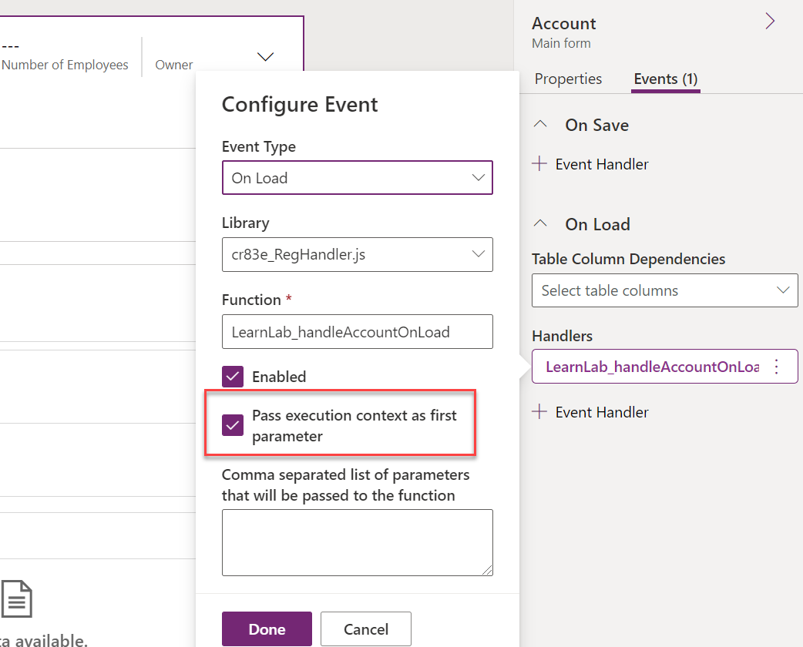
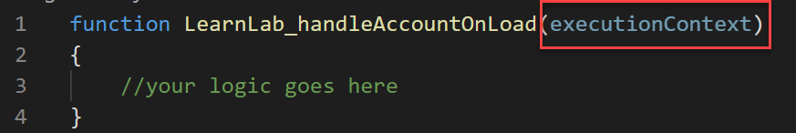
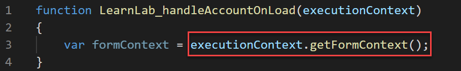
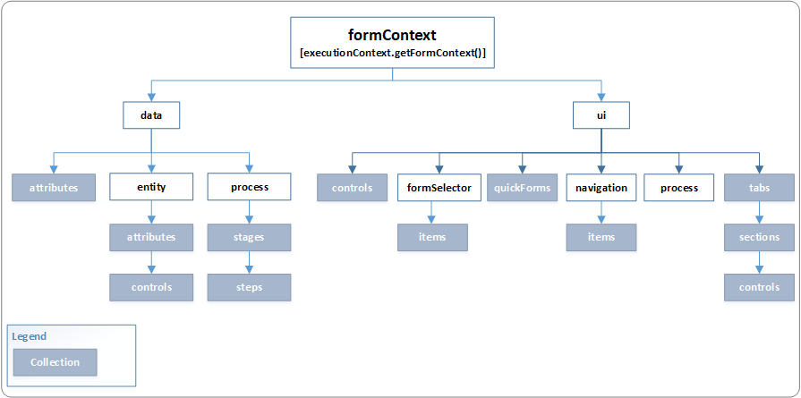

When creating event handlers and using the client scripting API, you should understand the context objects available and how to use them. The purpose of the context objects is to give you information about the context in which your code is executing. This context ensures you don't have to hardcode the information in your logic. This context allows you to create more generic functions and makes your functions less sensitive to the specific layout structure of the UI components you're working with.

## Execution context

When you register an event handler, you can have the execution context passed as the first parameter. When you register the event handler using form properties, this is an option that you can enable. The image shows registering an OnLoad handler and enabling execution context.

> [!div class="mx-imgBorder"]
> [](../media/pass-execution-context.png#lightbox)

Typically, it's a good idea to always have this option selected when you register an event handler using form properties. When you register an event handler using code, this option is automatically selected.

Your function definition that takes execution context as the first parameter would look like this:

> [!div class="mx-imgBorder"]
> [](../media/execution-context-function.png#lightbox)

The most common use of the execution context is to retrieve the form and grid contexts. Another useful method in this context is getEventSource. The event source returns a reference to the object that the event occurred. This object allows you to write generic handlers that interrogate the event source at run time to find out which control the event occurred on. This object can be helpful when writing one method you plan to register on events for multiple controls instead of registering a separate event handler for each control.

## Form context

The Client API form context (**formContext**) references the form or an item on the form, such as a quick view control or a row in an editable grid, against which the current code runs. You can retrieve the **formContext** object from the execution context using the **getFormContext** function.

> [!div class="mx-imgBorder"]
> [](../media/form-context.png#lightbox)

Before the form context, the item or form was available using the global Xrm.Page object. With the latest version, the Xrm.Page object is deprecated, and you should use the getFormContext method of the passed in the execution context object to return a reference to the appropriate form or an item on the form. So, instead of writing code like the following.

```javascript
var firstName = Xrm.Page.getAttribute("firstname").getValue();
```

You would instead write the below code using formContext.

```javascript
var formContext = executionContext.getFormContext();

var firstName = formContext.getAttribute("firstname").getValue();
```

You can learn more about the [deprecation of Xrm.Page](/dynamics365/get-started/whats-new/customer-engagement/important-changes-coming?azure-portal=true#some-client-apis-are-deprecated).

The below diagram is a high-level overview of the properties and methods that are available within the form context:

> [!div class="mx-imgBorder"]
> [](../media/form-context-diagram.png#lightbox)

### Data object

The data object (**formContext.data**) is intended to be used for any table and process data manipulation within the form.

This table is a summary of each of the data object's containing objects and collections:

| Name | Description |
|------|-------------|
| Attributes | Collection of non-entity data on the form. Items in this collection are of the same data type as the attributes collection on entity, but it's important to note that they aren't attributes of the form table. |
| Entity | Provides methods to retrieve information that are specific to the row that is displayed on the page, the save method, and a collection of all the attributes that are included on the form. Attribute data is limited to attributes that are represented by fields on the form versus all fields that are available in the entity configuration. For more information, see [formContext.data.entity](/power-apps/developer/model-driven-apps/clientapi/reference/formcontext-data-entity/?azure-portal=true). |
| Process | Provides objects and methods to interact with the business process flow data on a form. For more information, see [formContext.data.process](/power-apps/developer/model-driven-apps/clientapi/reference/formcontext-data-process/?azure-portal=true). |

### UI object

The UI object (**formContext.ui**) provides methods to retrieve information about the user interface, and also collections for several sub components of the form or grid.

This table summarizes each of the UI object's containing objects and collections.

| Name | Description |
|------|-------------|
| Controls | Collection of all the controls on the page. See [Collections](/power-apps/developer/model-driven-apps/clientapi/reference/collections/?azure-portal=true) for information about the collections, controls, and the control objects in the collection. |
| FormSelector | Use the formSelector.getCurrentItem method to retrieve information about the form that is currently in use. Use the formSelector.items collection to return information about all the forms that are available for the user. |
| Navigation | A collection of all the navigation items on the page. See [formContext.ui.navigation item](/power-apps/developer/model-driven-apps/clientapi/reference/formcontext-ui-navigation/?azure-portal=true) for information about the items in the collection. Navigation isn't available for Microsoft Dynamics 365 for tablets. For automating overall application navigation, we tend to use the Xrm.Navigation namespace. |
| Process | Provides objects and methods to interact with the business process flow control on a form, such as setting its visibility. For more information, see [formContext.ui.process](/power-apps/developer/model-driven-apps/clientapi/reference/formcontext-ui-process/?azure-portal=true). |
| QuickForms | A collection of all the quick view controls on a form. For more information, see [formContext.ui.quickForms](/power-apps/developer/model-driven-apps/clientapi/reference/formcontext-ui-quickforms/?azure-portal=true). |
| Tabs | A collection of all the tabs on the page. See [formContex.ui.tabs](/power-apps/developer/model-driven-apps/clientapi/reference/formcontext-ui-tabs/?azure-portal=true) for information about the items in the collection. |

It's common to use the data object instead of the UI object if you need to get or set a table column value. The data object has only a single attribute representing the table column value. With the UI object, you can have multiple controls for the same table column on a form, each with a reference to the attribute. So, it's easier to work with the data object to manipulate the attribute value and the UI object if you want to work with the controls that represent that attribute on the form.

Using the context objects in your scripts makes them more resilient to change on the form and in the client API.
