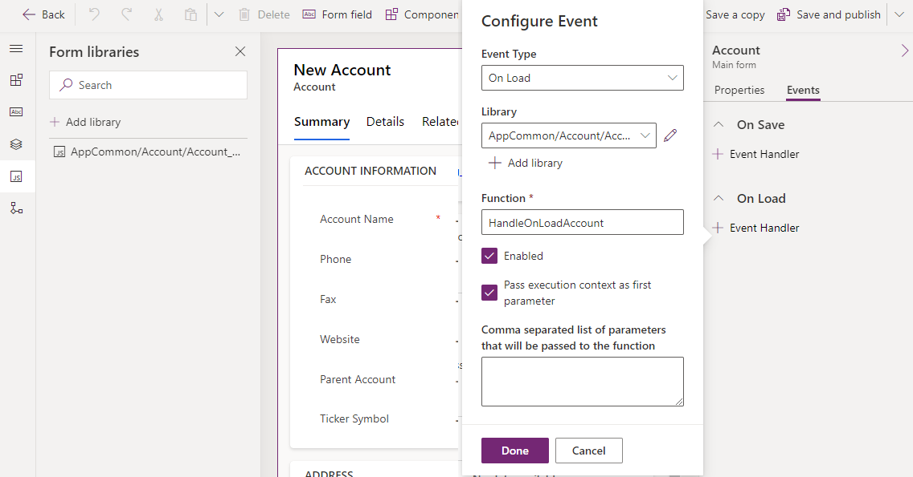
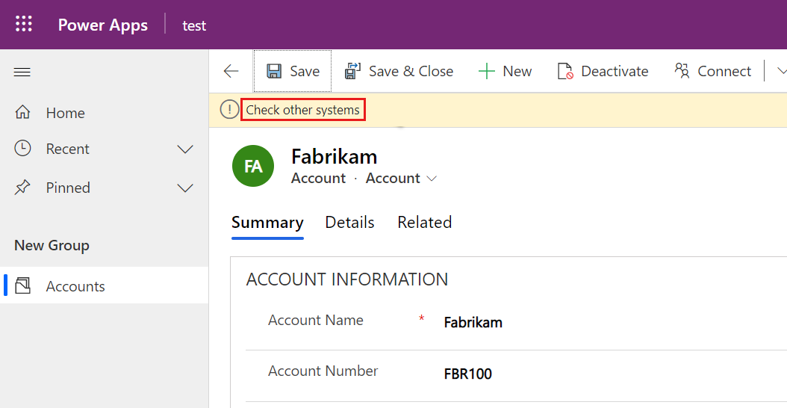

Client scripting logic runs as event handlers for form events. You must register your event handlers to have your logic executed. Registration for common events can be done via the form properties dialog or from code. Some events can only register with code. Event handlers can run on multiple forms but must be registered separately on each form.

## Register via form properties

Registering event handlers using form properties creates a static configuration of event handlers at design time. Each time the form loads, the same event handlers run. Unlike when you register the event handler with code, logic can determine what should be registered.

In the form designer you can register event handlers for the following events:

- **Form** - This handler allows you to register OnLoad and OnSave event handlers.

- **Tabs** - This handler allows you to register events for each tab on the form for tab state change. Commonly this is used to know if a tab is expanded so you can do something like dynamically load data.

- **Columns** - This handler allows you to register an event handler if column data is changed.

The following is an example of registering an **OnLoad** event handler for the account table.

> [!div class="mx-imgBorder"]
> [](../media/configure-event.png#lightbox)

One common pattern is registering an **OnLoad** handler and then registering the remaining event handlers via code in the OnLoad event handler logic. The benefit of this approach is that when you need your logic to run on multiple forms, you don't have to register all the event handlers on each form. Another advantage is if you need to dynamically determine some of the event handlers, you can use logic to decide whether to register a handler. For example, you may want to skip registering an event handler for a column if you can determine when the form is loaded and if this column is read-only or hidden.

## Register using code

Registering event handlers using code is possible for all handlers except **OnLoad**, which must be registered using configuration. You can then use the OnLoad handler to register other handlers in code. The following is an example of registering an **OnChange** handler on the account number column in the account table by performing the following steps:

- Create a function that runs in the **OnLoad** event of the account form.

- In that function, call **addOnChange** to register the function to call when the account number column changes.

- Register the **OnLoad** event handler on the account form properties.

```javascript
function LearnLab_handleAccountOnLoad(executionContext)
{
    var formContext = executionContext.getFormContext();
    formContext.getAttribute('accountnumber').addOnChange(LearnLab_handleOnChangeAccountNumber)
}
function LearnLab_handleOnChangeAccountNumber(executionContext)
{
    var formContext = executionContext.getFormContext();
    formContext.ui.setFormNotification('Check other systems', 'INFO', 'AcctNumber');
}
```

This code displays a form level notification whenever the account number column data changed.

> [!div class="mx-imgBorder"]
> [](../media/notification.png#lightbox)

There are many other [client side events](/power-apps/developer/model-driven-apps/clientapi/reference/events/?azure-portal=true) for which you can register handlers.
