In this exercise, you use client script to implement the business requirement of hiding the Status section when a project start date isn't provided or in the future.

> [!IMPORTANT]
> Use a test environment with Microsoft Dataverse provisioned and the sample apps enabled. If you do not have one you can sign up for the [community plan](https://powerapps.microsoft.com/communityplan/?azure-portal=true).

## Task 1 - Prepare solution with the form

In this task, you create a solution, add an existing table to the solution, and prepare the main form of the table you added to the solution.

1. Navigate to [Power Apps maker portal](https://make.powerapps.com/?azure-portal=true) and make sure you are in the correct environment that has the sample apps enabled.

   > [!div class="mx-imgBorder"]
   > [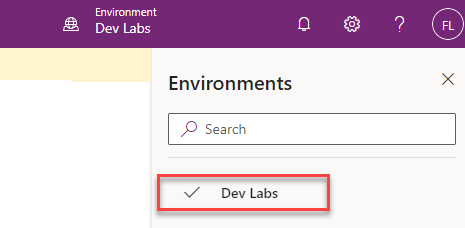](../media/environment-name.png#lightbox)

1. Select **Solutions** and then select **+ New solution**.

1. Enter **Innovation Challenge Enhancements** for **Display name**, select **CDS default publisher** for **Publisher**, and select **Create**.

   > [!div class="mx-imgBorder"]
   > [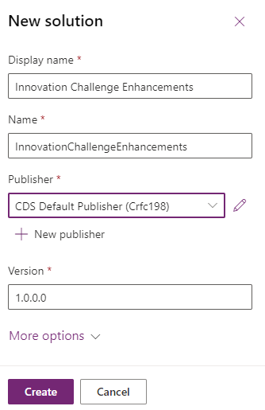](../media/new-solution.png#lightbox)

1. The **Innovation Challenge Enhancements** you created should open.

1. Select **+ Add existing** and then select **Table**.

1. Enter team in the search textbox, select **Team Project**, and then select **Next**.

   > [!NOTE]
   > If you are unable to locate **Team Project** table you may not have the sample apps in your environment. Select another environment or create a new one with the sample apps installed.

1. Select the **Select objects** button.

   > [!div class="mx-imgBorder"]
   > [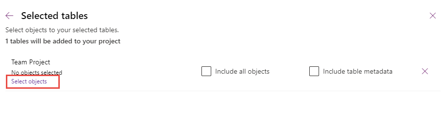](../media/select-components.png#lightbox)

1. Select the **Forms** tab, select the **Information** form of **Form type** Main, and then select **Add**.

   > [!div class="mx-imgBorder"]
   > [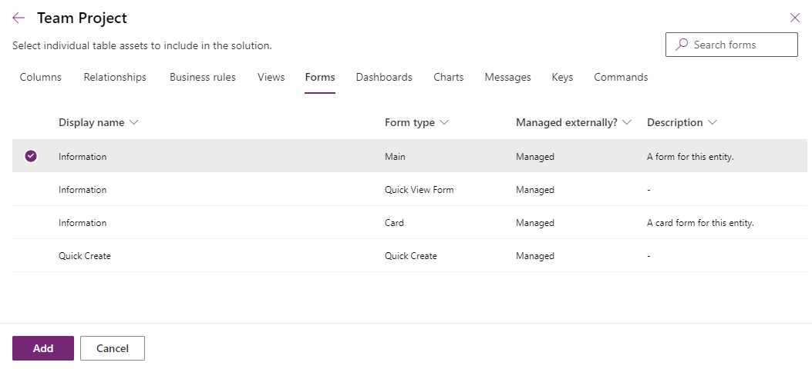](../media/add-component.png#lightbox)

1. Select **Add** again.

1. Open the **Team Project** table you just added to the solution.

1. Select the **Forms** in the **Data experiences** card.

1. Open the **Information** form of **Form type** Main.

   > [!div class="mx-imgBorder"]
   > [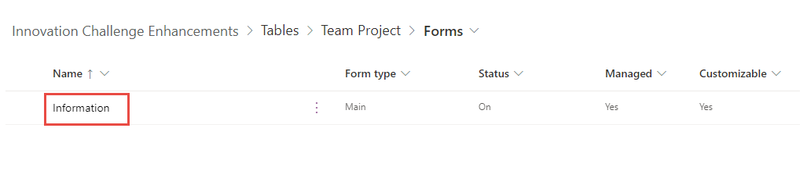](../media/information.png#lightbox)

1. Select the **Status** section.

   > [!div class="mx-imgBorder"]
   > [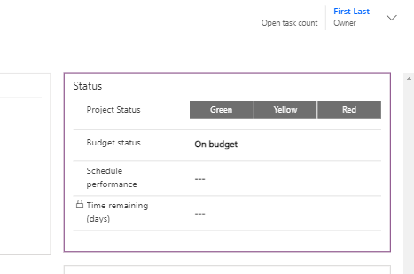](../media/status.png#lightbox)

1. In the **Properties** pane, change the **Name** to **section_status**, and check the **Hide** checkbox. By default, a GUID is assigned as the section name. Change it to a more meaningful name to reference in your scripts. You also hide the section by default to reduce the jarring effect of showing and then hiding on load of the form.

   > [!div class="mx-imgBorder"]
   > [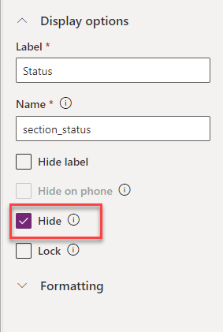](../media/hide.png#lightbox)

1. Go to the Tree view and select the **General** tab.

   > [!div class="mx-imgBorder"]
   > [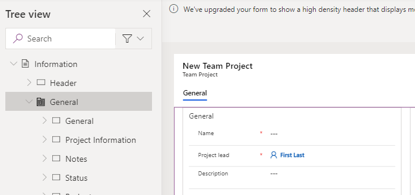](../media/general.png#lightbox)

1. In the Properties pane, change the **Name** to **tab_general**.

1. Select the **Project start** column.

   > [!div class="mx-imgBorder"]
   > [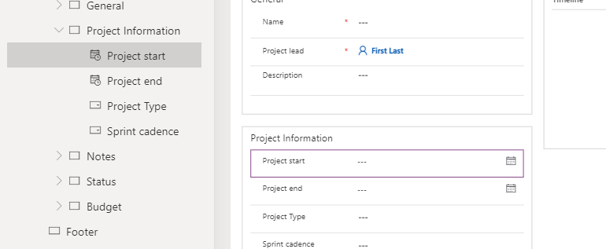](../media/project-start.png#lightbox)

1. Go the **Properties** pane and select the **(i)** button next to the **Table column** name.

1. Copy the **Logical name** (**sample_projectstart**) and paste it into a notepad. You use this name in your script to reference the data column.

   > [!div class="mx-imgBorder"]
   > [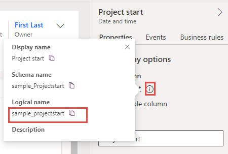](../media/information-button.png#lightbox)

1. Select **Save and publish** to save your changes. Wait for the publishing to complete.

1. Select the **Back** button.

   > [!div class="mx-imgBorder"]
   > [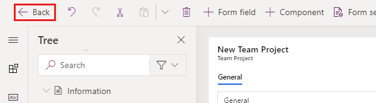](../media/back.png#lightbox)

1. Select **All**.

1. Select **Publish all customizations** and wait for the publishing to complete.

## Task 2 - Build the client script

In this task, you create a script that shows/hides the status section based on the project start date.

Hide the status section. If the project start date is empty or in the future, otherwise show the status section.

1. Start a new instance Visual Studio Code or use your favorite code editor. You can download and install [Visual Studio Code](https://code.visualstudio.com/?azure-portal=true).

1. Select **Open Folder**.

   > [!div class="mx-imgBorder"]
   > [](../media/open-folder.png#lightbox)

1. Create a folder in your Documents folder and name it **ClientScriptLab**.

1. Select the **ClientScriptLab** folder you created and **Select Folder**.

   > [!div class="mx-imgBorder"]
   > [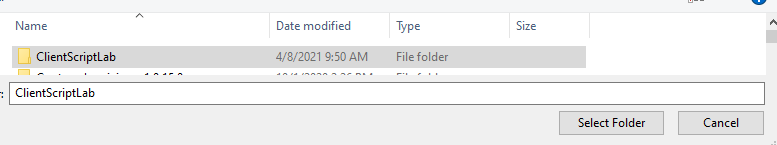](../media/select-folder.png#lightbox)

1. Hover over the **CLIENTSCRIPTLAB** folder and select **New File**.

   > [!div class="mx-imgBorder"]
   > [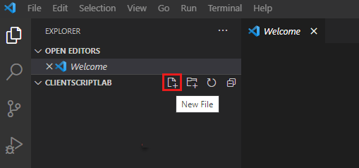](../media/new-file.png#lightbox)

1. Name the file **FormTeamProject.js**.

1. Add the below functions to **FormTeamProject.js**. Your functions should have either unique names or use a namespace to ensure uniqueness.

   ```javascript
   function LearnLab_handleTeamProjectOnLoad(executionContext) {

   }
   function LearnLab_handleProjectStatusOnChange(executionContext) {

   }
   function LearnLab_hideOrShowStatusSection(formContext) {

   }
   ```

1. Add this script to the **OnLoad** function. Notice the project start column name here **sample_projectstart**. This is the logical name you saved earlier. This code registers an **onChange** event handler and calls a common function to show/hide the section. You need to handle on change in case a project start date input changes the hide/show requirement.

   ```javascript
   var formContext = executionContext.getFormContext();
   formContext.getAttribute('sample_projectstart').addOnChange(LearnLab_handleProjectStatusOnChange);
   LearnLab_hideOrShowStatusSection(formContext);
   ```

   > [!div class="mx-imgBorder"]
   > [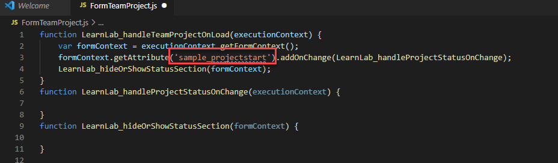](../media/onload-function.png#lightbox)

1. Add this script to the OnChange function. This code simply gets the formContext and then calls the common function to hide/show.

   ```javascript
   var formContext = executionContext.getFormContext();
   LearnLab_hideOrShowStatusSection(formContext);
   ```

1. Add this script to the **hideOrShowStatusSection** function. Notice the tab name **tab_general**, the section name **section_status**, and column name **sample_projectstart**.

   ```javascript
   var tabGeneral = formContext.ui.tabs.get('tab_general');
   var sectionStatus = tabGeneral.sections.get('section_status');
   var startDate = formContext.getAttribute('sample_projectstart').getValue();
   var CurrentDate = new Date();
   if (startDate == null || startDate > CurrentDate) {
     sectionStatus.setVisible(false);
   } else {
     sectionStatus.setVisible(true);
   }
   ```

1. Your script should now look like this image.

   > [!div class="mx-imgBorder"]
   > [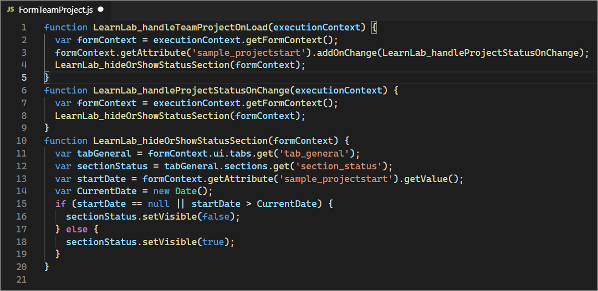](../media/example-script.png#lightbox)

1. Select **File** and **Save**.

## Task 3 - Upload the script

In this task, you load the script you created into your environment.

1. Navigate to [Power Apps maker portal](https://make.powerapps.com/?azure-portal=true) and make sure you are in the correct environment.

1. Select **Solutions** and open the **Innovation Challenge Enhancements** solution.

1. Select **+ New** and then select **More | Web resource**.

   > [!div class="mx-imgBorder"]
   > [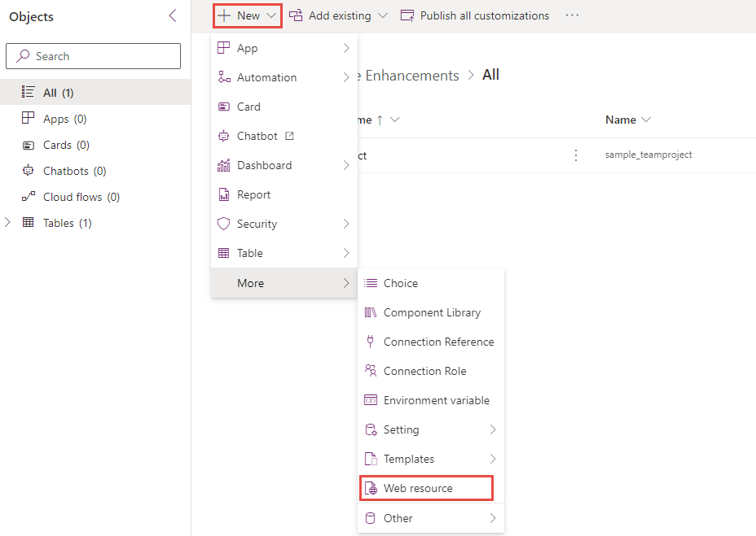](../media/new-web-resource.png#lightbox)

1. Enter **FormTeamProject.js** for **Name**, enter **FormTeamProject.js** for **Display name**, select **Java script (JS)** for **Type**, and select **Choose File.**

   > [!div class="mx-imgBorder"]
   > [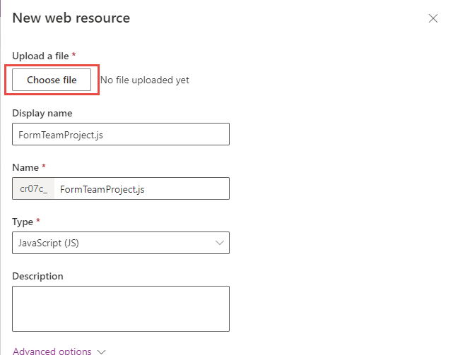](../media/choose-file.png#lightbox)

1. Select the **FormTeamProject.js** file you created earlier and then select **Open**.

1. Select **Save**.

1. Your solution should now have the **Team Project** table and the **FormTeamsProject.js** web resource.

1. Don't navigate away from this page.

## Task 4 - Edit form

In this task, you add JavaScript library to the Team Project main form and add an event handler for the **On Load** event.

1. Make sure you're still in the **Innovation Challenge Enhancements** solution.

1. Expand **Tables** and then expand the **Team Project** table.

1. Select **Forms** and open the **Information** form.

1. Go to the **Properties** pane, select the **Events** tab, and select **+ Add library**.

   > [!div class="mx-imgBorder"]
   > [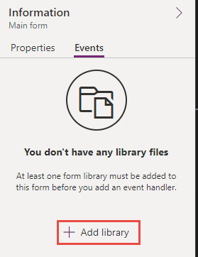](../media/add-new-library.png#lightbox)

1. Enter **team** in the search textbox and press **Enter**. Select **FormTeamProject.js**, and select **Add**.

   > [!div class="mx-imgBorder"]
   > [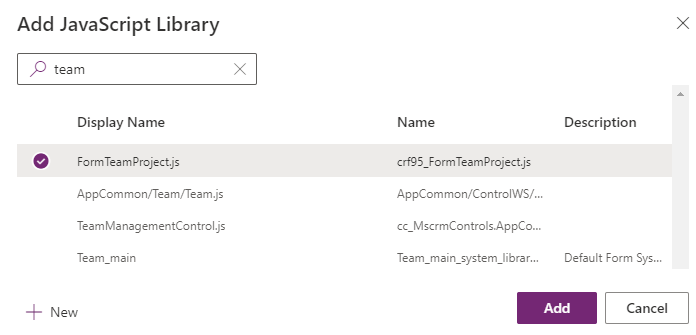](../media/javascript-library.png#lightbox)

1. Expand the **On Load** section and select **+ Event Handler**.

   > [!div class="mx-imgBorder"]
   > [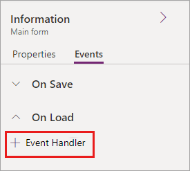](../media/add-event-handler.png#lightbox)

1. Enter **LearnLab_handleTeamProjectOnLoad** for **Function**, check the **Pass execution context as first parameter** checkbox, and select **Done**.

   > [!div class="mx-imgBorder"]
   > [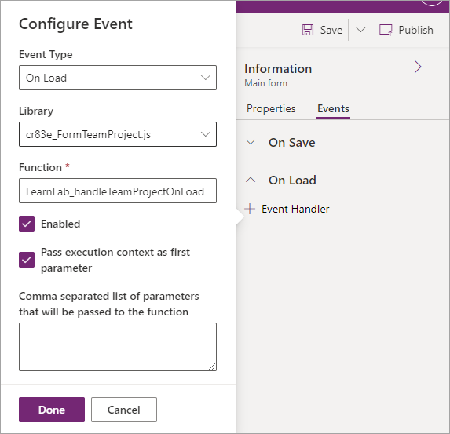](../media/configure-event-details.png#lightbox)

1. Select **Save and publish** and wait for your changes to be saved.

1. Select the **Back** button.

1. Select **All**.

1. Select **Publish all customizations** and wait for the publishing to complete.

## Task 5 - Test

In this task, you test your script.

1. Navigate to [Power Apps maker portal](https://make.powerapps.com/?azure-portal=true) and make sure you are in the correct environment.

1. Select **Apps** and open the **Innovation Challenge** application.

1. Select **Team Projects** and open the **Cloud Computing** team project.

1. The **Status section** should be hidden because the **Project start** column is empty.

   > [!div class="mx-imgBorder"]
   > [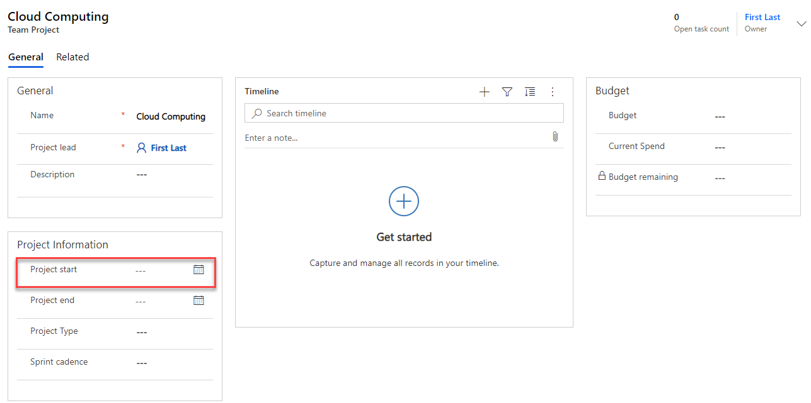](../media/project-start-value.png#lightbox)

1. Press calendar icon next to the **Project start** and select today's date.

1. The **Status** section should become visible.

   > [!div class="mx-imgBorder"]
   > [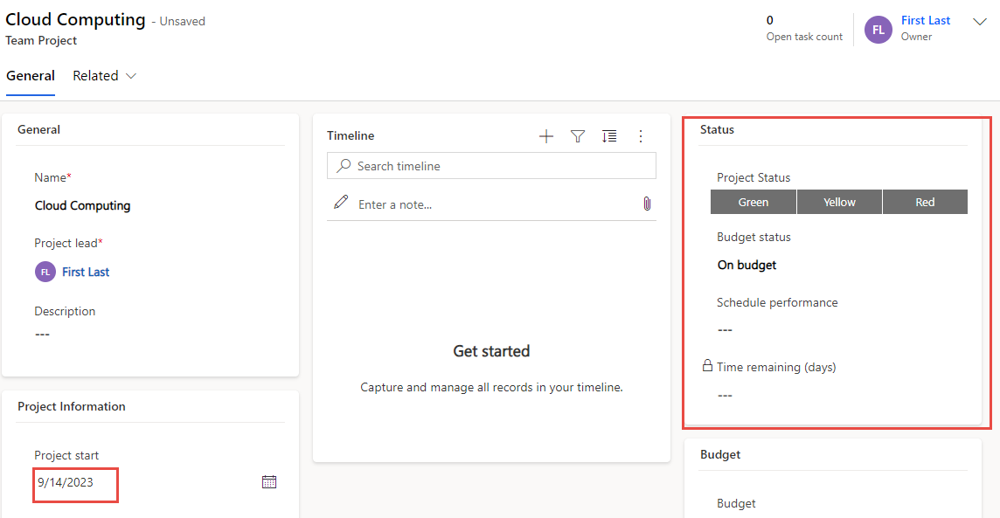](../media/project-start-today.png#lightbox)

1. Change the **Project start** to a future date.

1. The **Status** section should now become hidden.

1. Change the **Project start** to a date in the past.

1. The **Status** section should become visible again.

You have now used JavaScript and Client API to implement business requirements that aren't possible to implement using declarative options like business rules.
