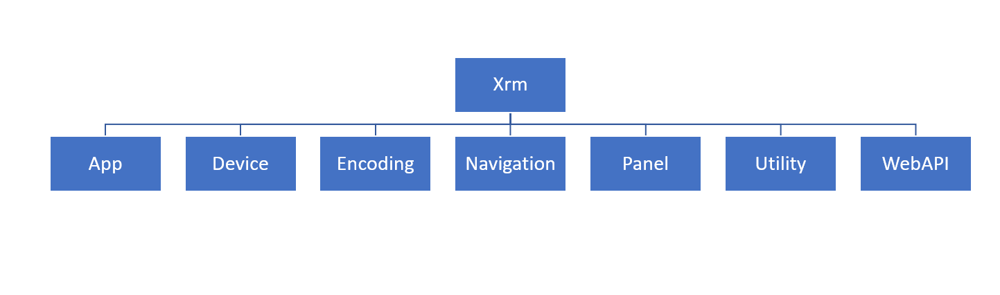

Client scripting allows you to use JavaScript in Power Apps model-driven apps to implement custom business logic. Client scripting should be an alternative when declarative business rules don't meet the requirements. Client scripting runs on a model-driven form in response to form events. The following are the most common events you can register event handlers for:

- Form load

- Data in a column changed

- Form is saved

In addition, you can configure a command bar button to invoke a client script function when pressed.

Some of the common tasks that you can accomplish using client scripting include:

- Get or set column values on the form.

- Show and hide user interface elements.

- Reference multiple controls per column.

- Switch between forms where multiple forms are available for a table.

- Open forms, views, dialogs, and reports.

- Interact with the business process flow control.

Using the provided client scripting API, you should implement your interaction with data, form content changes, or app behavior modifications. While you write your logic in JavaScript, it's important to note that even though the form uses standard HTML, direct manipulation of the form content isn't supported. Client scripting provides an object model with methods for interacting with the various form components. This approach ensures any changes in the layout or specific HTML used in the form rendering don't affect your business logic. It's equally important to only use documented objects and functions, not any that you may discover, as these can change or not be available at any time. For more information about supported and unsupported customizations, see  [Microsoft Dataverse app building practices - Power Apps](/power-apps/developer/data-platform/customization-support?azure-portal=true#common-unsupported-customization-practices) in the Dataverse developer guide.

This is the high-level structure of the client scripting API object model and namespaces:

> [!div class="mx-imgBorder"]
> 

- **App** - Enables adding event handlers for any app level notifications.

- **Device** - Allows, with consent, access to device content such as image, video, audio, location, and more.

- **Encoding** - Quick access to HTML encode/decode functions.

- **Navigation** - Provides platform-independent navigation functions including open dialogs, forms, files, and URLs.

- **Panel** - Displays the web page represented by a URL in the static area in the side pane, which appears on all pages in the model-driven apps web client.

- **Utility** - Collection of utility functions including access to metadata and several context objects.

- **WebAPI** - Provides properties and functions to use Web API to create and manage records and execute Web API actions and functions.

Another key high-level concept is the context objects that are available as event handler parameters or can be retrieved using special methods. These context objects help avoid writing code that you hard-wire to a particular form control layout or specific control. The following are the contexts you work with:

- **Execution** - Defines the event context in which your code executes. The execution context is passed when an event occurs on a form or grid, which you can use in your event handler to perform various tasks such as determine formContext or gridContext or manage the save event.

- **Form** - Provides a reference to the form or to an item on the form, such as, a quick view control or a row in an editable grid, against which the current code executes. Form context is retrieved using getFormContext() method of the execution context or included as an argument when code is executed from a ribbon action. Form context has the following key namespaces within it:

  - **data** - This namespace gives access to the data for the table row that is presented on a form. Includes functions like save and refresh. For example, formContext.data.entity.save("saveandnew");

  - **ui** - This namespace allows you to manipulate controls on the form such as tabs, sections, and controls. Common tasks include hiding, showing, and making required or not required. For example, formContext.ui.refreshRibbon(true);

- **Grid** - Provides context information to event handlers registered on subgrids on a form.

As you can tell from the high-level descriptions, using the client scripting API gives you much flexibility to implement client-side logic. It's important to remember that logic implemented with client-side scripting only enforces your logic when the user is using the application. In many cases, client scripting must be paired with the server-side implementation to ensure the logic always runs regardless of the method used to access the data and functionality. The rest of this module dives deeper into how to use client scripting.
