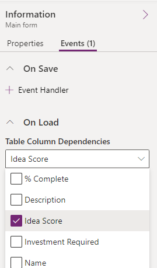

The script must first be uploaded as a script web resource to use client scripting on a form. You can use script web resources to maintain libraries of client script functions written in JavaScript or TypeScript, and you can use them from within a model-driven app form or from the command bar definition. When using TypeScript, it must be transpiled to JavaScript before uploading as a web resource.

To upload a script web resource, create a new **Forms Library** from the form editor.

> [!div class="mx-imgBorder"]
> 

Make sure to select **Script(JScript)** as the type.

> [!div class="mx-imgBorder"]
> 

 For table column data to be available to include in a script's logic, you must ensure you configure the form to use the column on the form. In addition to having to add the column as a control on the form, you risk somebody removing it and causing your script to break because the referenced column is no longer available. You can add the column as a dependency to ensure the column data is always available for your script logic. The following image shows adding the **Idea Score** column from the **Idea** table as a dependency.

> [!div class="mx-imgBorder"]
> 

## Web resource dependencies

In addition to data dependencies, you can also configure dependencies on other web resources. This dependency saves time and simplifies loading logic because the form doesn't need to explicitly load multiple dependent web resources when you register a script for a form event, ribbon command, or ribbon enable rules. With dependency configuration, you can register the primary script and let the dependency configuration load the other resources your code depends on.

It's important to note that web resource dependencies don't provide any control over the order in which the web resources load. All the web resources are loaded asynchronously and in parallel. If you have a JavaScript web resource that depends on another JavaScript web resource to load and initialize before it can initialize, you need to manage that dependency in another way.

## Use client script libraries

Once configured as a script web resource, client script libraries can be associated with ribbon commands and form events. To associate a script with a form, select the **Form libraries** in the tool bar and then **Add library**.

> [!div class="mx-imgBorder"]
> 

From the **Add library** dialog, you can either associate an existing uploaded script web resource or create a new one.

> [!div class="mx-imgBorder"]
> 

Associating the script library with the form is only required once per script for each form, regardless of how many event handlers you register on that form.

As you're building your client script logic and need to make changes after the initial upload, you would return to the script web resource in the solution and upload the new version of the file. After uploading, you must publish the script web resource so the app uses the latest changes.
