In this exercise, you'll build a category classification model to help a health clinic classify and dispatch patient feedback.

Four customer experience managers are assigned the responsibility of handling customer feedback based on the department that they're part of. Patient feedback is captured through a centralized email address that is identified when the patients receive their leave authorization.

## Data preparation

As with all custom models, one initial important step is to identify and prepare data that will be used to train the model. AI Builder category classification is no different and requires historical data to determine patterns that will help predict the tags for new data to process.

To accelerate this exercise, you'll follow the steps that are described in [Use sample data to do category classification](/ai-builder/text-classification-sample-data?azure-portal=true#set-up-an-environment-with-data).

For this exercise, you'll reference the **healthcare_feedback** table that is part of the **AI Builder Lab** solution. It contains over 500 patient feedback records that are tagged with one or more of the following category keywords:

- Care

- Facilities

- Check-in

- Staff

> [!div class="mx-imgBorder"]
> [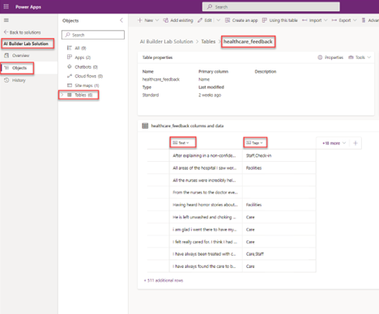](../media/feedback.png#lightbox)

## Get started

The category classification model determines the potential tags after it analyzes historical data. By providing records that already have categories assigned, you can train a custom model so that it can be published and used to categorize new data.

After having identified the historical data that will be used for training, you'll create the custom model by following these steps:

1. In Microsoft Power Apps Studio, in the left navigation menu, under **AI Builder**, select **Explore** and then select the **Category Classification (Custom model)**.

    > [!div class="mx-imgBorder"]
    > [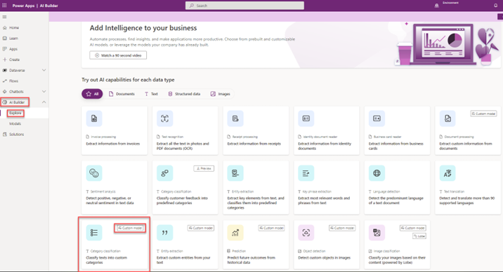](../media/custom-model.png#lightbox)

1. Select **Get started**.

    > [!div class="mx-imgBorder"]
    > 

1. Select the **Select text** option.

    > [!div class="mx-imgBorder"]
    > 

1. Search for and select the **healthcare_feedback** table.

    > [!div class="mx-imgBorder"]
    > [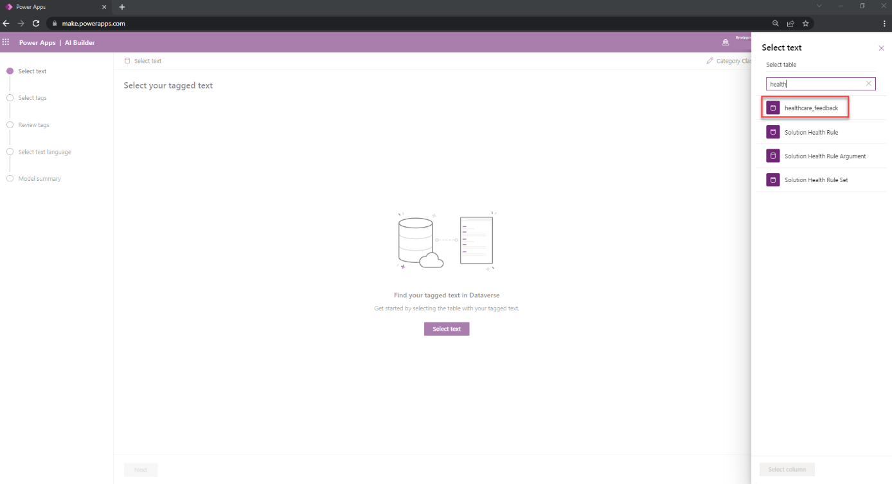](../media/healthcare-feedback.png#lightbox)

1. Select the **Text** column and then select **Select column**.

    > [!div class="mx-imgBorder"]
    > [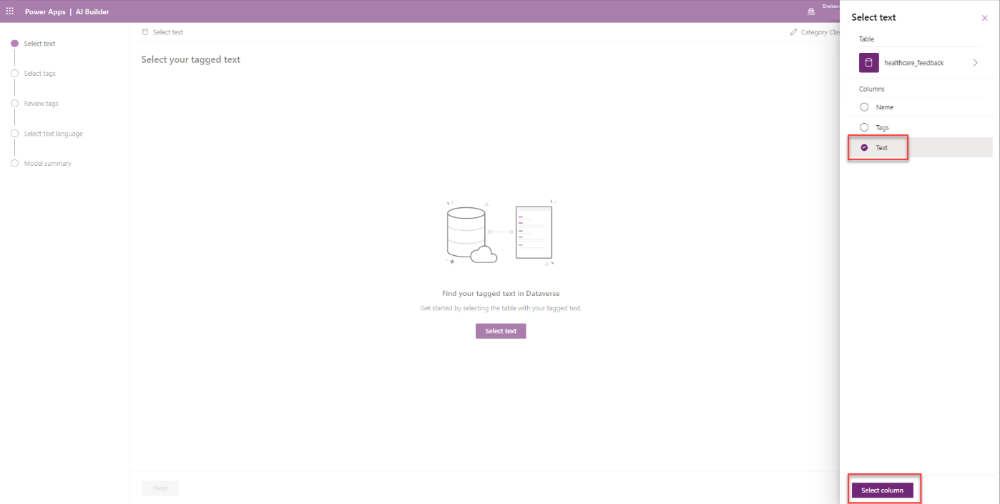](../media/text.png#lightbox)

1. Review the tagged text for the selected column and then select **Next**.

    > [!div class="mx-imgBorder"]
    > [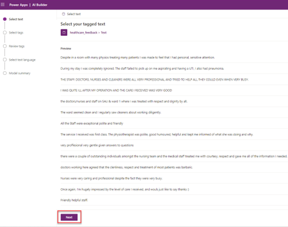](../media/next.png#lightbox)

1. Select the **Select tags** option.

    > [!div class="mx-imgBorder"]
    > [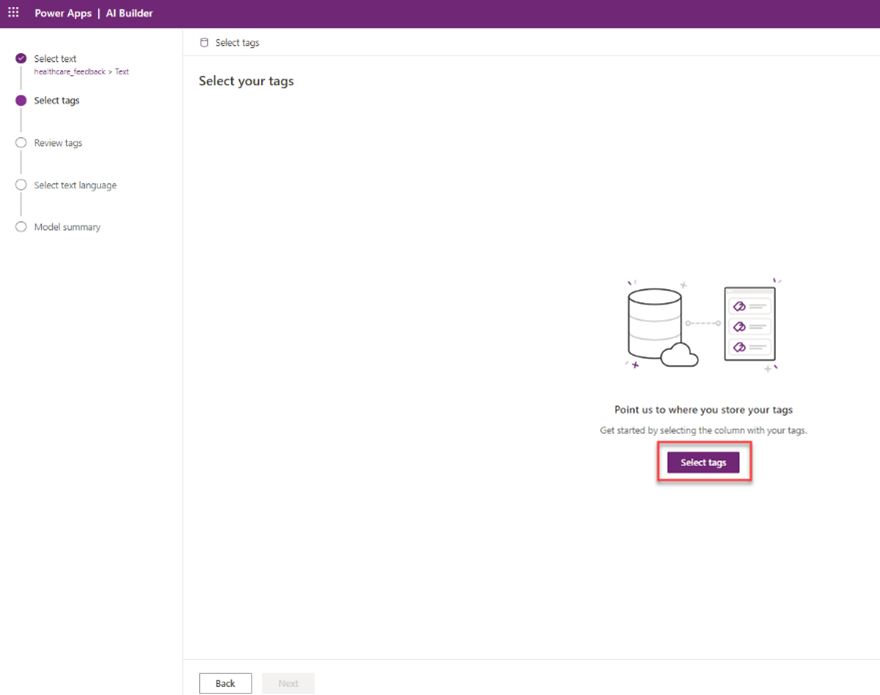](../media/select-tags.png#lightbox)

1. Select the column named **Tags** and then select **Select column**.

    > [!div class="mx-imgBorder"]
    > [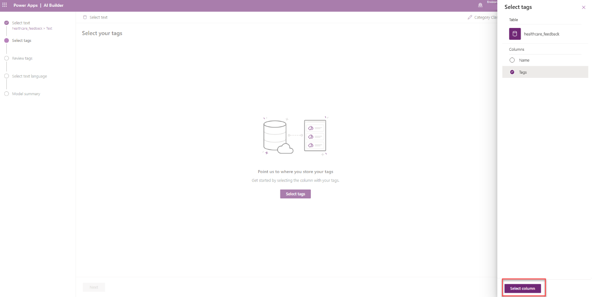](../media/select-column.png#lightbox)

1. Review the different tag separator options, select **Comma**, and then select **Next**.

    > [!div class="mx-imgBorder"]
    > [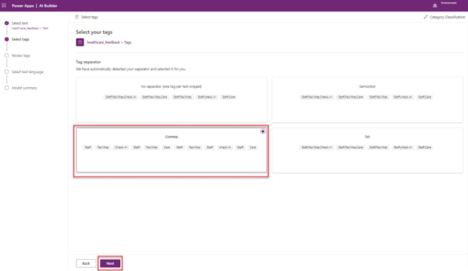](../media/comma.png#lightbox)

1. Review the text and tags to validate your selections and then select **Next**.

    > [!div class="mx-imgBorder"]
    > [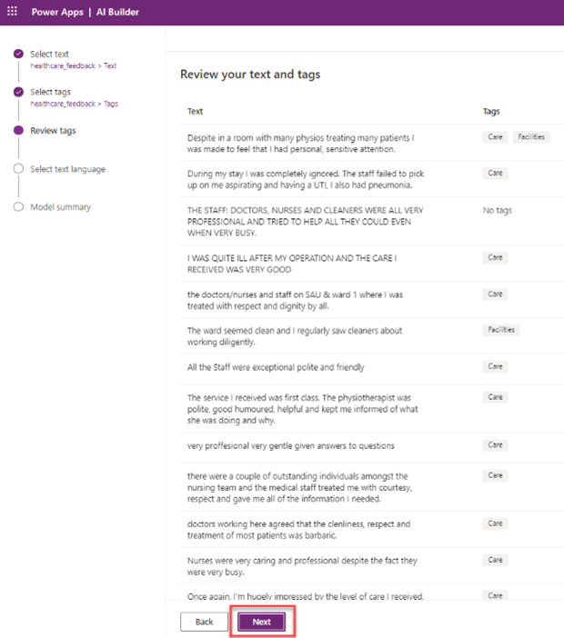](../media/review.png#lightbox)

1. Select **English** as the text language and then select **Next**.

    > [!div class="mx-imgBorder"]
    > [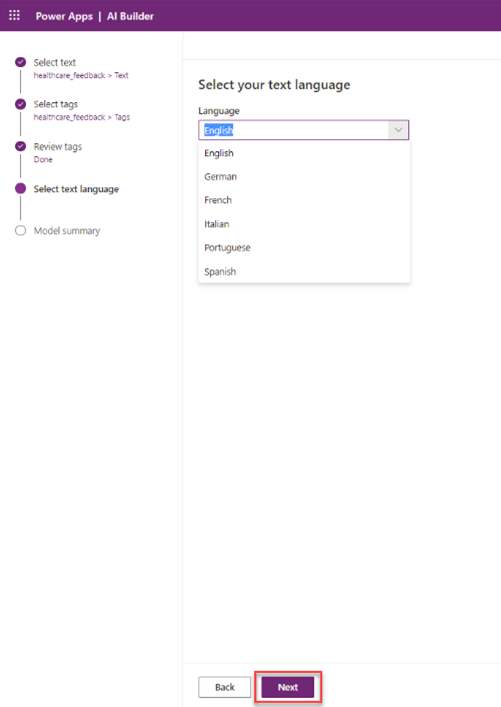](../media/language.png#lightbox)

1. Review the model summary. Select **Train** to move to the next portion of this exercise.

    > [!div class="mx-imgBorder"]
    > 

## Train and publish the model

After selecting the columns that contain the text and related tags for category classification, you'll need to train the custom model before it can be used in Power Apps or Power Automate.

To complete this series of tasks, follow these steps:

1. After selecting **Train** in the last step of the previous portion of this exercise, select **Go to models**.

    > [!div class="mx-imgBorder"]
    > [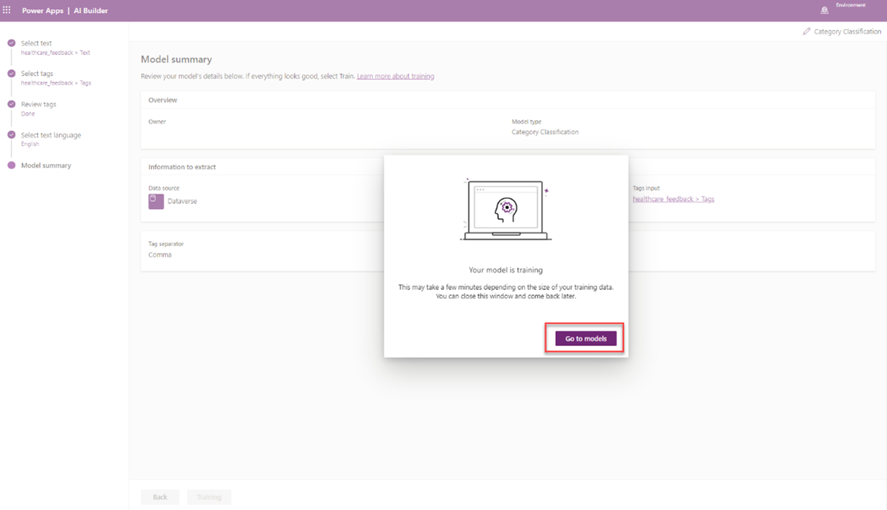](../media/models.png#lightbox)

1. In the list of AI Builder models, under **My models**, identify your newly created model that's in **Training**.

    > [!div class="mx-imgBorder"]
    > 

1. When the **Status** changes to **Trained**, select your custom model.

    > [!div class="mx-imgBorder"]
    > [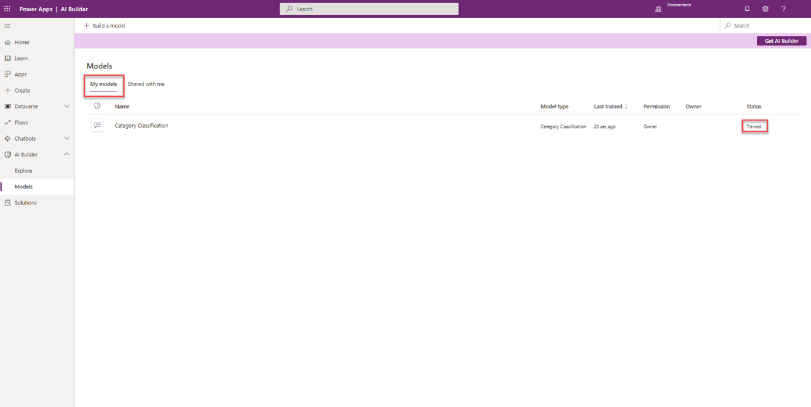](../media/trained.png#lightbox)

1. Confirm the performance of the model by selecting **Quick test**.

    > [!div class="mx-imgBorder"]
    > [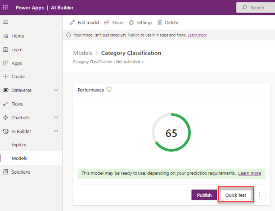](../media/quick-test.png#lightbox)

1. Submit any text value that will allow you to determine if the model has performed as expected, and then select **Test**.

    > [!div class="mx-imgBorder"]
    > [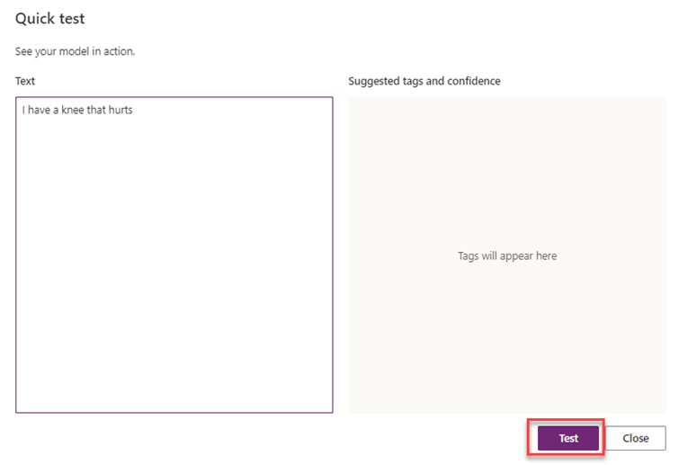](../media/test.png#lightbox)

1. Review the suggested tags and confidence. You can repeat these tests multiple times. When tests have completed, select **Close**.

    > [!div class="mx-imgBorder"]
    > [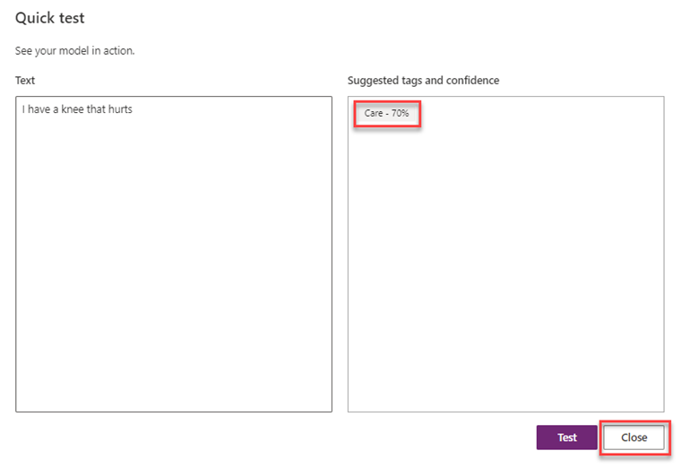](../media/care.png#lightbox)

1. If tests and performance level are adequate, select **Publish**. For situations where the performance level isn't satisfactory, you can edit the model and revise the configuration.

    > [!div class="mx-imgBorder"]
    > [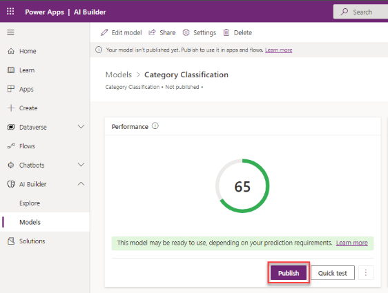](../media/publish.png#lightbox)

1. After the model has been published, you can move to the next portion of this exercise.

    > [!div class="mx-imgBorder"]
    > 

## Create a Power Automate cloud flow

For this exercise, you'll process the patient feedback as it's received in a Microsoft Outlook inbox by creating a cloud flow that integrates the newly created category classification model.

To create this Power Automate cloud flow, follow these steps:

1. For the newly published model, select **Use model**.

    > [!div class="mx-imgBorder"]
    > 

1. Select **Build intelligent automations**.

    > [!div class="mx-imgBorder"]
    > [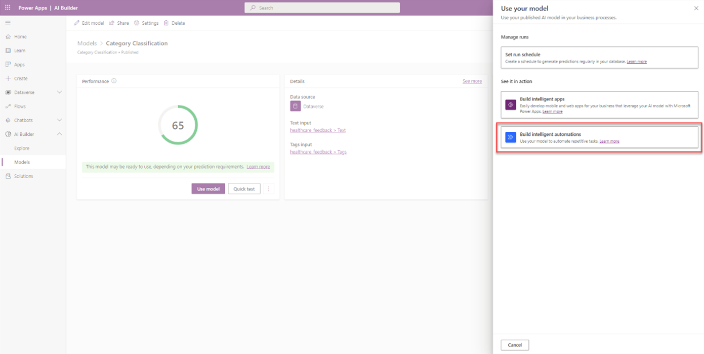](../media/build.png#lightbox)

1. You'll be redirected in a new browser tab in Power Automate Studio, with a template that corresponds with the scenario of this exercise. Select the **Analyze incoming emails and route them to the right person** tile.

    > [!div class="mx-imgBorder"]
    > [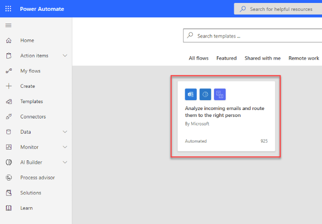](../media/templates.png#lightbox)

1. You'll be redirected to a presentation of the template. After you've validated the required connections, select **Continue**.

    > [!div class="mx-imgBorder"]
    > [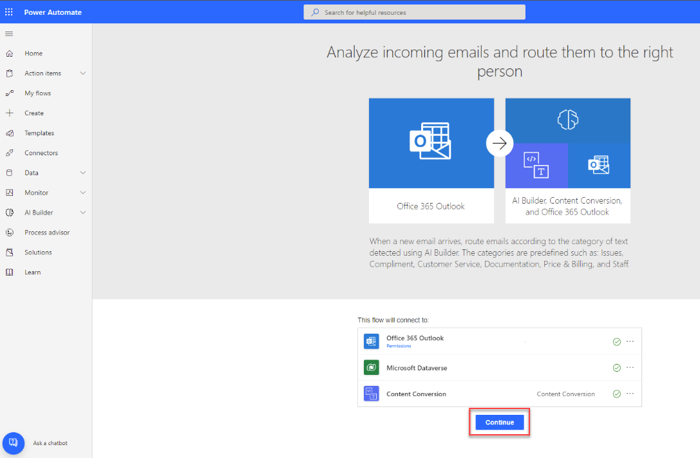](../media/continue.png#lightbox)

1. You'll be redirected to the cloud flow editor with a new flow created based on the selected template. You'll build this template by using the prebuilt **Category Classification** model, which provides a base for this exercise. You'll modify the template to integrate the custom model. After the **Convert html to text** action, select **Add an action**.

    > [!div class="mx-imgBorder"]
    > [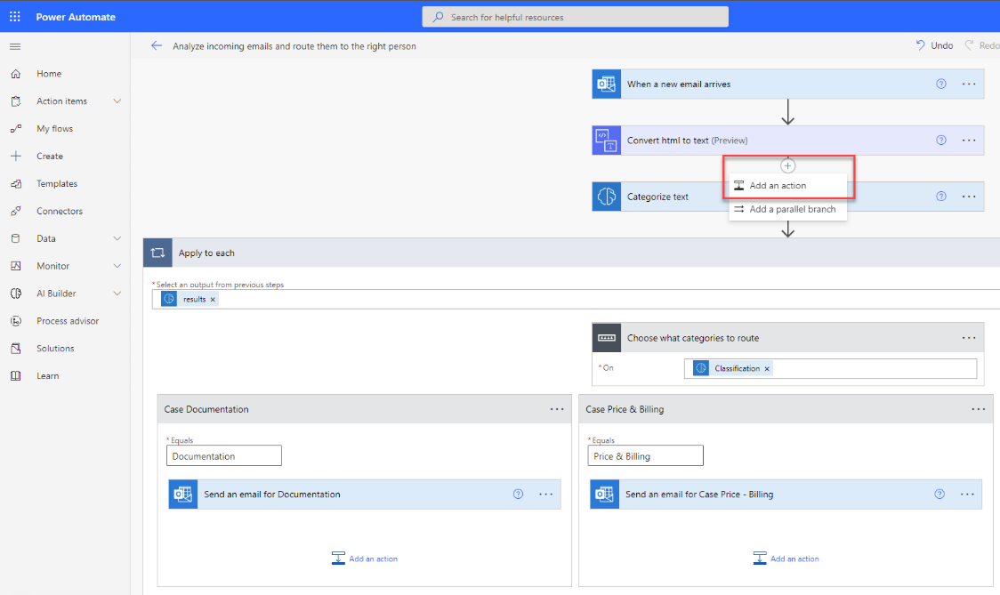](../media/add-action.png#lightbox)

1. Select the **AI Builder** connector, and then in the list of actions, select **Classify text into categories with one of your custom models**.

    > [!div class="mx-imgBorder"]
    > [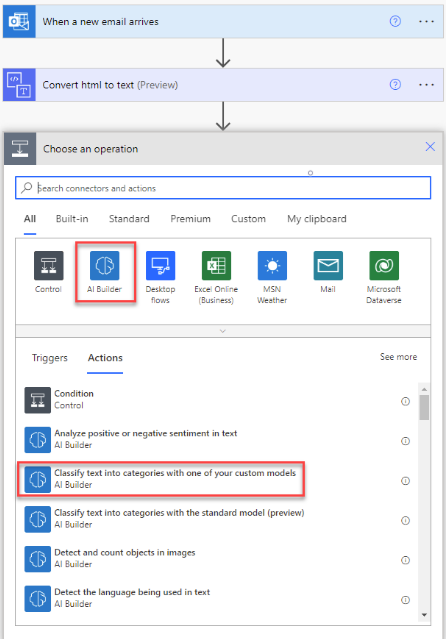](../media/classify.png#lightbox)

1. Define the required parameters by selecting the custom model that you created during this exercise and by using the output of the previous action as the text to process.

    > [!div class="mx-imgBorder"]
    > [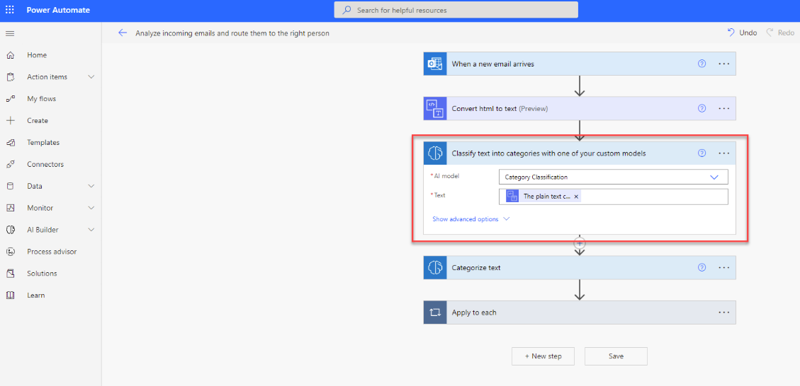](../media/parameters-filled.png#lightbox)

1. Delete the **Categorize text** action.

    > [!div class="mx-imgBorder"]
    > [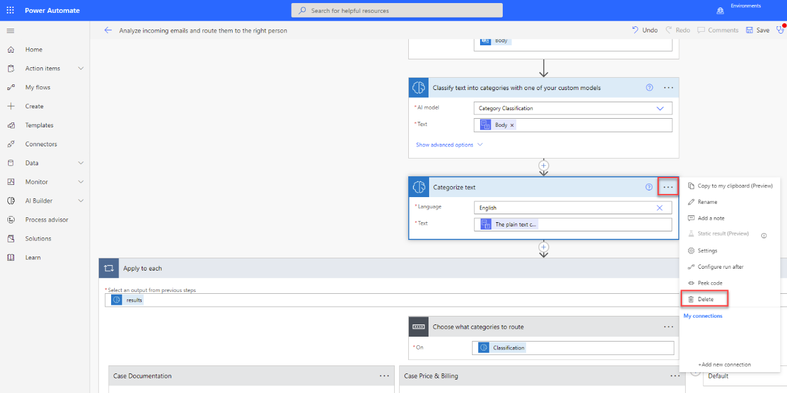](../media/delete.png#lightbox)

1. For the **Apply to each** action, select the **results** from the previously added AI Builder action as the output to loop on.

    > [!div class="mx-imgBorder"]
    > [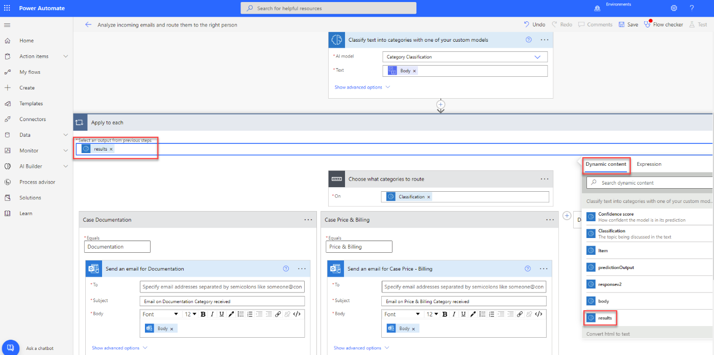](../media/results.png#lightbox)

1. Edit or create the different **Case** options for the tags of the model (Staff, Facilities, Check-In, Care). For each option, edit or add a **Send and email (v2)** action from the Office 365 Outlook connector. Set up the **To** parameter with the adequate customer experience manager. For this exercise, if you don't have multiple accounts, you can also send them to your account and set up the **Subject** to be specific to the tag text, so you'll be able to validate the routing based on that value.

    > [!div class="mx-imgBorder"]
    > [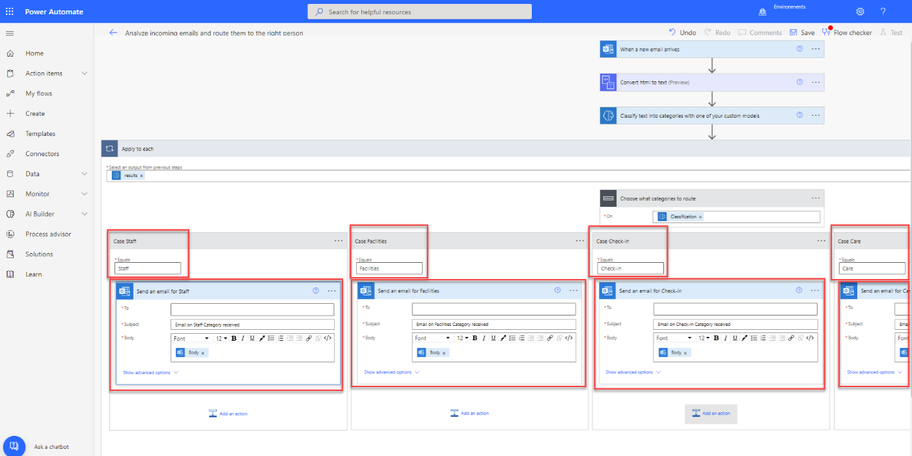](../media/case.png#lightbox)

1. For this exercise, if the monitored account (email address) is the same as the one that the results are sent to, it's preferred that you add a **Subject Filter** on the **When a new email arrives** trigger so that the flow doesn't trigger indefinitely.

    > [!div class="mx-imgBorder"]
    > [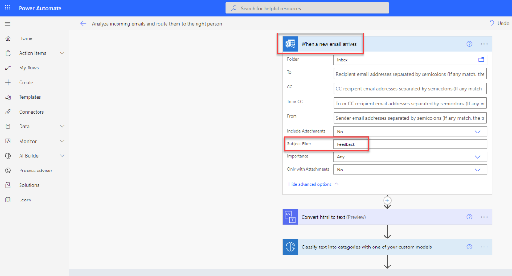](../media/subject-filter.png#lightbox)

1. When the process has completed, select **Save**.

    > [!div class="mx-imgBorder"]
    > 

## Test the flow and model

Now that the cloud flow and AI Builder model have been created, you can test the exercise scenario. It will use a few sample phrases to send email messages to the monitored inbox. Then, the flow will process the text by using the **Category Classification** model and will route them to the correct recipient or to the same inbox (for test purposes) by using a different subject for the sent email messages.

To test the flow, follow these steps:

1. Create and send a new email message to the monitored email address, with **Feedback** as the subject and a sample text as the body, such as: **The doctors were very professional, nurses were kind and attentive, the room was nice but the food at the cafeteria and in room is terrible**.

    > [!div class="mx-imgBorder"]
    > 

1. Wait to receive a new email with the category classification to confirm that the flow processed the sent message.

    > [!div class="mx-imgBorder"]
    > [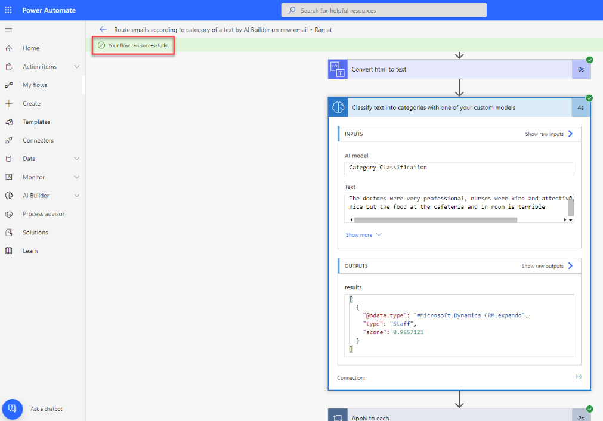](../media/success.png#lightbox)

You've now successfully created a custom category classification AI Builder model and integrated it in a Power Automate flow.
