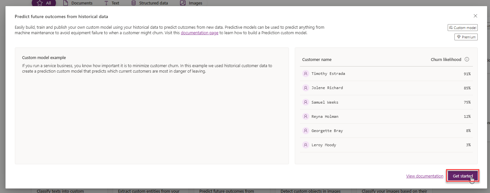
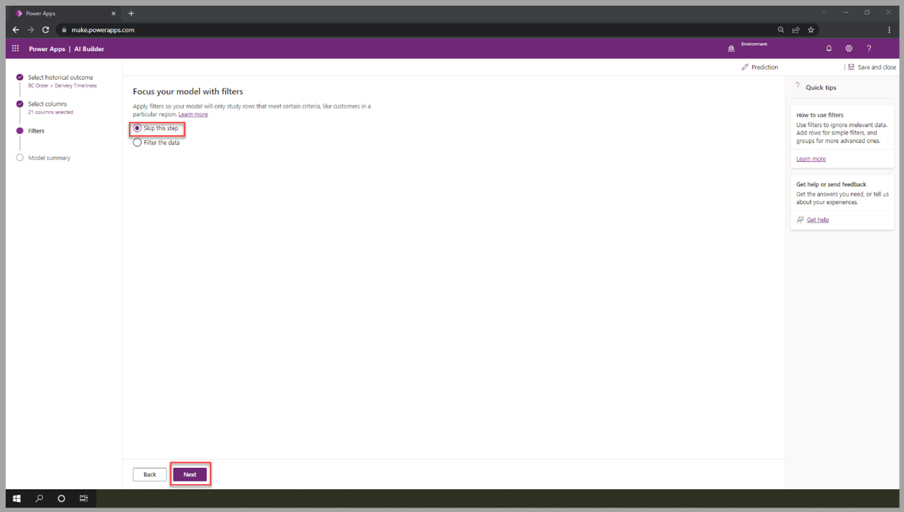
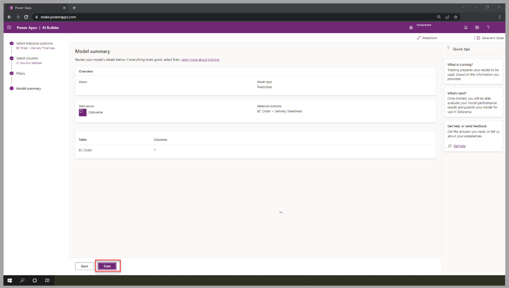
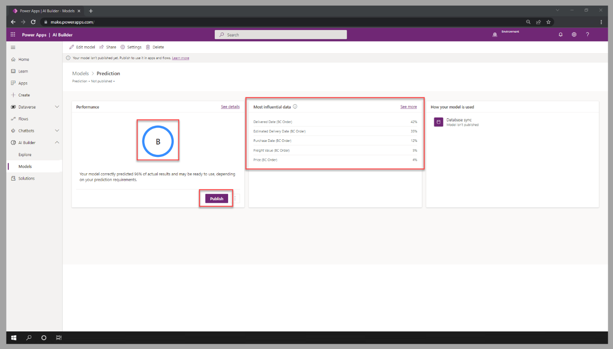
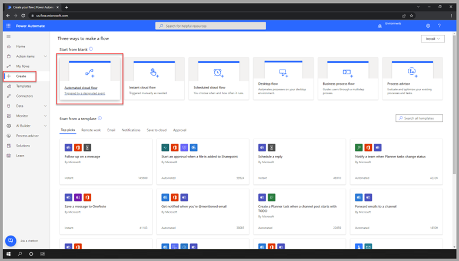
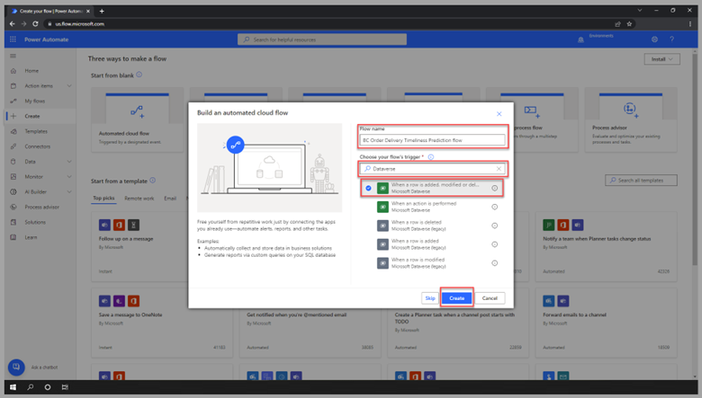
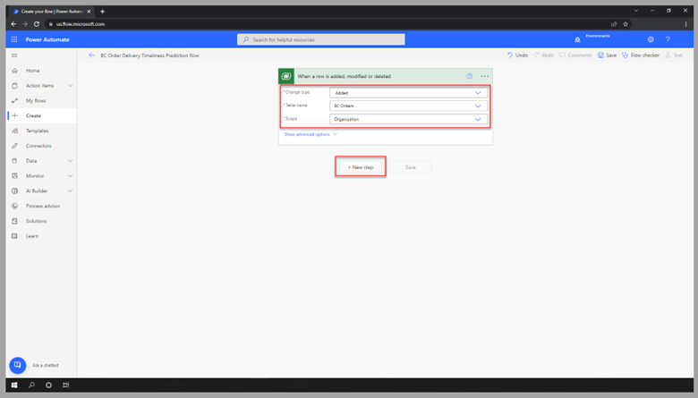
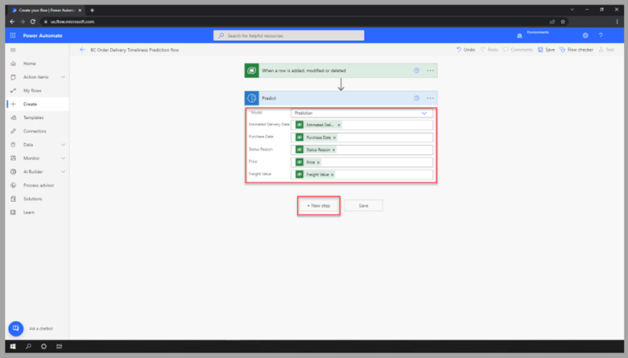
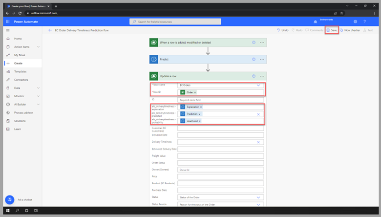
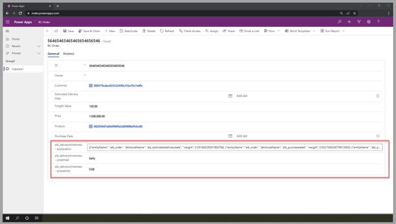

In this exercise, you'll build an AI Builder prediction model to help a Brazilian commerce predict the delivery timeliness of customer orders. The retailer has received complaints from customers about late shipments. This issue impacts the reviews and satisfaction surveys, which are high influence factors in competitive retail markets. By predicting the orders that have a probability of late arrival, this retailer can implement rules to automatically upgrade the shipping option to express service and have a higher probability of incurring no delay and receiving positive feedback from its customers.

## Data preparation

As with all custom models, an initial important step is to identify and prepare data that will be used to train the model. AI Builder prediction is no different and requires historical data to determine patterns that will help predict outcomes of new events.

To accelerate this exercise, follow the steps that are described in [Sample Dataset for prediction model](/ai-builder/prediction-data-prep?WT.mc_id=DX-MVP-5003600?azure-portal=true#sample-dataset-for-prediction-model).

For this exercise, you'll reference the following tables, which are part of the **Brazilian Commerce** (BC) Dataverse solution:

- **BC Customer** - A list of 5,000+ customers, with the city and zip code that their orders were delivered to.

- **BC Order** - A list of 5,000+ orders that are processed for the customers, with information about the product purchased, its price, estimated date of delivery, actual delivery date, and so on.

- **BC Product** - A list of 5,000+ products, with category and shipment volume and weight information.

> [!div class="mx-imgBorder"]
> 

The following video describes those data preparation steps.

> [!VIDEO https://www.microsoft.com/videoplayer/embed/RE52wlB]

## Create a model

The prediction model determines potential outcomes after analyzing historical data. By providing records that have multiple potential influencers and a clear outcome, you'll be able to support a model with a high confidence level.

The tables that are imported during the data preparation steps will be used to create the prediction model.

1. In Microsoft Power Apps Studio, in the left navigation menu, under **AI Builder**, select **Explore** and then select the prediction model.

	> [!div class="mx-imgBorder"]
	> 

2. Select **Get started**.

	> [!div class="mx-imgBorder"]
	> 

1. Select the **BC Order** table and **Delivery Timeliness** column. Confirm the four outcomes that the model will study and then select **Next**.

	> [!div class="mx-imgBorder"]
	> 

1. Review and confirm the selected columns that might influence the outcome for the **BC Order** table. Notice that **Delivery Delta** and **Delivery Date** aren’t selected. These values are updated after the delivery has occurred and would bias the analysis, resulting in a model performance of type D. You can also remove other irrelevant columns for this model training, such as **ID** and **Order Status**. To move to the next step of this exercise, select **Next**.

	> [!div class="mx-imgBorder"]
	> 

1. For this exercise, no filter is required. Select **Skip this step > Next**.

    > [!div class="mx-imgBorder"]
	> 

1. Review the model summary. Select **Train** to move to the next portion of this exercise.

    > [!div class="mx-imgBorder"]
	> 

1. Select **Go to models**. The model will be in training for a few minutes. When training completes, the status will change to **Trained**.

1. To view the performance details, select the trained model.

    > [!div class="mx-imgBorder"]
	> 

1. Review the performance details. For this exercise, **B** level is satisfactory. Most influential data will provide information about the columns that have the highest impact on the determination of the outcome. Select **Publish** to move to the next step of this exercise.

    > [!div class="mx-imgBorder"]
	> 

## Use the model for real-time prediction

When a prediction model is published, it will run automatically to refresh the outcome for newly created records, which is daily by default.
In scenarios where the prediction is required instantly, a Microsoft Power Automate cloud flow is required to generate the outcome as rows are created.
Follow these steps to create a flow that will use the outcome of the custom model to predict the delivery timeline’s potential for new orders:

1. In Power Automate Studio, in the left navigation menu, select **Create** and then select the **Automated cloud flow** tile.

	> [!div class="mx-imgBorder"]
	> 

1. Enter a name for the flow and then select the **When a row is added, modified, or deleted** trigger for Dataverse. Select **Create**.

	> [!div class="mx-imgBorder"]
	> 

1. In Power Automate Studio, for the new cloud flow, select **Added** for the trigger type, select **BC Orders** as the table name, and select **Organization** as the scope. Then, select **New step** to create an action.

	> [!div class="mx-imgBorder"]
	> 

1. For the AI Builder connector, select the **Predict** action.

	> [!div class="mx-imgBorder"]
	> 

1. Select the prediction model that you created for this exercise. For each requested value by the model, select the appropriate column from the BC Order table. Then, select **New step** to create an action.

    > [!div class="mx-imgBorder"]
	> 

1. For the **Dataverse** connector, select the **Update a row** action.

    > [!div class="mx-imgBorder"]
	> 

1. In the **Table name** dropdown menu, select **BC Order**. In the **Row ID** field, provide the unique identifier from the trigger. Enter **Explanation**, **Prediction**, and **Likelihood** from the **Predict** action as the other required values. Then, select **Save** to complete the creation of the flow.

    > [!div class="mx-imgBorder"]
	> 

1. To test the prediction model and flow, add a new row to the table, and refresh the data entry form. The results should be visible.

    > [!div class="mx-imgBorder"]
	> 

You've now successfully created a prediction model. Additionally, you’ve created a Power Automate cloud flow that generates the outcome analysis when new rows are added to the BC Order table.
