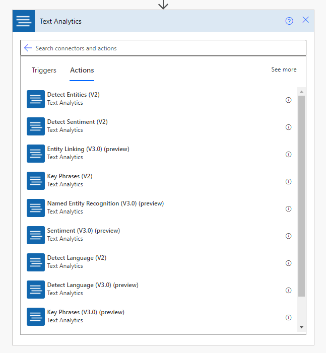
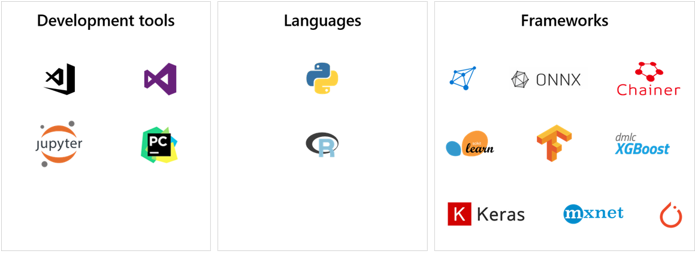
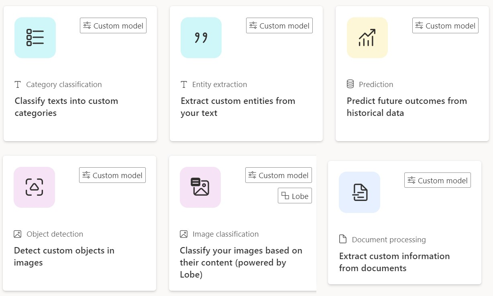
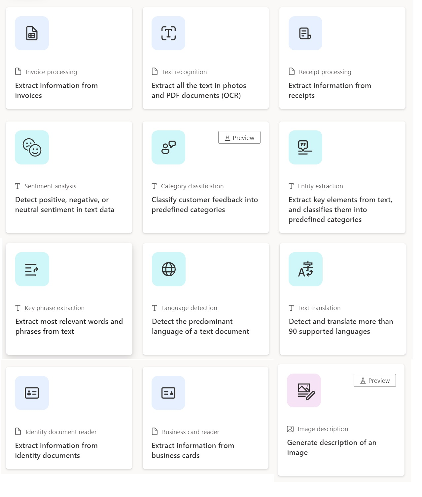

AI refers to computers thinking and acting in a way that simulates a human. AI is a technology that takes information from its environment and responds based on what it learns. The goal of AI is to create a machine that can mimic human behavior.

AI is more than learning; it's knowledge representation, reasoning, and abstract thinking. Machine learning is the subset of AI that takes the approach of teaching computers to learn for themselves rather than teaching computers all that they need to know. Machine learning is the foundation for modern AI and focuses on identifying and making sense of the patterns and structures in data.

Microsoft provides many machine learning services to enhance data.

## Dynamics 365 AI apps

Solution architects need to be aware of the prebuilt insights that are available with Dynamics 365 apps, including:

- Dynamics 365 Sales Insights
- Dynamics 365 Customer Insights - Data
- Dynamics 365 Fraud Protection

## Azure Cognitive Services

Cognitive Services is a suite of prebuilt AI services that developers can use to build AI solutions. Cognitive Services meets common AI requirements and allows you to add AI to your apps quickly without expertise in machine learning.

Cognitive Services APIs cover:

- Computer vision
- Natural language processing
- Speech
- Decision
- OpenAI

Cognitive Services is available as a set of REST APIs that applications can consume. Essentially, Cognitive Services includes off-the-shelf services that help you develop an AI-based solution quickly and with less specialist expertise.

Microsoft has created connectors for Azure Cognitive Services for Power Apps and Power Automate:

- Content Moderator
- Computer Vision
- Custom Vision
- Face
- Cognitive Service for Language (including Sentiment, Named Entity Recognition, Key Phrase Extraction)
- Translator

> [!NOTE]
> Cognitive Services connectors are premium connectors.

These connectors can be used to enhance data and application functionality.

## Azure Machine Learning

Azure provides many different services to help you create your own machine learning models when Cognitive Services doesn't meet your needs. You can build machine learning models by using many different tools, languages, and frameworks.

Machine learning is beyond the scope of this course. However, solution architects should understand that Azure Machine Learning allows developers to implement enterprise grade machine learning for scenarios that AI Builder or Cognitive Services don't meet.

## AI Builder

AI Builder is a component of Microsoft Power Platform solution that allows you to add AI to predict outcomes to help improve business performance without writing code. You don't need to understand machine learning or learn Python to use AI Builder. Microsoft helps make it easier for you to create AI models and then consume those models in Microsoft Power Platform.

AI Builder takes the concept of Cognitive Services further, enabling anyone to use AI in their apps and flows. And anyone can build their own machine learning models without needing expertise in machine learning or having to write code.

With AI Builder, you can:

- Use one of the prebuilt AI models that are supplied with AI Builder.
- Build and train your own AI model by using your own data.

AI Builder has several model types for document processing, prediction, vision, and language.

AI Builder has many pretrained models including:

- **Invoice processing** - Extracts key invoice data to help automate the processing of invoices.
- **Text recognition** - Extracts words from documents and images into machine-readable character streams.
- **Category classification** - Classifies text into categories that are associated with customer feedback, such as compliments, issues, and pricing.
- **Entity extraction** - Recognizes and extracts standard business objects in data.
- **Key phrase extraction** - Identifies the main talking points from a piece of text.
- **Language detection** - Identifies the language that is used in a piece of text.
- **Sentiment analysis** - Detects whether the message in a piece of text has a positive or negative emotion.
- **Text Translation** - Translates text from one language into another language.
- **Identity document reader** - Extract information from passports and US driver licenses.
- **Business card reader** - Extracts information from an image of a business card.
- **Receipt processing** - Extracts details from pictures of printed and handwritten receipts.

Canvas apps can use prebuilt models and custom models to enhance data. You could use an AI Builder model to analyze text that a user has entered. You can take a picture with a canvas app and then use an AI Builder model to extract the text from the image or to detect objects in the image.

You can use AI Builder models in two ways with a canvas app:

- By adding AI Builder model controls to a screen
- By using AI Builder models through the formula bar

Power Automate can use all prebuilt models and any custom models in AI Builder to enhance data. You can trigger a Power Automate flow when a record is created or when an image is stored. An AI Builder connector is available that you can add to a flow to access the models. For example, Power Automate can categorize a new record or predict what happens to a newly created record.

The solution architect decides whether to use AI in the solution. They also decide which of AI Builder, Cognitive Services, and Azure Machine Learning to use.
