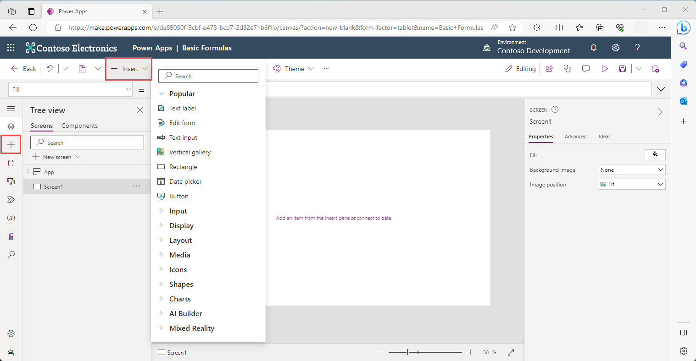

Formulas help you enhance functionality, performance, and user experience in your Power Apps canvas app. Like Excel, in Microsoft Power Apps you can create single function formulas or combine multiple functions and elements in the same formula. Also, like Excel, you have an **fx** formula entry field. In Power Apps, you can modify the way controls behave and display by defining the control's properties with a formula.

Stick around to the end of this module, and we provide you with some useful skills along the way. If you're not familiar with Power Apps, prepare to be tempted to use it!

## Inserting controls

Using controls is the way you begin to interact with and shape your data. When you're inserting controls into your app, you can either select the insert tab from the left side rail, *or* you can select the **+ Insert** button from the control ribbon at the top of the screen. Both have identical functionality with a search field at the top to help you quickly find the controls you're looking for.

> [!div class="mx-imgBorder"]
> [](../media/control.png#lightbox)

When you select **+ Insert**, the **Popular** controls are listed at the top and they're expanded. If you select any of those items, that control appears on your canvas. Notice in your **Insert** menu that the other headers can expand. Selecting **Input** expands the list of controls available for user input.

### Use the Search field

The **Search** field is helpful to find controls quickly. For example, if you want to find a **Camera** media control, enter *cam* in the search field and Power Apps filter your results to four controls that you might be looking for. You can easily find under **Media** exactly what you're looking for.

> 

## Control properties

Each control has a specific set of properties. The properties available vary based on the control type. This is because each control has a slightly different use, look and feel when users interact with the app. However, there are a few properties, such as **Visible**, **X** and **Y** that are present for all controls. (The exception is the **Screen** control, which doesn't have an X or Y property since it fills the entire canvas!)

## Choosing a control

Before creating your app, try to determine what functionality you're looking for and choose controls that best fit those needs.

In some cases, depending on the app requirements, you can use different controls interchangeably to get the same results. For example, **Dropdown** and **Combo box** are similar controls. Key differences between the two is a **Combo box** allows you to search for and select multiple items while the **Dropdown** control merely allows you to select a single item from a scrollable list.

Therefore, if you have a short list that can only have a single input item, then a **Dropdown** control might be a better option. If you have hundreds of items and/or need to have multiple selections, then the **Combo box** might be the better choice for you.

## Localization

What is **Localization** and why is it important? “Localization” refers to the process of adapting an app to meet the language and cultural requirements of a specific region or country. Since Power Apps is a global product, you can build and use canvas apps in many different languages and regions. It's possible to enable your control functionality to meet local requirements. It's also important to understand that reference material might include formulas that might not match your region and might need some translation.

Both while building and running apps, the text you see in Power Apps has been translated into a regional language. The menu items, dialog boxes, ribbon tabs, and other text display in your native language. Dates and numbers also appear for your particular language and region. For example, some regions of the world use a **.** (dot or period) as the decimal separator while others use a **,** (comma).

**Power Apps formulas adapt to your local language**. For example, you might see the following formula:

```powerappsfl
Filter(DataSource, Price > 12.50)
```

This formula is the default for languages where the dot (.) is used as the decimal separator. If your language uses the comma (,) as the decimal separator then the syntax of the formula adapts, and the previous formula becomes this one:

```powerappsfl
Filter(DataSource; Price > 12,50)
```

Keep the language in mind as you start to learn and work with formulas and functions. All of the formulas found in this learning content assume a decimal (.) separator.

In the next module, we're going to learn how to use formulas to modify controls to make them able to update properties dynamically.
