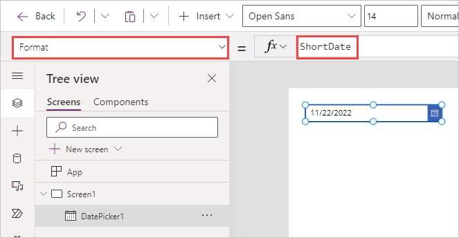
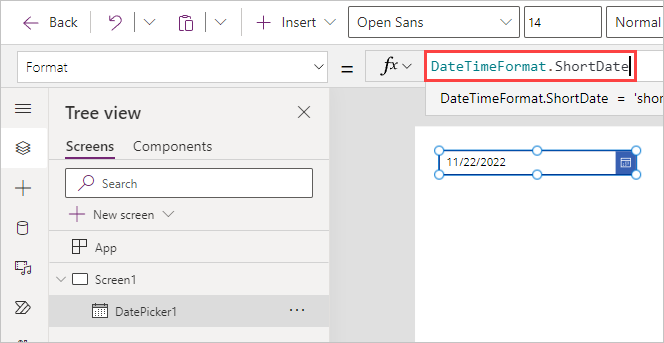
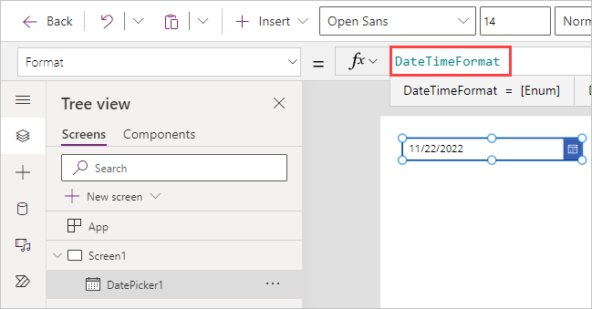
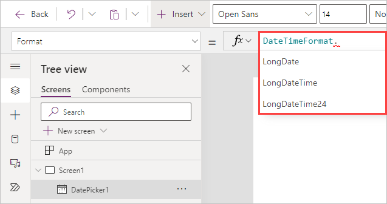
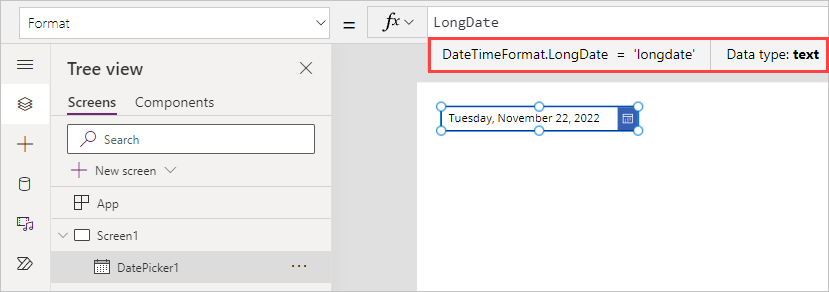

Remember that every canvas app you build includes controls with slightly different sets of **Properties**. Because of their differences, the controls can be used as different means to do different tasks. That's why it's helpful to consult the references for the controls and formulas, so you can use the right ones.

As you gain more experience using the different controls with different formulas, you learn what works best in certain circumstances, but the references are always helpful to have! Don't worry, though, we include the links for references at the end of this learning module.

## Changing control properties

When building your app, you can create formulas to dynamically change and update different control properties, such as:

- Format

- Text

- Color

- Position (X and Y)

### Where to change control properties - Power *fx* and IntelliSense

You can pick the different properties of the control by using the property picker to the left of the **Power *fx*** (formula) bar. You can also view/change properties by using the Properties pane on the right side of the screen, but it's easier to update properties by using the **Power *fx*** bar. The reason for this is that **IntelliSense** provides valuable feedback as you're entering formulas. Therefore, take advantage of **IntelliSense** by using the **Power *fx*** bar to input and change formulas.

### Different properties modeled by the Date picker control

As an example of some different properties available for a control, let's focus for a moment on the **Date picker** control. The Date picker control has a few unique properties:

- **DefaultDate** - The first property you see in the formula bar. This date is the initial value of a date control unless the user changes it. By default, it's set to the formula **Today()**, which returns today's date. However, you could enter a different date as the default date, and that would be the date this control always starts with.

- **StartYear** and **EndYear**- The **StartYear** has an effect on the DefaultDate. Any date input earlier than the start year magically becomes 1/1/(whatever your StartYear value is). Likewise, this applies for the **EndYear** control, which would become 12/31/(the year of your EndYear).

- **StartOfWeek** - The day of the week that the calendar shows when you select the calendar icon on the right of the control. These defaults are set according to your regional settings.

- **Format** - The text format in which the control shows the date and the user specifies the date.

- **Language** - Determines the language used to format dates, including names of months. If this property isn't specified, the user's device setting determines the language.

### Try out a Date picker control

Let's try using this control in a canvas app. Open your Power Apps Studio and follow these steps to add the **Date picker** control and modify the displayed format.

1. From the studio ribbon, select the **+ Insert** button; then select **Date picker**.

1. Notice that when the control appears on your screen the property that appears in the **Power *fx*** entry field is the **DefaultDate** reflecting **Today()** as the value. Now, select the **Format** property from the **Properties** drop-down menu at the top-left of the screen. By default, the **Format** property is set to **ShortDate**.

    >

1. Select inside of the Power *fx* entry field and notice that the formula visually changes to **DateTimeFormat.ShortDate**.

    >

1. With your curser to the right of **ShortDate**, backspace all the way up through the (.) period, so that only **DateTimeFormat** is in the **fx** field.

    >

1. Now type the period in the **fx** field to the right of **DateTimeFormat** and notice that options for the formula suffix appear below the **fx** field and **DateTimeFormat**. This is **IntelliSense** at work, and this is an important trick to remember. There are many formulas that have *more options* that you can display as you're authoring formulas.  In this case, you can scroll through the list to see what options are available.

    >

1. Go ahead and select **LongDate** from the list of options and notice how the formula changes to **DateTimeFormat.LongDate**. This changes the display directly on your control from the format of something like `11/22/2022`, to `Tuesday, November 22, 2022`. Just below the Power *fx* field you see that Power Apps displays **DateTimeFormat.LongDate = 'longdate' | Data type: text**. This, again, is IntelliSense providing you not only the complete formula at work, but also the data type of this property.

    >

### Power Apps assists with formula information

Remember that Power Apps can help you with formulas. IntelliSense gives you valuable suggestions and information on your formulas regarding data types and any abbreviations, just like our DatePicker example. The feedback is real-time and helpful as you use controls to interact with data in your app. You can retrieve information like this at any time simply by selecting the control and then selecting your formula inside of the Power *fx* field.

In the next unit, we'll learn how to use formulas to do  mathematical calculations in our app. In a few minutes, you'll know how to use Power Apps to calculate data and display it in currency format. Let's go!
