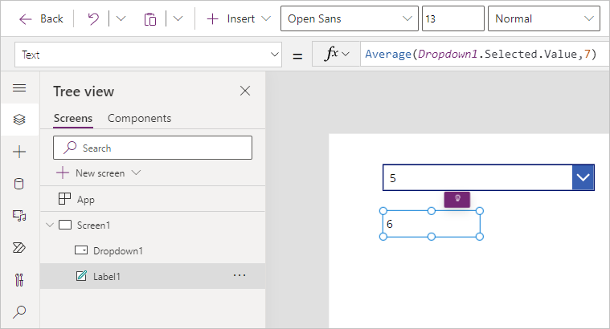
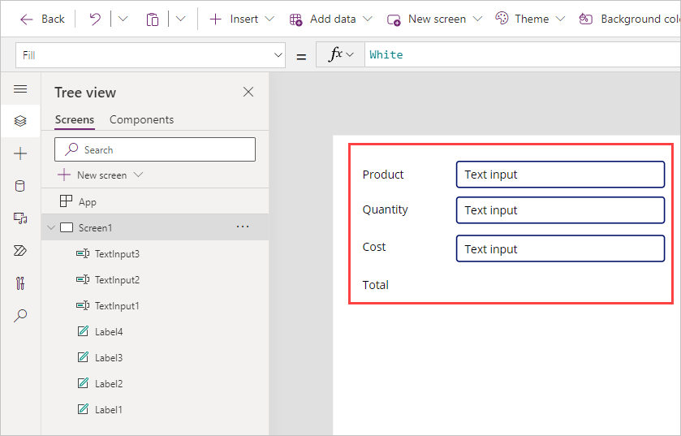
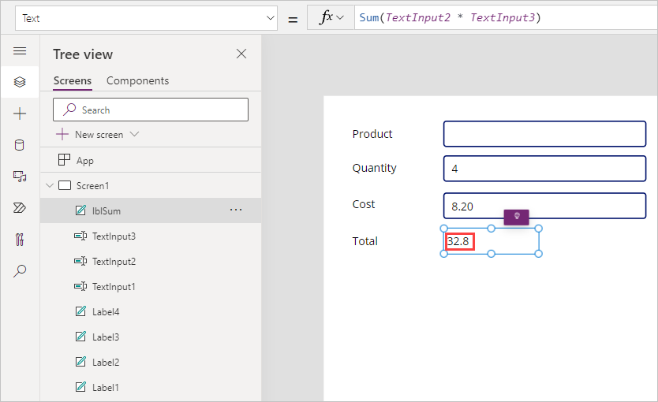
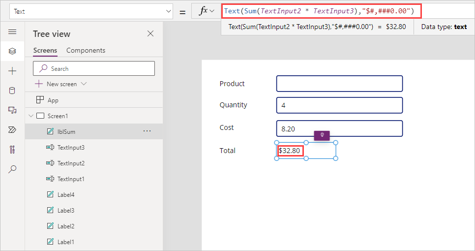
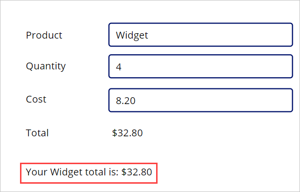

In Power Apps, just like Excel, you can create formulas to calculate and return values. Listed here are a few of the common functions that you can use when working with numbers and calculating values. The syntax allows for multiple numbers to be input between the parentheses of each, but in our examples below we only include two numbers.

- **Average** - Calculates the average, or arithmetic mean, of its
    arguments.

  - Example: `Average(3,7)` returns 5

- **Max** - Finds the maximum value.

  - Example: `Max(3,7)` returns 7

- **Min** - Finds the minimum value.

  - Example: `Min(3,7)` returns 3

- **Sum** - Calculates the sum of its arguments.

  - Example: `Sum(3,7)` returns 10

- **StdevP** - Calculates the standard deviation of its arguments.

  - Example: `StdevP(3,7)` returns 2

- **VarP** - Calculates the variance of its arguments.

  - Example: `VarP(3,7)` returns 4

## Incorporate controls into formulas

You can incorporate controls into your formulas by referencing the control name in your formula.

For example, in the following image, we've added a dropdown control with the **Items** property as `[1, 2, 3, 4, 5]`. Just below that we've added a label control with the **Text** value: `Average(Dropdown1.Selected.Value,7)`. In other words, our formula for the label outputs the average of whatever is the value in our dropdown and the number seven.

By changing the dropdown value to 5, the value of the label changes to 6 (as shown). Using control references in your formulas makes your app more dynamic.

   

## Use multiple controls in your formula

It's possible to refer to multiple controls in the same formula to provide dynamic output for your app users.

In the following example, we walk through how you might build a form experience based on several inputs, which outputs a message as feedback to your user. Our example shows a way to calculate the cost of a particular quantity of a particular item and output it as a message with currency information included.

> [!NOTE]
> As you're working through these steps and your formula returns an error, then remember that the language setting of your Power Apps environment (or Localization) can affect some separators and operators. For example, the formula `Text(ThisItem.Price, "$ ##.00")` is expressed in a language and region that uses dot or period as the decimal separator, such as Japan or the United Kingdom. However, for a language and region where a comma is used for the decimal separator, such as France or Spain, the formula would be: `Text(ThisItem.Price; "$ ##,00")`.
>
> The property selection operator (dot or period) in ThisItem.Price is always the same, no matter what the decimal separator is, but notice that the decimal separator and the chaining operation separator change to a comma and semicolon respectively. Internally the formula doesn't change, all that changes is how it's displayed and edited by the author.

1. In a separate browser instance or tab, go to make.powerapps.com, and create a new app (you can use the same app that you created in another unit).

1. Select **+ Insert** > **Text label**.

1. Change the **Text** property to `"Product"`.

1. Add three more text labels and position them below your first label. Change the **Text** properties to `"Quantity"`, `"Cost"` , and `"Total"`, like the following image.

   > [!TIP]
   > You can rename the Text property of each label by double-clicking the control itself. Double-clicking highlights the existing text in the control and then typing text automatically inserts the text into your label control (it also updates your formula Power *fx*, including the quotes).

1. Next, insert three **Text Input** controls into your canvas app,
   and arrange them as shown in the following screenshot.

   

1. In the **Default** property for each **TextInput** delete "Text input" so that each **Default** is blank.

1. Insert another **Text label** to the right of *Total*. Rename this control *lblSum*.

1. Change the **Text** property to the following:

   `Sum(TextInput2.Text * TextInput3.Text)`

   (In this example, TextInput2 is the Quantity purchased and TextInput3 is the Cost per item.)

1. Now preview the app by selecting the **Play** button in the
   upper-right corner. Test the formula by entering `4` for the **Quantity** input field and `8.20` for the **Cost**. Notice that we're not currently showing two decimal places (which is normal when depicting currency) or a currency sign, so we modify our formula to show that next.

   >

1. To modify our formula to display the value as a *Currency*, update
   the **Text** property of *lblSum* to:

   `Text(Sum(TextInput2.Text * TextInput3.Text),"$#,###0.00")`

   > [!div class="mx-imgBorder"]
   > 

   Notice how *Total* now displays your result as *Currency*.

   So what just happened? We told our formula to add a dollar sign at the front of a formula that included a comma at the thousands place, and to put a zero in front of a decimal if the value was less than 1, and to add two places after the decimal, even if the value was zero.

1. Let's take our formula a step further by adding a transaction summary. Add one final **Text label** under your other controls and stretch the width to take up at least half the screen canvas. In the **Text** property, enter the following formula:

   `"Your "& TextInput1.Text & " total is: " & lblSum.Text`

   Where *TextInput1* is the Text input control next to **Product**

1. Put the app in preview mode and enter a value in your text input control next to **Product**. Notice how you get a transaction summary message incorporating the values of all of your input fields. In our example, we've entered *Widget* as the product name. Try entering different values in the text input fields to see how your total and transaction summary message change dynamically.

   > 

We've now used three input controls with the **Sum** formula to calculate a total and display a transaction summary message. Hopefully, you can see the potential of using multiple controls in formulas to provide dynamic and relevant feedback to your app users.

Next, we introduce how we can use a control to modify the properties of other controls, specifically how we can change the display position of a control. So, keep your practice app open and let's head to the next unit!
