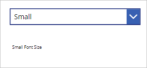
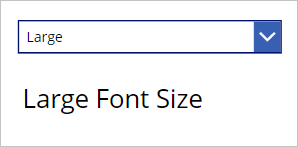
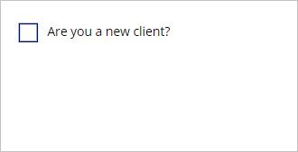
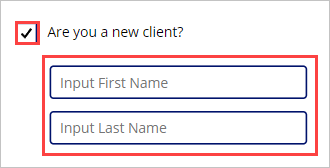
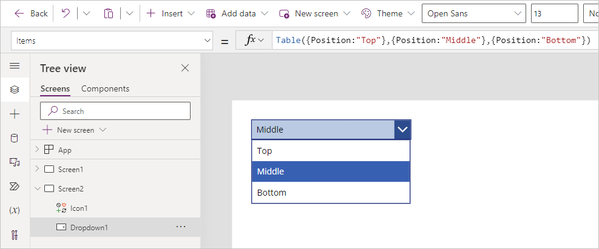
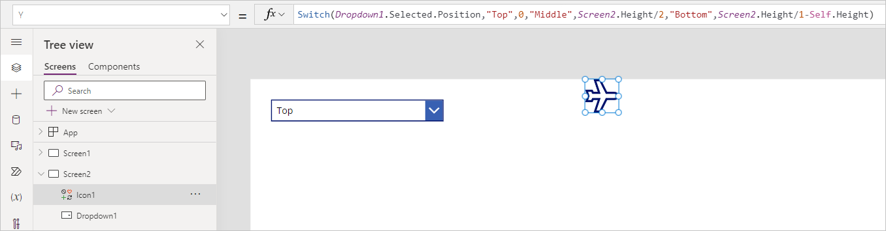

When working with controls, you can modify the way that a particular control
functions based on another control's properties. This functionality allows your users to see changes to their experience based on their input.

As an example, your app might have a drop-down menu allowing the user to choose a small, medium, or large font size. Based on this setting, the app could dynamically change the font size throughout the app.





You could apply similar logic for font colors, fill colors, locations of your controls, or showing or hiding controls based on user selections. For example, if a user selects a check box for "Are you a new client?", the fields for entering a new client would appear on the screen.





## Use inputs to adjust the positions of a control

Let's use an example to understand control positioning on the
canvas and how to use the user's input to modify it. As an introduction, a control's location on the canvas is based on a combination of two properties: the **X** and the **Y** property.

- **X** - distance between the left edge of a control and the left edge of the screen.

- **Y** - distance between the top edge of a control and the top edge of the screen.

Remember that the **X** and **Y** properties apply to all controls except screens. Now go to your app and let's learn via practice.

1. First, let's create a new screen for your app by selecting **+ New screen** from the **Tree view** panel, then select **Blank**.

1. Next insert a dropdown control. Select the **+ Insert** button and enter *drop* in the search field, then select **Drop down**.

1. Change the **Items** property on your dropdown from **DropDownSample** to the following:

    ```powerappsfl
    Table({Position:"Top"},{Position:"Middle"},{Position:"Bottom"})
    ```

    This creates a table of records with a single column called **Position** with three records called *Top*, *Bottom*, and *Middle*. If you select your dropdown control while holding the **Alt** key, you see these values displayed.

   > [!div class="mx-imgBorder"]
   > [](../media/dropdown-items.png#lightbox)

1. Next, we add a control that we can dynamically reposition on the screen. Once more, select **+ Insert** from the ribbon, enter *airplane* in the search field, and select the **Airplane** icon. Drag the **Airplane** icon to the middle of your screen.

1. Now, let's make our **Airplane** icon appear at different heights on the screen based on our dropdown control. To do this, select the airplane icon and find the **Y** property. Notice that it currently has a static number value. Change the value for the **Y** property to the following:

    ```powerappsfl
    Switch(Dropdown1.SelectedText.Value,"Top",0,"Middle",Screen1.Height/2,"Bottom",Screen1.Height/1-Self.Height)
    ```

    > [!NOTE]
    > Your dropdown control may have a different name than *Dropdown1*; make sure you replace *Dropdown1* with the specific name of your control.

   > [!div class="mx-imgBorder"]
   > [](../media/property.png#lightbox)

1. To have a little fun (and test your formula), put your app in preview mode. Now, select each position from the drop-down menu. Notice that the **Airplane** icon adjusts its 'altitude' (or **Y** coordinate) as you change the dropdown value!

## Explanation

We were able to accomplish the movement of our airplane icon because our **Y** property is just a numeric value. Not all numbers would work, though, so we had to give numbers that would show our icon on the screen.

We used a **Switch** function based on the position value of our dropdown control, assigning a different value to **Y** based on user input. Zero is at the top, and the entire height of the screen is at the bottom. We used the **Height** property of our screen control to account for any platform using this app.

We also used the **Height** property of the airplane icon (Self.Height) for the "Bottom" value so that we could see the airplane icon at the bottom of the screen, else it would have been off of our viewable screen.

You can change properties in your controls to modify how other controls behave. Doing this provides a great way to shape the user experience. Keep your practice app open and in the next module we'll learn how to enhance your app by applying conditional formatting.
