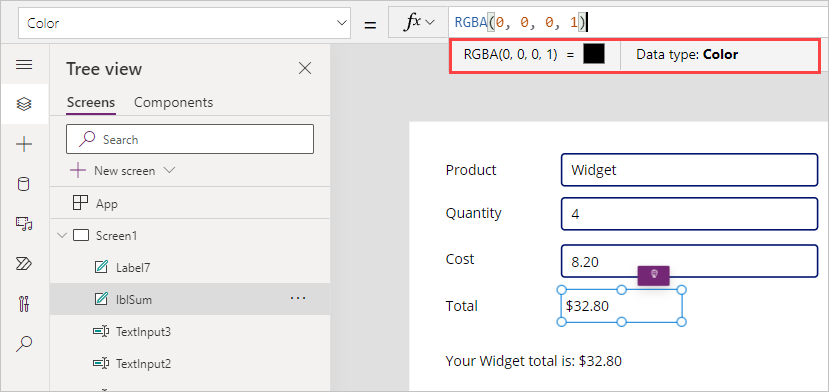
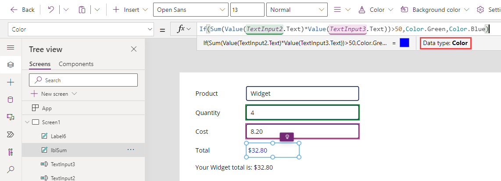
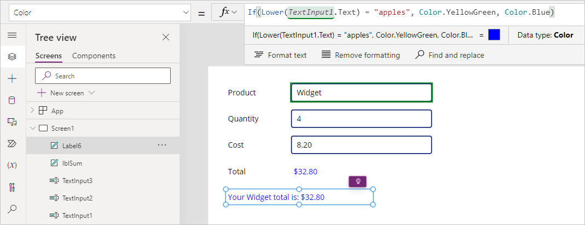
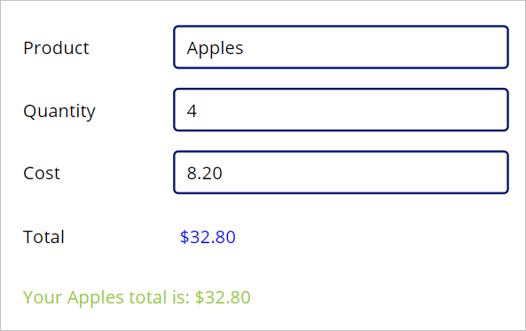

Applying conditional formatting to your app can enhance the user experience. Remember, each control has slightly different properties, which means that the conditional formatting for one control might not be the same for another. Examples of how you can use conditional formatting include setting the **Visible** property of an **Image** control to hide it when certain users are signed in, or to change the **DisplayMode** of a button to **Disabled** until all of the fields in a **Form** control have data entered in them. Conditional formatting can greatly enhance the user experience with visual indicators and modified functionality based on conditions.

## Conditional formatting for text color

Continuing with our example using the **Sum** function, let's craft a formula to apply conditional formatting to the **lblSum Color** property. Go back to the first screen in your practice app that we created in Unit 3 (refer to the screenshot).

1. With **lblSum** selected, go to the **Color** property. If you select the formula field, notice how the information just below the field shows that the value of `RGBA(0, 0, 0, 1)` is a black-colored square and the Data type is Color.

    

1. Erase the current value and enter the following into the Power *fx* entry field for **Color**:

    ```Power Apps
    If(Sum(Value(TextInput2.Text)*Value(TextInput3.Text))>50,Color.Green,Color.Blue)
    ```

    The **Color** property defines the color of the text in the label control. For this example, if the **Sum** calculation of the two **TextInput** controls is greater than 50, then the color is green, if not then the color is blue. Also, notice how, if you put your cursor in the formula bar after you change the formula, the output data type is **Color**.

   > [!div class="mx-imgBorder"]
   > [](../media/conditional-color.png#lightbox)

When setting the Color property in Power Apps, there are different options available. You can provide a color object in your formula, as shown in the example, by using **Color.Green** or **Color.Blue** (or any of the other predefined colors in Power Apps). There's also a **ColorValue** (which uses CSS color names and 6 and 8-digit hex color values) and an **RGBA** function available to use any creatable color scheme.

## Reference text property to update color

You can also reference the **Text** property to determine the **Color** property.

Let's paint a scenario that we want our customers to receive feedback based on the item they order. If a particular product is entered, we change the color of the summary text.

When you use text as a value in your formula, your text case is important. Therefore, we can use a function like **Lower** for our formula, such as *Lower(yourtextvalue)*, which would return whatever your text value is in lower-case.

Try replacing the formula in the **Color** property for your transaction summary to the following:

```Power Apps
If(Lower(TextInput1.Text) = "apples", Color.YellowGreen, Color.Blue)
```

> [!div class="mx-imgBorder"]
> [](../media/summary-color.png#lightbox)

Notice how the label text immediately changes to blue. Now put your app in preview mode and type "Apples" into the **Product** input field, and you can see how the text color of your transaction summary changes to the yellow-green color. Also notice how we entered our apples with a capital "A," but the formula still worked. The letter case of our entry doesn't matter, only the spelling.



Hopefully, you're beginning to see how conditional formatting in your canvas app can enhance the user experience. Keep your practice app open; we'll use it again as we learn about some **Data validation** functions.
